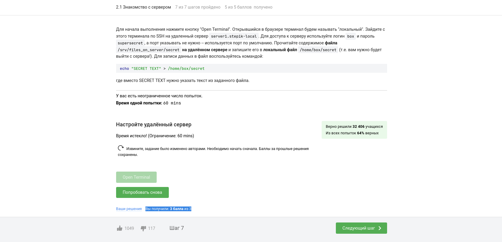
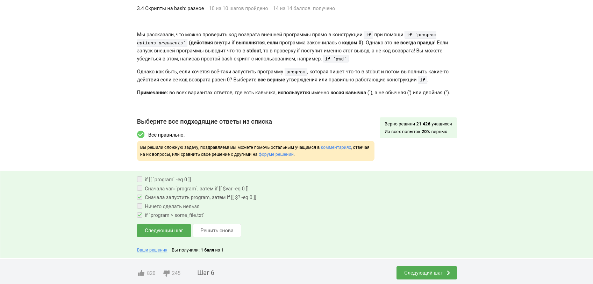
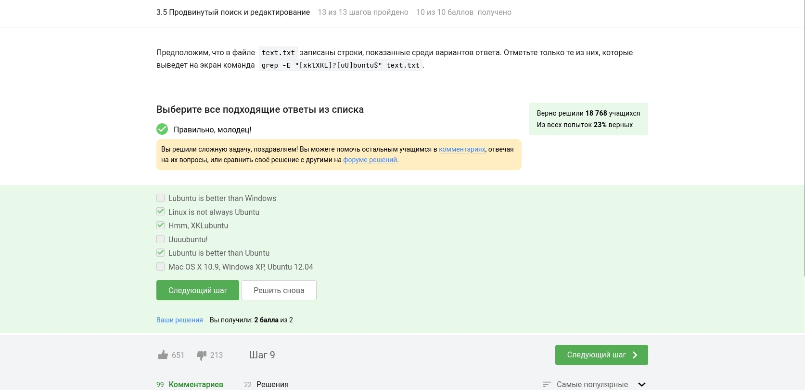

---
## Front matter
title: "ОТЧЕТ О ВЫПОЛНЕНИИ ВНЕШНЕГО КУРСА 'ВВЕДЕНИЕ В LINUX'"
subtitle: "_дисциплина: Операционные системы_"
author: "Шилоносов Данил Вячеславович"

## Generic otions
lang: ru-RU
toc-title: "Содержание"

## Bibliography
bibliography: bib/cite.bib
csl: pandoc/csl/gost-r-7-0-5-2008-numeric.csl```

## Pdf output format
toc: true # Table of contents
toc-depth: 2
lof: true # List of figures
lot: false # List of tables
fontsize: 12pt
linestretch: 1.5
papersize: a4
documentclass: scrreprt
## I18n polyglossia
polyglossia-lang:
  name: russian
  options:
	- spelling=modern
	- babelshorthands=true
polyglossia-otherlangs:
  name: english
## I18n babel
babel-lang: russian
babel-otherlangs: english
## Fonts
mainfont: PT Serif
romanfont: PT Serif
sansfont: PT Sans
monofont: PT Mono
mainfontoptions: Ligatures=TeX
romanfontoptions: Ligatures=TeX
sansfontoptions: Ligatures=TeX,Scale=MatchLowercase
monofontoptions: Scale=MatchLowercase,Scale=0.9
## Biblatex
biblatex: true
biblio-style: "gost-numeric"
biblatexoptions:
  - parentracker=true
  - backend=biber
  - hyperref=auto
  - language=auto
  - autolang=other*
  - citestyle=gost-numeric
## Pandoc-crossref LaTeX customization
figureTitle: "Рис."
tableTitle: "Таблица"
listingTitle: "Листинг"
lofTitle: "Список иллюстраций"
lotTitle: "Список таблиц"
lolTitle: "Листинги"
## Misc options
indent: true
header-includes:
  - \usepackage{indentfirst}
  - \usepackage{float} # keep figures where there are in the text
  - \floatplacement{figure}{H} # keep figures where there are in the text
---

# Цель работы
Освоить основы операционной системы Linux, включая установку, использование графического интерфейса и командной строки, работу на удаленном сервере, написание скриптов на языке bash и использование текстового редактора vim.

# Задачи
1. Добавить описание всех задач, выполненных при прохождении данного модуля: для каждого тестового или интерактивного вопроса включить:
   1. Скриншоты, содержащие формулировку задания и подтверждение его выполнения;
   2. Пояснения по выбору ответа на вопрос теста.
   
# Описание выполнения внешнего курса

## Модуль №1

### Задание №1 
#### Формулировка задания и подтверждение его выполнения 
Скриншот, содержащий формулировку задания и подтверждение его выполнения (Рис. [1-@fig:001]):

{#fig:001 width=100%}

#### Пояснение к ответу на задание
Курс называется "Введение в Linux".

### Задание №2 
#### Формулировка задания и подтверждение его выполнения 
Скриншот, содержащий формулировку задания и подтверждение его выполнения (Рис. [2-@fig:002]):

{#fig:002 width=100%}

#### Пояснение к ответу на задание
Цитата: _Внимание: дедлайнов по этому курсу нет._
Остальные варианты ответа не требуют пояснений.

### Задание №3 
#### Формулировка задания и подтверждение его выполнения 
Скриншот, содержащий формулировку задания и подтверждение его выполнения (Рис. [3-@fig:003]):

{#fig:003 width=100%}

#### Пояснение к ответу на задание
Я использую для домашней работы и учебы Linux и Windows.

### Задание №4 
#### Формулировка задания и подтверждение его выполнения 
Скриншот, содержащий формулировку задания и подтверждение его выполнения (Рис. [4-@fig:004]):

{#fig:004 width=100%}

#### Пояснение к ответу на задание
Виртуальная машина - это программное обеспечение или эмулятор, который создает виртуальную среду, в которой можно запускать операционные системы и приложения. Она обычно работает поверх реальной операционной системы и предоставляет изолированное окружение, в котором операционная система может функционировать так, как если бы она была запущена непосредственно на реальном аппаратном обеспечении.

### Задание №5 
#### Формулировка задания и подтверждение его выполнения 
Скриншот, содержащий формулировку задания и подтверждение его выполнения (Рис. [5-@fig:005]):

{#fig:005 width=100%}

#### Пояснение к ответу на задание
ДА, я смог запустить Linux на своем компьютере.

### Задание №6 
#### Формулировка задания и подтверждение его выполнения 
Скриншот, содержащий формулировку задания и подтверждение его выполнения (Рис. [6-@fig:006]):

{#fig:006 width=100%}

#### Пояснение к ответу на задание
Задание состоит в создании документа в текстовом редакторе OpenOffice/LibreOffice Writer, написании строки "Hello, Linux!" шрифтом FreeMono (или Arial/Times New Roman), и сохранении файла в формате XML или FODT. Затем требуется загрузить сохраненный файл в указанную форму. Если возникает ошибка при загрузке, необходимо убедиться, что файл сохранен в правильном формате.

### Задание №7 
#### Формулировка задания и подтверждение его выполнения 
Скриншот, содержащий формулировку задания и подтверждение его выполнения (Рис. [7-@fig:007]):

{#fig:007 width=100%}

#### Пояснение к ответу на задание
В операционной системе Ubuntu и других дистрибутивах Linux, использующих систему управления пакетами Debian, установочные пакеты имеют расширение ".deb". Файлы с расширением .deb содержат компоненты программы, такие как исполняемые файлы, библиотеки, настройки и другие необходимые файлы, необходимые для установки программного обеспечения.

### Задание №8 
#### Формулировка задания и подтверждение его выполнения 
Скриншот, содержащий формулировку задания и подтверждение его выполнения (Рис. [8-@fig:008]):

{#fig:008 width=100%}

#### Пояснение к ответу на задание
Установил VLC-плеер и посмотрел справку.

### Задание №9 
#### Формулировка задания и подтверждение его выполнения 
Скриншот, содержащий формулировку задания и подтверждение его выполнения (Рис. [9-@fig:009]):

{#fig:009 width=100%}

#### Пояснение к ответу на задание
Update Manager (Менеджер обновлений) в операционной системе Ubuntu используется для управления обновлениями системы и установленного программного обеспечения. Он предоставляет интерфейс для проверки наличия доступных обновлений и установки их.

Выбранный вариант ответа "Для обновления всей системы до новой версии" указывает на возможность использования Update Manager для обновления всей операционной системы до новой версии, когда такое обновление доступно. Это включает в себя обновление ядра операционной системы, системных библиотек, настроек и других компонентов.

Выбранный вариант ответа "Для обновления установленных программ" указывает на возможность использования Update Manager для обновления уже установленных программ на вашей системе. Update Manager проверяет наличие обновлений для установленных программ и предлагает установить новые версии, если они доступны.

Однако, выбранный вариант ответа "Для обновления ссылок в Software Center" не соответствует использованию приложения Update Manager. Update Manager не обновляет ссылки в Software Center, а скорее занимается обновлением системы и установленного программного обеспечения.

### Задание №10 
#### Формулировка задания и подтверждение его выполнения 
Скриншот, содержащий формулировку задания и подтверждение его выполнения (Рис. [10-@fig:010]):

{#fig:010 width=100%}

#### Пояснение к ответу на задание
Синонимы - слова схожие по значение. Со словом "командная строка" схожи значения "терминала" и "консоли".

### Задание №11 
#### Формулировка задания и подтверждение его выполнения 
Скриншот, содержащий формулировку задания и подтверждение его выполнения (Рис. [11-@fig:011]):

{#fig:011 width=100%}

#### Пояснение к ответу на задание
pwd - командная, предназначенная для вывода пути директории, в которой находится пользователь. В этом можно убедиться с помощью команды man pwd.

### Задание №12 
#### Формулировка задания и подтверждение его выполнения 
Скриншот, содержащий формулировку задания и подтверждение его выполнения (Рис. [12-@fig:012]):

{#fig:012 width=100%}

#### Пояснение к ответу на задание
- Ключ -A (или --almost-all) отображает все файлы и папки в указанном каталоге, включая скрытые файлы и папки.
- Ключ --human-readable (или -h) делает вывод информации в более читаемом формате, используя единицы измерения, такие как "K" для килобайт и "M" для мегабайт.
- Ключ -l отображает информацию о файлах и папках в формате "длинного списка", включая права доступа, владельца, размер, дату и время изменения и т.д.

### Задание №13 
#### Формулировка задания и подтверждение его выполнения 
Скриншот, содержащий формулировку задания и подтверждение его выполнения (Рис. [13-@fig:013]):

{#fig:013 width=100%}

#### Пояснение к ответу на задание
В данной ситуации, находясь в директории /home/bi/Documents, вы можете использовать относительный путь, чтобы перейти к директории /home/bi/Downloads. Символ "../" в команде "ls ../Downloads" указывает на переход на уровень выше, в данном случае к домашней директории (/home/bi), а затем указывает на папку Downloads.

### Задание №14 
#### Формулировка задания и подтверждение его выполнения 
Скриншот, содержащий формулировку задания и подтверждение его выполнения (Рис. [14-@fig:014]):

{#fig:014 width=100%}

#### Пояснение к ответу на задание
Для удаления директорий используется команда rm -r (для пустых каталогов - rmdir).
 
### Задание №15 
#### Формулировка задания и подтверждение его выполнения 
Скриншот, содержащий формулировку задания и подтверждение его выполнения (Рис. [15-@fig:015]):

{#fig:015 width=100%}

#### Пояснение к ответу на задание
Когда вы вводите команду "firefox" в терминале для запуска браузера Firefox, Firefox открывается в отдельном окне, независимом от терминала. То есть, терминал остается активным и ожидает ввода новых команд.

Когда вы вводите команду "exit" в терминале, она просто завершает текущую сессию терминала и закрывает его окно. Это не оказывает никакого воздействия на запущенные программы, включая Firefox.

### Задание №16 
#### Формулировка задания и подтверждение его выполнения 
Скриншот, содержащий формулировку задания и подтверждение его выполнения (Рис. [16-@fig:016]):

{#fig:016 width=100%}

#### Пояснение к ответу на задание
При запуске программы с символом "&" в конце команды в терминале, программа запускается в фоновом режиме, что означает, что она выполняется в фоне, и терминал остается доступным для ввода других команд без ожидания завершения запущенной программы.

Для управления программами, запущенными в фоновом режиме, могут использоваться определенные комбинации клавиш. В данном случае, "Ctrl+Z" используется для остановки (приостановки) программы, переводя ее в спящий режим, а затем "bg" (от background) используется для возобновления работы программы в фоновом режиме.

### Задание №17 
#### Формулировка задания и подтверждение его выполнения 
Скриншот, содержащий формулировку задания и подтверждение его выполнения (Рис. [17-@fig:017]):

{#fig:017 width=100%}

#### Пояснение к ответу на задание
Делаем .py-файл исполняемым пользователем с помощью команды chmod +x и запускаем его. Копируем вывод и вставляем в форму под вопросом.

### Задание №18 
#### Формулировка задания и подтверждение его выполнения 
Скриншот, содержащий формулировку задания и подтверждение его выполнения (Рис. [18-@fig:018]):

{#fig:018 width=100%}

#### Пояснение к ответу на задание
По умолчанию, поток ошибок (stderr) из программы, запущенной в терминале, выводится на экран (стандартный вывод - stdout). Это означает, что сообщения об ошибках, предупреждения и другие выводы, отправляемые в поток ошибок, будут отображаться непосредственно в терминале, где была запущена программа.

### Задание №19 
#### Формулировка задания и подтверждение его выполнения 
Скриншот, содержащий формулировку задания и подтверждение его выполнения (Рис. [19-@fig:019]):

{#fig:019 width=100%}

#### Пояснение к ответу на задание
- "program 2> file.txt" создаст файл file.txt и перенаправит поток ошибок (stderr) программы program в этот файл. Если файл уже существует, он будет перезаписан.
- "program 2>> file.txt" также создаст файл file.txt и перенаправит поток ошибок программы program в конец файла. Если файл уже существует, данные будут добавлены в конец файла без перезаписи.

Остальные варианты ответа не соответствуют задаче:

- "program << file.txt" используется для ввода данных в программу из файла, а не для вывода потока ошибок в файл.
- "program file.txt <2" содержит некорректный синтаксис. Корректный синтаксис для перенаправления потока ошибок в файл - "2> file.txt".
- "program >> file.txt" перенаправит поток вывода (stdout) программы program в конец файла, а не поток ошибок.

### Задание №20 
#### Формулировка задания и подтверждение его выполнения 
Скриншот, содержащий формулировку задания и подтверждение его выполнения (Рис. [20-@fig:020]):

{#fig:020 width=100%}

#### Пояснение к ответу на задание
Когда программы объединены в конвейер (pipe), входные данные передаются от одной программы к другой в виде потока. При этом поток ошибок (stderr) также передается от одной программы к другой внутри конвейера.

Сообщения об ошибках (вывод в stderr) от программ, объединенных в конвейер, будут выводиться на экран, если они не перенаправлены в другой файл или обработаны специальными командами в конвейере.

### Задание №21 
#### Формулировка задания и подтверждение его выполнения 
Скриншот, содержащий формулировку задания и подтверждение его выполнения (Рис. [21-@fig:021]):

{#fig:021 width=100%}

#### Пояснение к ответу на задание
При выполнении команды "wget -P /home/alex/Pictures -O 1.jpg http://example.com/example.jpg" происходит скачивание файла с URL-адреса http://example.com/example.jpg и сохранение его с именем "1.jpg" в указанной директории "/home/alex/Pictures".

### Задание №22 
#### Формулировка задания и подтверждение его выполнения 
Скриншот, содержащий формулировку задания и подтверждение его выполнения (Рис. [22-@fig:022]):

{#fig:022 width=100%}

#### Пояснение к ответу на задание
Опция "-q" или "--quiet" в команде wget используется для того, чтобы не выводить никаких сообщений на экран, включая информацию о процессе загрузки, ошибки и другую отладочную информацию.

### Задание №23 
#### Формулировка задания и подтверждение его выполнения 
Скриншот, содержащий формулировку задания и подтверждение его выполнения (Рис. [23-@fig:023]):

{#fig:023 width=100%}

#### Пояснение к ответу на задание
Когда вы запускаете команду "wget -r -l 1 -A jpg" и передаете ссылку на web-страницу, следующие файлы будут скачаны на компьютер:

1. Картинки в формате jpg, так как опция "-A jpg" указывает на скачивание файлов только с расширением .jpg.

2. HTML файлы, так как опция "-r" включает рекурсивное скачивание, а опция "-l 1" указывает на ограничение глубины рекурсии до 1, что означает, что будут скачаны только ссылки на первый уровень вложенности. HTML файлы являются ссылками на другие страницы сайта, и они будут скачаны вместе с первоначальной web-страницей.

Однако, все скачанные HTML файлы будут удалены, так как опция "-A jpg" указывает на скачивание только файлов с расширением .jpg, а остальные файлы будут проигнорированы или удалены, в зависимости от других опций команды wget.

### Задание №24 
#### Формулировка задания и подтверждение его выполнения 
Скриншот, содержащий формулировку задания и подтверждение его выполнения (Рис. [24-@fig:024]):

{#fig:024 width=100%}

#### Пояснение к ответу на задание
Основным отличие gzip от zip является то, то gzip удаляет архив после его распаковки.

### Задание №25 
#### Формулировка задания и подтверждение его выполнения 
Скриншот, содержащий формулировку задания и подтверждение его выполнения (Рис. [25-@fig:025]):

{#fig:025 width=100%}

#### Пояснение к ответу на задание
- "zip" является одной из наиболее распространенных программ-архиваторов и предоставляет возможность создавать архивы из директорий и файлов в формате ZIP.

- "tar" (сокращение от "tape archive") - это утилита командной строки в UNIX-подобных системах, которая может создавать архивы из директорий и файлов. Однако, утилита "tar" сама по себе не выполняет сжатие, поэтому для создания сжатого архива требуется дополнительное использование программы сжатия, например, gzip или bzip2.

### Задание №26 
#### Формулировка задания и подтверждение его выполнения 
Скриншот, содержащий формулировку задания и подтверждение его выполнения (Рис. [26-@fig:026]):

{#fig:026 width=100%}

#### Пояснение к ответу на задание
- Опция "-c" используется для создания нового архива.
- Опция "-j" указывает на использование алгоритма сжатия Bzip2.
- Опция "-f" используется для указания имени архива.

### Задание №27 
#### Формулировка задания и подтверждение его выполнения 
Скриншот, содержащий формулировку задания и подтверждение его выполнения (Рис. [27-@fig:027]):

{#fig:027 width=100%}

#### Пояснение к ответу на задание
Загружаем архив в указанную директорию:
wget -P /home/box https://stepik.org/media/attachments/course73/quiz_archive.tar.gz 

Распаковка:
tar -xzvf quiz_archive.tar.gz 

### Задание №28 
#### Формулировка задания и подтверждение его выполнения 
Скриншот, содержащий формулировку задания и подтверждение его выполнения (Рис. [28-@fig:028]):

{#fig:028 width=100%}

#### Пояснение к ответу на задание
- "*.?" означает, что мы ищем файлы с расширением из одного символа. В данном случае, файл "Alexey.jpeg" имеет расширение из четырех символов ("jpeg"), поэтому эта маска не будет соответствовать файлу "Alexey.jpeg".
- "Alex*" найдет файлы, начинающиеся с "Alex".
- "*.jpg" найдет файлы с расширением "jpg".
- "Alexey.jpeg" точно соответствует имени файла "Alexey.jpeg".
- "." найдет файлы, у которых есть расширение (символы после последней точки).

### Задание №29 
#### Формулировка задания и подтверждение его выполнения 
Скриншот, содержащий формулировку задания и подтверждение его выполнения (Рис. [29-@fig:029]):

{#fig:029 width=100%}

#### Пояснение к ответу на задание
Команда grep "world" text.txt ищет строки, содержащие подстроку "world" в файле text.txt. В данном случае, следующие строки будут соответствовать условию поиска и будут выведены на экран:

- "The "world" is not enough"
- "The world is not enough"
- "The beautiful-world is not enough"
- "world"

Остальные варианты ответа не содержат подстроку "world" или содержат ее в другом регистре (например, "World" или "The World Is Not Enough").

### Задание №30 
#### Формулировка задания и подтверждение его выполнения 
Скриншот, содержащий формулировку задания и подтверждение его выполнения (Рис. [30-@fig:030]):

{#fig:030 width=100%}

#### Пояснение к ответу на задание
wget https://stepik.org/media/attachments/course73/shakespeare.tar.gz
tar  -xzvf shakespeare.tar.gz
grep  -r 'love' ./Shakespeare > 1.txt

## Модуль №2

### Задание №1 
#### Формулировка задания и подтверждение его выполнения 
Скриншот, содержащий формулировку задания и подтверждение его выполнения (Рис. [1-@fig:031]):

{#fig:031 width=100%}

### Задание №2 
#### Формулировка задания и подтверждение его выполнения 
Скриншот, содержащий формулировку задания и подтверждение его выполнения (Рис. [2-@fig:032]):

{#fig:032 width=100%}

### Задание №3 
#### Формулировка задания и подтверждение его выполнения 
Скриншот, содержащий формулировку задания и подтверждение его выполнения (Рис. [3-@fig:033]):

{#fig:033 width=100%}

### Задание №4 
#### Формулировка задания и подтверждение его выполнения 
Скриншот, содержащий формулировку задания и подтверждение его выполнения (Рис. [4-@fig:034]):

{#fig:034 width=100%}

### Задание №5 
#### Формулировка задания и подтверждение его выполнения 
Скриншот, содержащий формулировку задания и подтверждение его выполнения (Рис. [5-@fig:035]):

{#fig:035 width=100%}

### Задание №6 
#### Формулировка задания и подтверждение его выполнения 
Скриншот, содержащий формулировку задания и подтверждение его выполнения (Рис. [6-@fig:036]):

{#fig:036 width=100%}

### Задание №7 
#### Формулировка задания и подтверждение его выполнения 
Скриншот, содержащий формулировку задания и подтверждение его выполнения (Рис. [7-@fig:037]):

{#fig:037 width=100%}

### Задание №8 
#### Формулировка задания и подтверждение его выполнения 
Скриншот, содержащий формулировку задания и подтверждение его выполнения (Рис. [8-@fig:038]):

{#fig:038 width=100%}

### Задание №9 
#### Формулировка задания и подтверждение его выполнения 
Скриншот, содержащий формулировку задания и подтверждение его выполнения (Рис. [9-@fig:039]):

{#fig:039 width=100%}

### Задание №10 
#### Формулировка задания и подтверждение его выполнения 
Скриншот, содержащий формулировку задания и подтверждение его выполнения (Рис. [10-@fig:040]):

{#fig:040 width=100%}

### Задание №11 
#### Формулировка задания и подтверждение его выполнения 
Скриншот, содержащий формулировку задания и подтверждение его выполнения (Рис. [11-@fig:041]):

{#fig:041 width=100%}

### Задание №12 
#### Формулировка задания и подтверждение его выполнения 
Скриншот, содержащий формулировку задания и подтверждение его выполнения (Рис. [12-@fig:042]):

{#fig:042 width=100%}

### Задание №13 
#### Формулировка задания и подтверждение его выполнения 
Скриншот, содержащий формулировку задания и подтверждение его выполнения (Рис. [13-@fig:043]):

{#fig:043 width=100%}

### Задание №14 
#### Формулировка задания и подтверждение его выполнения 
Скриншот, содержащий формулировку задания и подтверждение его выполнения (Рис. [14-@fig:044]):

{#fig:044 width=100%}

### Задание №15 
#### Формулировка задания и подтверждение его выполнения 
Скриншот, содержащий формулировку задания и подтверждение его выполнения (Рис. [15-@fig:045]):

{#fig:045 width=100%}

### Задание №16 
#### Формулировка задания и подтверждение его выполнения 
Скриншот, содержащий формулировку задания и подтверждение его выполнения (Рис. [16-@fig:046]):

{#fig:046 width=100%}

### Задание №17 
#### Формулировка задания и подтверждение его выполнения 
Скриншот, содержащий формулировку задания и подтверждение его выполнения (Рис. [17-@fig:047]):

{#fig:047 width=100%}

### Задание №18 
#### Формулировка задания и подтверждение его выполнения 
Скриншот, содержащий формулировку задания и подтверждение его выполнения (Рис. [18-@fig:048]):

{#fig:048 width=100%}

### Задание №19 
#### Формулировка задания и подтверждение его выполнения 
Скриншот, содержащий формулировку задания и подтверждение его выполнения (Рис. [19-@fig:049]):

{#fig:049 width=100%}

### Задание №20 
#### Формулировка задания и подтверждение его выполнения 
Скриншот, содержащий формулировку задания и подтверждение его выполнения (Рис. [20-@fig:050]):

{#fig:050 width=100%}

### Задание №21 
#### Формулировка задания и подтверждение его выполнения 
Скриншот, содержащий формулировку задания и подтверждение его выполнения (Рис. [21-@fig:051]):

{#fig:051 width=100%}

### Задание №22 
#### Формулировка задания и подтверждение его выполнения 
Скриншот, содержащий формулировку задания и подтверждение его выполнения (Рис. [22-@fig:052]):

{#fig:052 width=100%}

### Задание №23 
#### Формулировка задания и подтверждение его выполнения 
Скриншот, содержащий формулировку задания и подтверждение его выполнения (Рис. [23-@fig:053]):

{#fig:053 width=100%}

### Задание №24 
#### Формулировка задания и подтверждение его выполнения 
Скриншот, содержащий формулировку задания и подтверждение его выполнения (Рис. [24-@fig:054]):

{#fig:054 width=100%}

### Задание №25 
#### Формулировка задания и подтверждение его выполнения 
Скриншот, содержащий формулировку задания и подтверждение его выполнения (Рис. [25-@fig:055]):

{#fig:055 width=100%}

### Задание №26 
#### Формулировка задания и подтверждение его выполнения 
Скриншот, содержащий формулировку задания и подтверждение его выполнения (Рис. [26-@fig:056]):

{#fig:056 width=100%}


## Модуль №3

### Задание №1 
#### Формулировка задания и подтверждение его выполнения 
Скриншот, содержащий формулировку задания и подтверждение его выполнения (Рис. [1-@fig:057]):

{#fig:057 width=100%}

### Задание №2 
#### Формулировка задания и подтверждение его выполнения 
Скриншот, содержащий формулировку задания и подтверждение его выполнения (Рис. [2-@fig:058]):

{#fig:058 width=100%}

### Задание №3 
#### Формулировка задания и подтверждение его выполнения 
Скриншот, содержащий формулировку задания и подтверждение его выполнения (Рис. [3-@fig:059]):

{#fig:059 width=100%}

### Задание №4 
#### Формулировка задания и подтверждение его выполнения 
Скриншот, содержащий формулировку задания и подтверждение его выполнения (Рис. [4-@fig:060]):

{#fig:060 width=100%}

### Задание №5 
#### Формулировка задания и подтверждение его выполнения 
Скриншот, содержащий формулировку задания и подтверждение его выполнения (Рис. [5-@fig:061]):

{#fig:061 width=100%}

### Задание №6 
#### Формулировка задания и подтверждение его выполнения 
Скриншот, содержащий формулировку задания и подтверждение его выполнения (Рис. [6-@fig:062]):

{#fig:062 width=100%}

### Задание №7 
#### Формулировка задания и подтверждение его выполнения 
Скриншот, содержащий формулировку задания и подтверждение его выполнения (Рис. [7-@fig:063]):

{#fig:063 width=100%}

### Задание №8 
#### Формулировка задания и подтверждение его выполнения 
Скриншот, содержащий формулировку задания и подтверждение его выполнения (Рис. [8-@fig:064]):

{#fig:064 width=100%}

### Задание №9 
#### Формулировка задания и подтверждение его выполнения 
Скриншот, содержащий формулировку задания и подтверждение его выполнения (Рис. [9-@fig:065]):

{#fig:065 width=100%}

### Задание №10 
#### Формулировка задания и подтверждение его выполнения 
Скриншот, содержащий формулировку задания и подтверждение его выполнения (Рис. [10-@fig:066]):

{#fig:066 width=100%}

### Задание №11 
#### Формулировка задания и подтверждение его выполнения 
Скриншот, содержащий формулировку задания и подтверждение его выполнения (Рис. [11-@fig:067]):

{#fig:067 width=100%}

### Задание №12 
#### Формулировка задания и подтверждение его выполнения 
Скриншот, содержащий формулировку задания и подтверждение его выполнения (Рис. [12-@fig:068]):

{#fig:068 width=100%}

### Задание №13 
#### Формулировка задания и подтверждение его выполнения 
Скриншот, содержащий формулировку задания и подтверждение его выполнения (Рис. [13-@fig:069]):

{#fig:069 width=100%}

### Задание №14 
#### Формулировка задания и подтверждение его выполнения 
Скриншот, содержащий формулировку задания и подтверждение его выполнения (Рис. [14-@fig:070]):

{#fig:070 width=100%}

### Задание №15 
#### Формулировка задания и подтверждение его выполнения 
Скриншот, содержащий формулировку задания и подтверждение его выполнения (Рис. [15-@fig:071]):

{#fig:071 width=100%}

### Задание №16 
#### Формулировка задания и подтверждение его выполнения 
Скриншот, содержащий формулировку задания и подтверждение его выполнения (Рис. [16-@fig:072]):

{#fig:072 width=100%}

### Задание №17 
#### Формулировка задания и подтверждение его выполнения 
Скриншот, содержащий формулировку задания и подтверждение его выполнения (Рис. [17-@fig:073]):

{#fig:073 width=100%}

### Задание №18 
#### Формулировка задания и подтверждение его выполнения 
Скриншот, содержащий формулировку задания и подтверждение его выполнения (Рис. [18-@fig:074]):

{#fig:074 width=100%}

### Задание №19 
#### Формулировка задания и подтверждение его выполнения 
Скриншот, содержащий формулировку задания и подтверждение его выполнения (Рис. [19-@fig:075]):

{#fig:075 width=100%}

### Задание №20 
#### Формулировка задания и подтверждение его выполнения 
Скриншот, содержащий формулировку задания и подтверждение его выполнения (Рис. [20-@fig:076]):

{#fig:076 width=100%}

### Задание №21 
#### Формулировка задания и подтверждение его выполнения 
Скриншот, содержащий формулировку задания и подтверждение его выполнения (Рис. [21-@fig:077]):

{#fig:077 width=100%}

### Задание №22 
#### Формулировка задания и подтверждение его выполнения 
Скриншот, содержащий формулировку задания и подтверждение его выполнения (Рис. [22-@fig:078]):

{#fig:078 width=100%}

### Задание №23 
#### Формулировка задания и подтверждение его выполнения 
Скриншот, содержащий формулировку задания и подтверждение его выполнения (Рис. [23-@fig:079]):

{#fig:079 width=100%}

### Задание №24 
#### Формулировка задания и подтверждение его выполнения 
Скриншот, содержащий формулировку задания и подтверждение его выполнения (Рис. [24-@fig:080]):

{#fig:080 width=100%}

### Задание №25 
#### Формулировка задания и подтверждение его выполнения 
Скриншот, содержащий формулировку задания и подтверждение его выполнения (Рис. [25-@fig:081]):

{#fig:081 width=100%}

### Задание №26 
#### Формулировка задания и подтверждение его выполнения 
Скриншот, содержащий формулировку задания и подтверждение его выполнения (Рис. [26-@fig:082]):

{#fig:082 width=100%}

### Задание №27 
#### Формулировка задания и подтверждение его выполнения 
Скриншот, содержащий формулировку задания и подтверждение его выполнения (Рис. [27-@fig:083]):

{#fig:083 width=100%}

### Задание №28 
#### Формулировка задания и подтверждение его выполнения 
Скриншот, содержащий формулировку задания и подтверждение его выполнения (Рис. [28-@fig:084]):

{#fig:084 width=100%}

### Задание №29 
#### Формулировка задания и подтверждение его выполнения 
Скриншот, содержащий формулировку задания и подтверждение его выполнения (Рис. [29-@fig:085]):

{#fig:085 width=100%}

### Задание №30 
#### Формулировка задания и подтверждение его выполнения 
Скриншот, содержащий формулировку задания и подтверждение его выполнения (Рис. [30-@fig:086]):

{#fig:086 width=100%}

### Задание №31 
#### Формулировка задания и подтверждение его выполнения 
Скриншот, содержащий формулировку задания и подтверждение его выполнения (Рис. [31-@fig:087]):

{#fig:087 width=100%}

### Задание №32 
#### Формулировка задания и подтверждение его выполнения 
Скриншот, содержащий формулировку задания и подтверждение его выполнения (Рис. [32-@fig:088]):

{#fig:088 width=100%}

### Задание №33 
#### Формулировка задания и подтверждение его выполнения 
Скриншот, содержащий формулировку задания и подтверждение его выполнения (Рис. [33-@fig:089]):

{#fig:089 width=100%}

### Задание №34 
#### Формулировка задания и подтверждение его выполнения 
Скриншот, содержащий формулировку задания и подтверждение его выполнения (Рис. [34-@fig:090]):

{#fig:090 width=100%}

### Задание №35 
#### Формулировка задания и подтверждение его выполнения 
Скриншот, содержащий формулировку задания и подтверждение его выполнения (Рис. [35-@fig:091]):

{#fig:091 width=100%}

### Задание №36 
#### Формулировка задания и подтверждение его выполнения 
Скриншот, содержащий формулировку задания и подтверждение его выполнения (Рис. [36-@fig:092]):

{#fig:092 width=100%}

### Задание №37 
#### Формулировка задания и подтверждение его выполнения 
Скриншот, содержащий формулировку задания и подтверждение его выполнения (Рис. [37-@fig:093]):

{#fig:093 width=100%}


# Выводы
В ходе выполнения работы была достигнута поставленная цель - освоение основных принципов и навыков работы с операционной системой Linux. Курс предоставил полное введение в Linux, начиная с установки и знакомства с графическим интерфейсом, что позволило понять его сходства и отличия с другими популярными операционными системами.

Были изучены основы работы с командной строкой, которая оказалась мощным инструментом для выполнения различных задач. Постепенно становились понятными преимущества командной строки перед графическим интерфейсом, такие как скорость выполнения, автоматизация и гибкость.

Также были освоены навыки работы на удаленном сервере, включая подключение к серверу, запуск программ удаленно и передачу результатов на локальный компьютер для дальнейшего анализа. Это знание может быть полезным при работе с удаленными ресурсами или в области системного администрирования.

Заключительная часть курса была посвящена более продвинутым темам, таким как написание скриптов на языке bash и использование текстового редактора vim. Эти навыки позволяют автоматизировать повторяющиеся задачи и улучшить производительность работы в Linux.

Курс предоставил практические задания и тесты, которые помогли закрепить полученные знания и проверить свои навыки. Это позволило мне применить теоретические знания на практике и убедиться в их понимании.

В итоге, освоение курса "Введение в Linux" позволило мне овладеть основами работы с этой операционной системой. Я уверен, что приобретенные знания и навыки будут полезными в моей дальнейшей работе с Linux, а также повысят мою компетентность в сфере информационных технологий.
