---
## Front matter
lang: ru-RU
title: Лабораторная работа №2
subtitle: Курс "Операционные Системы"
author:
  - Шилоносов Д.В. , НКАбд-03-22
institute:
  - Российский университет дружбы народов, Москва, Россия
  
date: 18 февраля 2023

## i18n babel
babel-lang: russian
babel-otherlangs: english

## Formatting pdf
toc: false
toc-title: Содержание
slide_level: 2
aspectratio: 169
section-titles: true
theme: metropolis
header-includes:
 - \metroset{progressbar=frametitle,sectionpage=progressbar,numbering=fraction}
 - '\makeatletter'
 - '\beamer@ignorenonframefalse'
 - '\makeatother'
---

## Докладчик

:::::::::::::: {.columns align=center}
::: {.column width="70%"}

  * Шилоносов Данил Вячеславович
  * студент группы НКАбд-03-22
  * кафедры Компьютерные и информационные науки 
  * Российский университет дружбы народов
  * [1132221810@pfur.ru](mailto:1132221810@pfur.ru)
  

:::
::: {.column width="30%"}

:::
::::::::::::::

## Цели и задачи
1. Изучить идеологию и применение средств контроля версий.
2. Освоить умения по работе с git.
3. Создать базовую конфигурацию для работы с git.
4. Создать ключ SSH.
5. Создать ключ PGP.
6. Настроить подписи git.
7. Зарегистрироваться на Github.
8. Создать локальный каталог для выполнения заданий по предмету.

# Выполнение лабораторной работы 

## Установка gh

Установим git и gh (у меня они уже установлены). (рис. [-@fig:001])

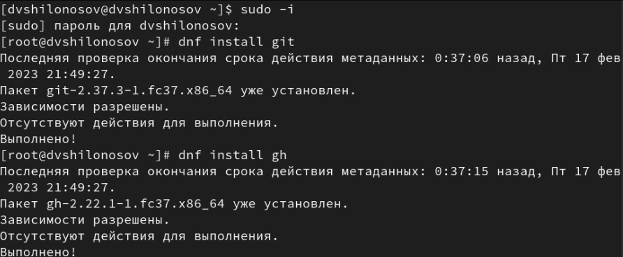{#fig:001 width=70%}

## Базовая настройка Git

Провожу базовую настройке git и прописываю некоторые параметры с помощью следующих команд (см. рис. 2) (рис. [-@fig:002]).

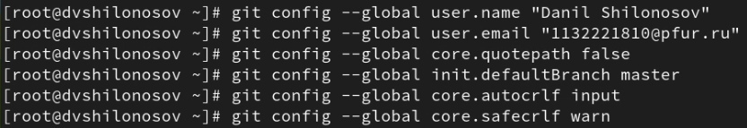{#fig:002 width=70%}

## Генерация ключей SSH

Сгенерируем ключи ssh по алгоритму rsa с размером 4096 бит и по алгоритму ed25519 (рис. [-@fig:003], [-@fig:004]).

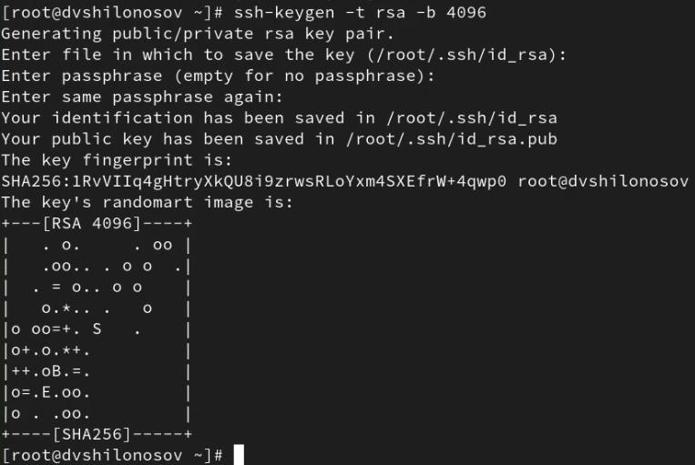{#fig:003 width=70%}

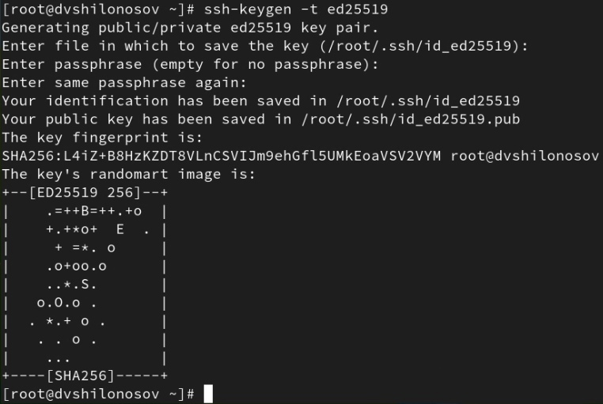{#fig:004 width=70%}

## Генерация PGP ключа 

Создадим PGP ключ со следующими параметрами: 
тип RSA and RSA; 
размер 4096; 
срок действия; значение по умолчанию — 0 (срок действия не ограничен).
GPG запросит личную информацию, которая сохранится в ключе: имя (не менее 5 символов), адрес электронной почты (рис. [-@fig:005]).

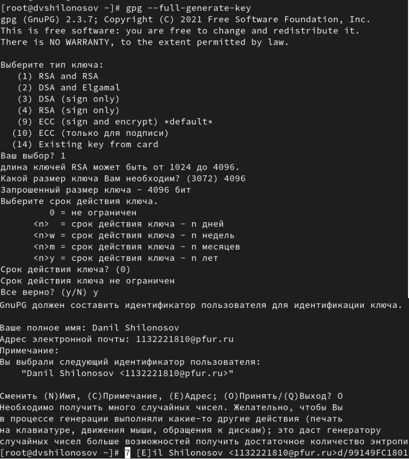{#fig:005 width=70%}

## Добавления PGP ключа на GItHub 

Далее необходимо скопировать сгенерированный ключ для того, чтобы сохранить его на Github. 
Выводим список ключей и копируем отпечаток приватного ключа (рис. [-@fig:006]).
Перейдем в настройки Github, нажмем на кнопку "New GPG key" и вставьте полученный ключ в поле ввода. (рис. [-@fig:007]).

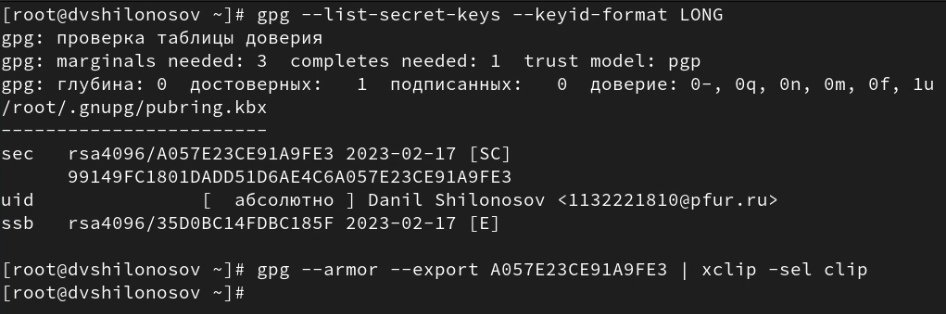{#fig:006 width=70%}

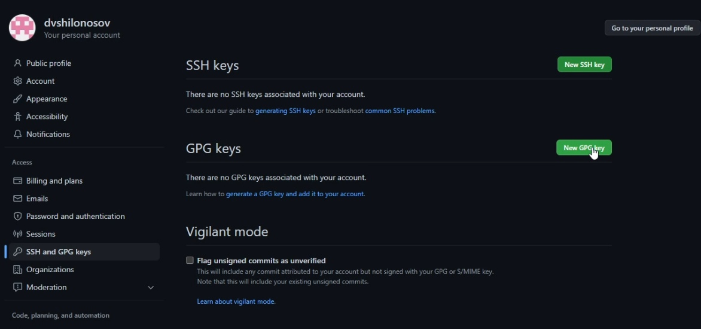{#fig:007 width=70%}

## Доказательство успешного формирования ключа

Ключ успешно сформирован (рис. [-@fig:008]).

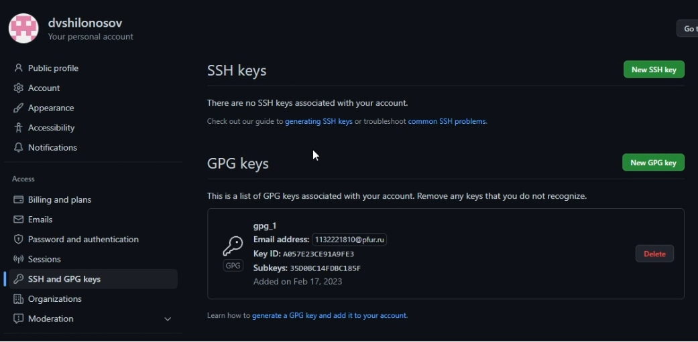{#fig:008 width=70%}

## Настройка автоматических подписей git

Используя введёный email, укажем git применять его при подписи коммитов: (рис. [-@fig:009])

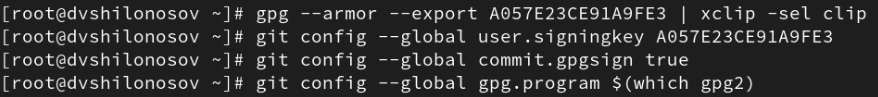{#fig:009 width=70%}

## Авторизация на gh

Далее необходимо настроить gh. Для этого пройдем авторизацию с помощью gh auth login: (рис. [-@fig:010]).

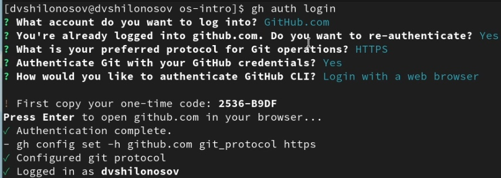{#fig:010 width=70%}

## Создание рабочего пространства в нашей ОС и связка с GitHub

Создадим рабочее пространство курса в нашей ОС и затем с помощью команды git clone скопируем материалы курса с github (рис. [-@fig:011]).

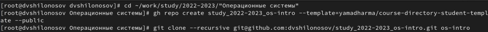{#fig:011 width=70%}

## Настройка каталогов курса 

Далее приступим к настройке каталога курса, для этого удалим лишние файлы командой rm package.json . Создадим необходимые каталоги echo os-intro > COURSE и make. (рис. [-@fig:012]).

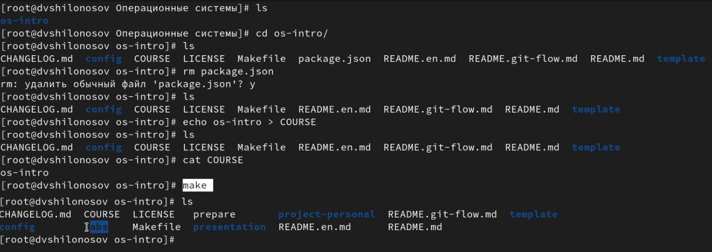{#fig:012 width=70%}

## Отправка файлов на сервер 

Последним шагом отправим файлы на сервер. (рис. [-@fig:013])

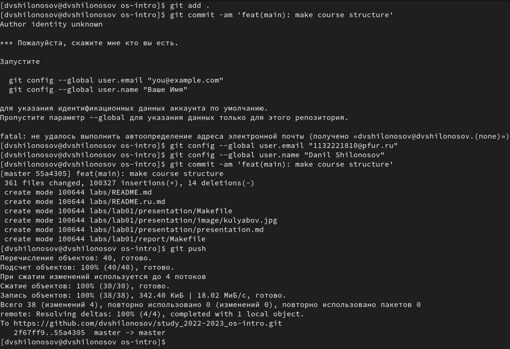{#fig:013 width=70%}

# Результаты

## Выводы

Таким образом, мы научились работать с GitHub, использовать сторонние шаблоны для организациями рабочего пространства в своей виртуальной ОС. Научился генерировать ключи и настраивать их. Научился работать с каталогами внутреннего пространства системы и научился составлять отчеты в MarkDown. Данная лабораторная работа необходима для дальнейшего понимания структуры OC. 

:::

