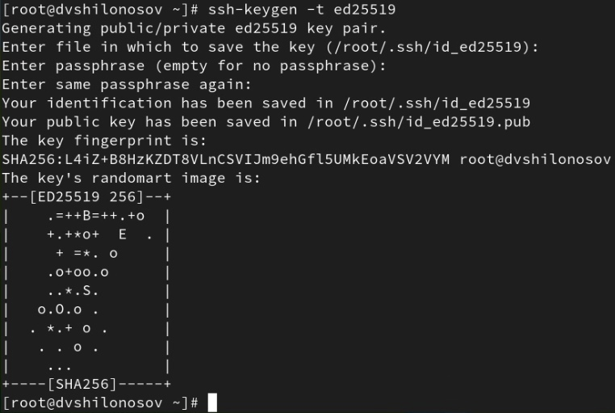
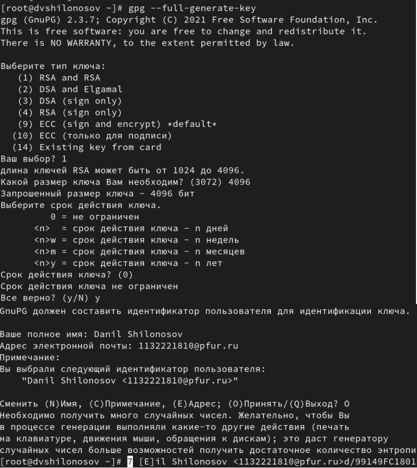
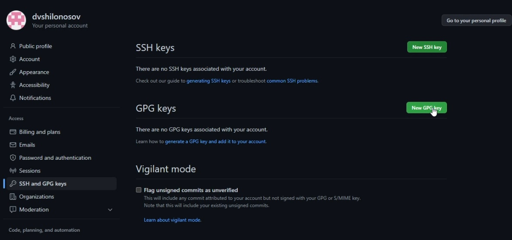
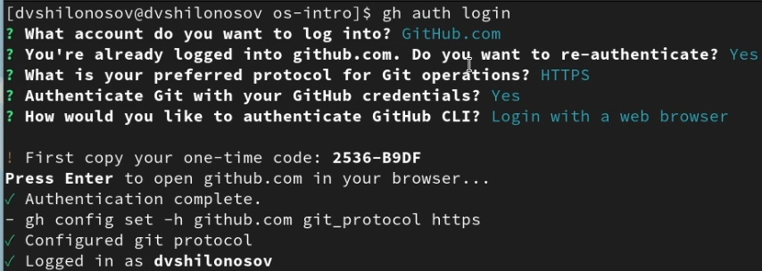

---
## Front matter
title: "ОТЧЕТ О ВЫПОЛНЕНИИ ЛАБОРАТОРНОЙ РАБОТЫ №2"
subtitle: "_дисциплина: Операционные системы_"
author: "Шилоносов Данил Вячеславович"

## Generic otions
lang: ru-RU
toc-title: "Содержание"

## Bibliography
bibliography: bib/cite.bib
csl: pandoc/csl/gost-r-7-0-5-2008-numeric.csl

## Pdf output format
toc: true # Table of contents
toc-depth: 2
lof: true # List of figures
lot: false # List of tables
fontsize: 12pt
linestretch: 1.5
papersize: a4
documentclass: scrreprt
## I18n polyglossia
polyglossia-lang:
  name: russian
  options:
	- spelling=modern
	- babelshorthands=true
polyglossia-otherlangs:
  name: english
## I18n babel
babel-lang: russian
babel-otherlangs: english
## Fonts
mainfont: PT Serif
romanfont: PT Serif
sansfont: PT Sans
monofont: PT Mono
mainfontoptions: Ligatures=TeX
romanfontoptions: Ligatures=TeX
sansfontoptions: Ligatures=TeX,Scale=MatchLowercase
monofontoptions: Scale=MatchLowercase,Scale=0.9
## Biblatex
biblatex: true
biblio-style: "gost-numeric"
biblatexoptions:
  - parentracker=true
  - backend=biber
  - hyperref=auto
  - language=auto
  - autolang=other*
  - citestyle=gost-numeric
## Pandoc-crossref LaTeX customization
figureTitle: "Рис."
tableTitle: "Таблица"
listingTitle: "Листинг"
lofTitle: "Список иллюстраций"
lotTitle: "Список таблиц"
lolTitle: "Листинги"
## Misc options
indent: true
header-includes:
  - \usepackage{indentfirst}
  - \usepackage{float} # keep figures where there are in the text
  - \floatplacement{figure}{H} # keep figures where there are in the text
---

# Цель работы

Изучение идеологии и применение средств контроля версий; освоение умений по работе с git.

# Задание

1) Создать базовую конфигурацию для работы с git.
2) Создать ключ SSH.
3) Создать ключ PGP.
4) Настроить подписи git.
5) Зарегистрироваться на Github.
6) Создать локальный каталог для выполнения заданий по предмету.

# Теоретическое введение

## Системы контроля версий. Общие понятия

Системы контроля версий (Version Control System, VCS) применяются при работе нескольких человек над одним проектом. Обычно основное дерево проекта хранится в локальном или удалённом репозитории, к которому настроен доступ для участников проекта. При внесении изменений в содержание проекта система контроля версий позволяет их фиксировать, совмещать изменения, произведённые разными участниками проекта, производить откат к любой более ранней версии проекта, если это требуется.В классических системах контроля версий используется централизованная модель, предполагающая наличие единого репозитория для хранения файлов. Выполнение большинства функций по управлению версиями осуществляется специальным сервером. Участник проекта (пользователь) перед началом работы посредством определённых команд получает нужную ему версию файлов. После внесения изменений, пользователь размещает новую версию в хранилище. При этом предыдущие версии не удаляются из центрального хранилища и к ним можно вернуться в любой момент. Сервер может сохранять не полную версию изменённых файлов, а производить так называемую дельта-компрессию — сохранять только изменения между последовательными версиями, что позволяет уменьшить объём хранимых данных.Системы контроля версий поддерживают возможность отслеживания и разрешения конфликтов, которые могут возникнуть при работе нескольких человек над одним файлом. Можно объединить (слить) изменения, сделанные разными участниками (автоматически или вручную), вручную выбрать нужную версию, отменить изменения вовсе или заблокировать файлы для изменения. В зависимости от настроек блокировка не позволяет другим пользователям получить рабочую копию или препятствует изменению рабочей копии файла средствами файловой системы ОС, обеспечивая таким образом, привилегированный доступ только одному пользователю, работающему с файлом.Системы контроля версий также могут обеспечивать дополнительные, более гибкие функциональные возможности. Например, они могут поддерживать работу с несколькими версиями одного файла, сохраняя общую историю изменений до точки ветвления версий и
собственные истории изменений каждой ветви. Кроме того, обычно доступна информация о том, кто из участников, когда и какие изменения вносил. Обычно такого рода информация хранится в журнале изменений, доступ к которому можно ограничить.В отличие от классических, в распределённых системах контроля версий центральный репозиторий не является обязательным.Среди классических VCS наиболее известны CVS, Subversion, а среди распределённых — Git, Bazaar, Mercurial. Принципы их работы схожи, отличаются они в основном синтаксисом используемых в работе команд.

## Основные команды git

Перечислим наиболее часто используемые команды git.
- Создание основного дерева репозитория: git init
- Получение обновлений (изменений) текущего дерева из центрального репозитория: git pull
- Отправка всех произведённых изменений локального дерева в центральный репозиторий: git push
- Просмотр списка изменённых файлов в текущей директории: git status
- Просмотр текущих изменений: git diff
- добавить все изменённые и/или созданные файлы и/или каталоги: git add .
- добавить конкретные изменённые и/или созданные файлы и/или каталоги: git add имена_файлов
- удалить файл и/или каталог из индекса репозитория (при этом файл и/или каталог остаётся в локальной директории): git rm имена_файлов
- сохранить все добавленные изменения и все изменённые файлы: git commit -am 'Описание коммита'
- сохранить добавленные изменения с внесением комментария через встроенный редактор: git commit
- создание новой ветки, базирующейся на текущей: git checkout -b имя_ветки
- переключение на некоторую ветку: git checkout имя_ветки (при переключении на ветку, которой ещё нет в локальном репозитории, она будет создана и связана с удалённой)
- отправка изменений конкретной ветки в центральный репозиторий: git push origin имя_ветки
- слияние ветки с текущим деревом: git merge —no-ff имя_ветки
- удаление локальной уже слитой с основным деревом ветки: git branch -d имя_ветки
- принудительное удаление локальной ветки: git branch -D имя_ветки
- удаление ветки с центрального репозитория: git push origin :имя_ветки

## Стандартные процедуры работы при наличии центрального репозитория

1. Работа пользователя со своей веткой начинается с проверки и получения изменений из центрального репозитория (при этом в локальное дерево до начала этой процедуры не должно было вноситься изменений):git checkout master | git pull | git checkout -b имя_ветки
2. Затем можно вносить изменения в локальном дереве и/или ветке.
3. После завершения внесения какого-то изменения в файлы и/или каталоги проекта необходимо разместить их в центральном репозитории. Для этого необходимо проверить, какие файлы изменились к текущему моменту: git status
4. При необходимости удаляем лишние файлы, которые не хотим отправлять в центральный репозиторий.
5. Затем полезно просмотреть текст изменений на предмет соответствия правилам ведения чистых коммитов: git diff
6. Если какие-либо файлы не должны попасть в коммит, то помечаем только те файлы, изменения которых нужно сохранить. Для этого используем команды добавления и/или удаления с нужными опциями: git add … / git rm …
7. Если нужно сохранить все изменения в текущем каталоге, то используем: git add .
8. Затем сохраняем изменения, поясняя, что было сделано: git commit -am "Some commit message"
9. Отправляем изменения в центральный репозиторий: git push origin имя_ветки или git push

## Работа с сервером репозиториев

- Для последующей идентификации пользователя на сервере репозиториев необходимо сгенерировать пару ключей (приватный и открытый): ssh-keygen -C "Имя Фамилия <[work@mail>" Ключи сохраняться в каталоге ~/.ssh/.
- Существует несколько доступных серверов репозиториев с возможностью бесплатного размещения данных. Например, https://github.com/.
- Для работы с ним необходимо сначала завести на сайте https://github.com/ учётную запись. Затем необходимо загрузить сгенерённый нами ранее открытый ключ.
- Для этого зайти на сайт https://github.com/ под своей учётной записью и перейти в меню GitHub setting.
- После этого выбрать в боковом меню GitHub setting>SSH-ключи и нажать кнопку Добавить ключ. Скопировав из локальной консоли ключ в буфер обмена: cat ~/.ssh/id_rsa.pub | xclip -sel clip
- Вставляем ключ в появившееся на сайте поле.
- После этого можно создать на сайте репозиторий, выбрав в меню , дать ему название и сделать общедоступным (публичным).
- Для загрузки репозитория из локального каталога на сервер выполняем следующие команды: git remote add origin [ssh://git@github.com/<username>/<reponame]>.git git push -u origin master
- Далее на локальном компьютере можно выполнять стандартные процедуры для работы с git при наличии центрального репозитория.

## Первичная настройка параметров git

- Зададим имя и email владельца репозитория: git config —global user.name "Name Surname" | git config —global user.email "work@mail"
- Настроим utf-8 в выводе сообщений git: git config —global core.quotepath false
- Настройте верификацию и подписание коммитов git.
- Зададим имя начальной ветки (будем называть её master): git config —global init.defaultBranch master

## Создание ключа ssh

1. В SSH поддерживается четыре алгоритма аутентификации по открытым ключам:
- DSA:размер ключей DSA не может превышать 1024, его следует отключить;
- RSA:следует создавать ключ большого размера: 4096 бит;
- ECDSA:ECDSA завязан на технологиях NIST, его следует отключить;
- Ed25519: используется пока не везде.
2. Симметричные шифры
- Из 15 поддерживаемых в SSH алгоритмов симметричного шифрования, безопасными можно считать:
- chacha20-poly1305;
- aes*-ctr;
- aes*-gcm.
- Шифры 3des-cbc и arcfour потенциально уязвимы в силу использования DES и RC4.
- Шифр cast128-cbc применяет слишком короткий размер блока (64 бит).
3. Обмен ключами

- Применяемые в SSH методы обмена ключей DH (Diffie-Hellman) и ECDH (Elliptic Curve Diffie-Hellman) можно считать безопасными.
- Из 8 поддерживаемых в SSH протоколов обмена ключами вызывают подозрения три, основанные на рекомендациях NIST:
- ecdh-sha2-nistp256;
- ecdh-sha2-nistp384;
- ecdh-sha2-nistp521.
- Не стоит использовать протоколы, основанные на SHA1.
4. Файлы ssh-ключей

- По умолчанию пользовательские ssh-ключи сохраняются в каталоге ~/.ssh в домашнем каталоге пользователя.
- Убедитесь, что у вас ещё нет ключа.
- Файлы закрытых ключей имеют названия типа id_<алгоритм> (например, id_dsa, id_rsa).
- По умолчанию закрытые ключи имеют имена:
- id_dsa
- id_ecdsa
- id_ed25519
- id_rsa
- Открытые ключи имеют дополнительные расширения .pub.
- По умолчанию публичные ключи имеют имена:
- id_dsa.pub
- id_ecdsa.pub
- id_ed25519.pub
- id_rsa.pub
- При создании ключа команда попросит ввести любую ключевую фразу для более надёжной защиты вашего пароля. Можно пропустить этот этап, нажав Enter.
- Сменить пароль на ключ можно с помощью команды: ssh-keygen -p

## Верификация коммитов с помощью PGP

Коммиты имеют следующие свойства:
- author (автор) — контрибьютор, выполнивший работу (указывается для справки); committer (коммитер) — пользователь, который закоммитил изменения.
- Эти свойства можно переопределить при совершении коммита.
- Авторство коммита можно подделать.
- В git есть функция подписи коммитов.
- Для подписывания коммитов используется технология PGP
- Подпись коммита позволяет удостовериться в том, кто является коммитером. Авторство не проверяется.

# Выполнение лабораторной работы

Установим git и gh (у меня они уже установлены). (рис. [-@fig:001])

{#fig:001 width=70%}

Провожу базовую настройке git и прописываю некоторые параметры с помощью следующих команд (см. рис. 2) (рис. [-@fig:002]).

{#fig:002 width=70%}

Сгенерируем ключи ssh по алгоритму rsa с размером 4096 бит и по алгоритму ed25519 (рис. [-@fig:003], [-@fig:004]).

{#fig:003 width=70%}

{#fig:004 width=70%}

Создадим PGP ключ со следующими параметрами: 
тип RSA and RSA; 
размер 4096; 
срок действия; значение по умолчанию — 0 (срок действия не ограничен).
GPG запросит личную информацию, которая сохранится в ключе: имя (не менее 5 символов), адрес электронной почты (рис. [-@fig:005]).

{#fig:005 width=70%}

Далее необходимо скопировать сгенерированный ключ для того, чтобы сохранить его на Github. 
Выводим список ключей и копируем отпечаток приватного ключа (рис. [-@fig:006]).
Перейдем в настройки Github, нажмем на кнопку "New GPG key" и вставьте полученный ключ в поле ввода. (рис. [-@fig:007]).

{#fig:006 width=70%}

{#fig:007 width=70%}

Ключ успешно сформирован (рис. [-@fig:008]).

{#fig:008 width=70%}

Используя введёный email, укажем git применять его при подписи коммитов: (рис. [-@fig:009])

{#fig:009 width=70%}

Далее необходимо настроить gh. Для этого пройдем авторизацию с помощью gh auth login: (рис. [-@fig:010]).

{#fig:010 width=70%}

Создадим рабочее пространство курса в нашей ОС и затем с помощью команды git clone скопируем материалы курса с github (рис. [-@fig:011]).

{#fig:011 width=70%}

Далее приступим к настройке каталога курса, для этого удалим лишние файлы командой rm package.json . Создадим необходимые каталоги echo os-intro > COURSE и make. (рис. [-@fig:012]).

{#fig:012 width=70%}

Последним шагом отправим файлы на сервер. (рис. [-@fig:013])

{#fig:013 width=70%}

## Ответы на контрольные вопросы

1. Что такое системы контроля версий (VCS) и для решения каких задач они предназначаются?
- Система контроля версий — программное обеспечение для облегчения работы с изменяющейся информацией. Система управления версиями позволяет хранить несколько версий одного и того же документа, при необходимости возвращаться к более ранним версиям, определять, кто и когда сделал то или иное изменение, и многое другое. Системы контроля версий (Version Control System, VCS) применяются для:
- Хранение полной истории изменений
- причин всех производимых изменений
- Откат изменений, если что-то пошло не так
- Поиск причины и ответственного за появления ошибок в программе
- Совместная работа группы над одним проектом
- Возможность изменять код, не мешая работе других пользователей

2. Объясните следующие понятия VCS и их отношения: хранилище, commit, история, рабочая копия
- Репозиторий - хранилище версий - в нем хранятся все документы вместе с историей их изменения и другой служебной информацией.
- Commit — отслеживание изменений, сохраняет разницу в изменениях
- Рабочая копия - копия проекта, связанная с репозиторием (текущее состояние файлов проекта, основанное на версии из хранилища (обычно на последней)
- История хранит все изменения в проекте и позволяет при необходимости обратиться к нужным данным.

3. Что представляют собой и чем отличаются централизованные и децентрализованные VCS? Приведите примеры VCS каждого вида
- Централизованные VCS (Subversion; CVS; TFS; VAULT; AccuRev):
- Одно основное хранилище всего проекта
- Каждый пользователь копирует себе необходимые ему файлы из этого репозитория, изменяет и, затем, добавляет свои изменения обратно Децентрализованные VCS (Git; Mercurial; Bazaar):
- У каждого пользователя свой вариант (возможно не один) репозитория
- Присутствует возможность добавлять и забирать изменения из любого репозитория . В классических системах контроля версий используется централизованная модель, предполагающая наличие единого репозитория для хранения файлов. Выполнение большинства функций по управлению версиями осуществляется специальным сервером. В отличие от классических, в распределённых системах контроля версий центральный репозиторий не является
обязательным.

4. Опишите действия с VCS при единоличной работе с хранилищем.
- Сначала создаем и подключаем удаленный репозиторий. Затем по мере изменения проекта отправлять эти изменения на сервер.

5. Опишите порядок работы с общим хранилищем VCS.
- Участник проекта (пользователь) перед началом работы посредством определённых команд получает нужную ему версию файлов. После внесения изменений, пользователь размещает новую версию в хранилище. При этом предыдущие версии не удаляются из центрального хранилища и к ним можно вернуться в любой момент.

6. Каковы основные задачи, решаемые инструментальным средством git?
- Первая — хранить информацию о всех изменениях в вашем коде, начиная с самой первой строчки, а вторая — обеспечение удобства командной работы над кодом.

7. Назовите и дайте краткую характеристику командам git.
- Наиболее часто используемые команды git: • создание основного дерева репозитория: git init • получение обновлений (изменений) текущего дерева из центрального репозитория: git pull • отправка всех произведённых изменений локального дерева в центральный репозиторий: git push • просмотр списка изменённых файлов в текущей директории: git status • просмотр текущих изменения: git diff • сохранение текущих изменений: – добавить все изменённые и/или созданные файлы и/или каталоги: git add. – добавить конкретные изменённые и/или созданные файлы и/или каталоги: git add имена_файлов • удалить файл и/или каталог из индекса репозитория (при этом файл и/или каталог остаётся в локальной директории): git rm имена_файлов • сохранение добавленных изменений: – сохранить все добавленные изменения и все изменённые файлы: git commit -am ‘Описание коммита’ – сохранить добавленные изменения с внесением комментария через встроенный редактор git commit • создание новой ветки, базирующейся на текущей: git checkout -b имя_ветки • переключение на некоторую ветку: git checkout имя_ветки (при переключении на ветку, которой ещё нет в локальном репозитории, она будет создана и связана с удалённой) • отправка изменений конкретной ветки в центральный репозиторий: git push origin имя_ветки • слияние ветки с текущим деревом: git merge –no-ff имя_ветки • удаление ветки: – удаление локальной уже слитой с основным деревом ветки: git branch -d имя_ветки – принудительное удаление локальной ветки: git branch -D имя_ветки – удаление ветки с центрального репозитория: git push origin :имя_ветки

8. Приведите примеры использования при работе с локальным и удалённым репозиториями.
- git push –all (push origin master/любой branch)

9. Что такое и зачем могут быть нужны ветви (branches)?
- Ветвление («ветка», branch) — один из параллельных участков истории в одном хранилище, исходящих из одной версии (точки ветвления). [3] • Обычно есть главная ветка (master), или ствол (trunk). • Между ветками, то есть их концами, возможно слияние. Используются для разработки новых функций.

10. Как и зачем можно игнорировать некоторые файлы при commit?
- Во время работы над проектом так или иначе могут создаваться файлы, которые не требуется добавлять в последствии в репозиторий. Например, временные файлы, создаваемые редакторами, или объектные файлы, создаваемые компиляторами. Можно прописать шаблоны игнорируемых при добавлении в репозиторий типов файлов в файл .gitignore с помощью сервисов.

# Выводы

В процессе выполнения лабораторной работы была изучена идеология git; освоены и проработаны практические навыки по работе с git.

