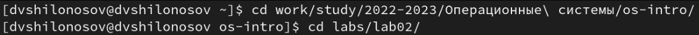
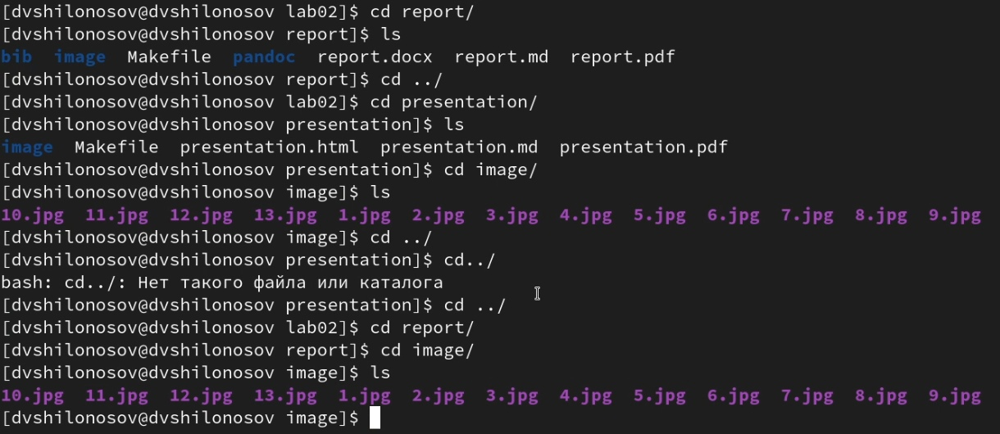
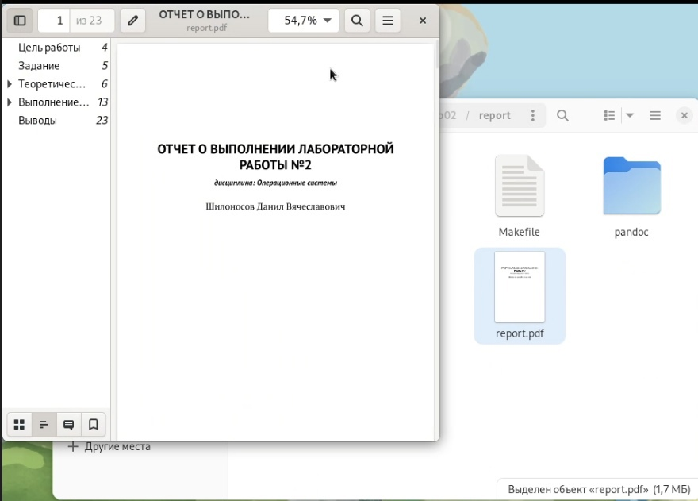
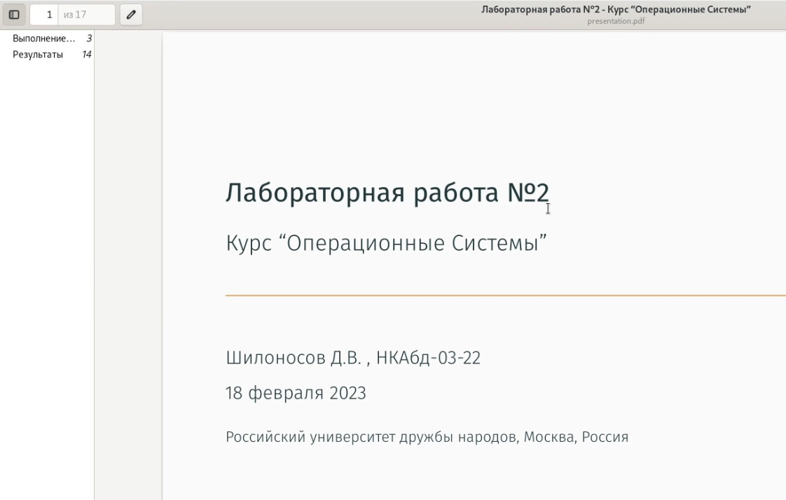

---
## Front matter
lang: ru-RU
title: Лабораторная работа №3
subtitle: Курс "Операционные Системы"
author:
  - Шилоносов Д.В. , НКАбд-03-22
institute:
  - Российский университет дружбы народов, Москва, Россия
  
date: 19 февраля 2023

## i18n babel
babel-lang: russian
babel-otherlangs: english

## Formatting pdf
toc: false
toc-title: Содержание
slide_level: 2
aspectratio: 169
section-titles: true
theme: metropolis
header-includes:
 - \metroset{progressbar=frametitle,sectionpage=progressbar,numbering=fraction}
 - '\makeatletter'
 - '\beamer@ignorenonframefalse'
 - '\makeatother'
---

## Докладчик

:::::::::::::: {.columns align=center}
::: {.column width="70%"}

  * Шилоносов Данил Вячеславович
  * студент группы НКАбд-03-22
  * кафедры Компьютерные и информационные науки 
  * Российский университет дружбы народов
  * [1132221810@pfur.ru](mailto:1132221810@pfur.ru)
  

:::
::: {.column width="30%"}

:::
::::::::::::::

## Цели и задачи
- Научиться оформлять отчёты с помощью легковесного языка разметки Markdown.
- Сделайте отчёт по предыдущей лабораторной работе в формате Markdown.
- В качестве отчёта предоставить отчёты в 3 форматах: pdf, docx и md (в архиве,
поскольку он должен содержать скриншоты, Makefile и т.д.)

# Выполнение лабораторной работы 

## Перемещение в каталог с репозиторием

Так как лабораторная работа №2 была выполнена ранее, перейдем в каталог нашего репозитория, затем в каталог, где находится выполненный отчет и презентация лабораторной работы №2.

## Проверка наличия выполненной лабораторной работы, .md-, .pdf-, .docx-файлов, изображений-скриншотов и т.д.

Проверим, что лабораторная работа действительно выполнена. Для этого посмотрим содержимое каталогов .../os-intro/labs/lab02/report и .../os-intro/labs/lab02/presentation. Убедимся, что все необходимое для отчета выполнения работы есть в наличии.

{#fig:002 width=40%}

## Проверка наличия выполненного report.pdf

Откроем report.pdf. Убедимся в том, что .pdf-файл непустой, и что титульный лист сделан по шаблону.

{#fig:003 width=40%}

## Проверка наличия выполненного presentation.pdf

То же самое выполним и с файлом presentation.pdf.

{#fig:004 width=40%}

# Результаты

## Выводы

В процессе работы мы научились оформлять отчеты с помощью легковесного языка разметки Markdown.
