---
## Front matter
lang: ru-RU
title: Лабораторная работа №4
subtitle: Курс "Операционные Системы"
author:
  - Шилоносов Д.В. , НКАбд-03-22
institute:
  - Российский университет дружбы народов, Москва, Россия
  
date: 27 февраля 2023

## i18n babel
babel-lang: russian
babel-otherlangs: english

## Formatting pdf
toc: false
toc-title: Содержание
slide_level: 2
aspectratio: 169
section-titles: true
theme: metropolis
header-includes:
 - \metroset{progressbar=frametitle,sectionpage=progressbar,numbering=fraction}
 - '\makeatletter'
 - '\beamer@ignorenonframefalse'
 - '\makeatother'
---

## Докладчик

:::::::::::::: {.columns align=center}
::: {.column width="70%"}

  * Шилоносов Данил Вячеславович
  * студент группы НКАбд-03-22
  * кафедры Компьютерные и информационные науки 
  * Российский университет дружбы народов
  * [1132221810@pfur.ru](mailto:1132221810@pfur.ru)
  

:::
::: {.column width="30%"}

:::
::::::::::::::

## Цели и задачи

**Целью работы** является приобретение практических навыков взаимодействия пользователя с системой посредством командной строки.

**Задачи:**

1. Определить полное имя домашнего каталога.
2. Выполнить следующие действия:
   1. Перейти в каталог /tmp.
   2. Вывести на экран содержимое каталога /tmp. Для этого использовать команду ls с различными опциями. Пояснить разницу в выводимой на экран информации.
   3. Определить, есть ли в каталоге /var/spool подкаталог с именем cron?
   4. Перейти в домашний каталог и вывести на экран его содержимое. Определить, кто является владельцем файлов и подкаталогов?
   
## Цели и задачи

3. Выполнить следующие действия:
   1. В домашнем каталоге создать новый каталог с именем newdir.
   2. В каталоге ~/newdir создать новый каталог с именем morefun.
   3. В домашнем каталоге создать одной командой три новых каталога с именами letters, memos, misk. Затем удалить эти каталоги одной командой.
   4. Попробовать удалить ранее созданный каталог ~/newdir командой rm. Проверить, был ли каталог удалён.
   5. Удалить каталог ~/newdir/morefun из домашнего каталога. Проверить, был ли каталог удалён.
   
## Цели и задачи

4. С помощью команды man определить, какую опцию команды ls нужно использовать для просмотра содержимого не только указанного каталога, но и подкаталогов, входящих в него.
5. С помощью команды man определить набор опций команды ls, позволяющей отсортировать по времени последнего изменения выводимый список содержимого каталога с развёрнутым описанием файлов.
6. Использовать команду man для просмотра описания следующих команд: cd, pwd, mkdir, rmdir, rm. Пояснить основные опции этих команд.
7. Используя информацию, полученную при помощи команды history, выполнить модификацию и исполнение нескольких команд из буфера команд.

# Выполнение лабораторной работы 

## Полное имя домашнего каталога

Определим полное имя домашнего каталога

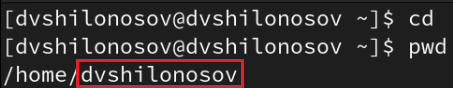{#fig:001 width=100%}

# Вывод содержимого каталога /tmp на экран

Выполним следующие действия:
Перейдем в каталог /tmp и выведем его содержимое на экран командой, используя команду ls с различными опциями

## ls -a

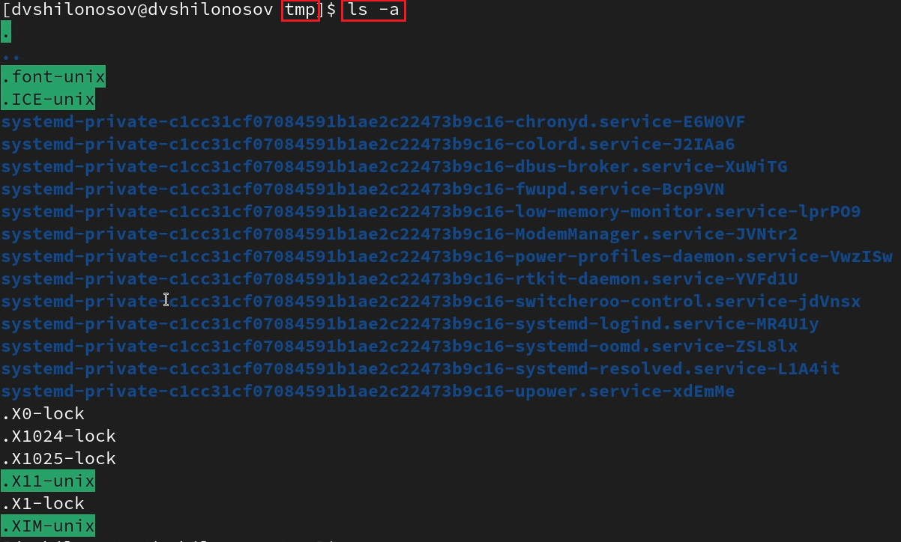{#fig:002 width=100%}

## ls -F

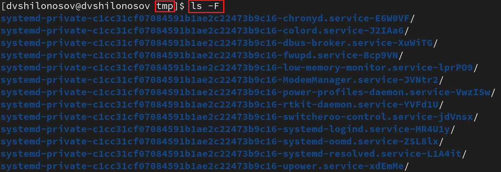{#fig:003 width=100%}

## ls -l

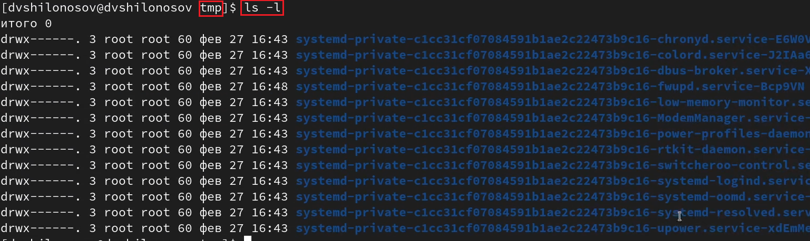{#fig:004 width=100%}

## Проверка наличия подкаталога cron в каталоге /var/spool

Определим, есть ли в каталоге /var/spool подкаталог с именем cron

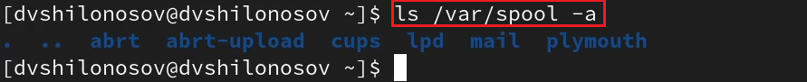{#fig:005 width=100%}

Можно заметить, что каталог /var/spool не имеет подкаталога с именем cron.

## Вывод на экран содержимого домашнего каталога

Перейдем в домашний каталог и выведем на экран его содержимое

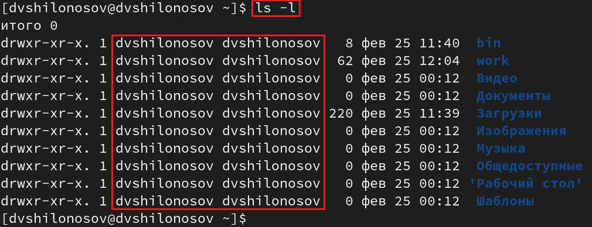{#fig:006 width=100%}

Заметим, что владельцем файлов и подкаталогов является dvshilonosov.

# Манипуляции с директориями

Выполним следующие действия:

## Создание каталога newdir в домашнем каталоге

В домашнем каталоге создадим новый каталог с именем newdir

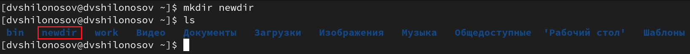{#fig:007 width=100%}

## Создание каталога morefun в ~/newdir

В каталоге ~/newdir создадим новый каталог с именем morefun

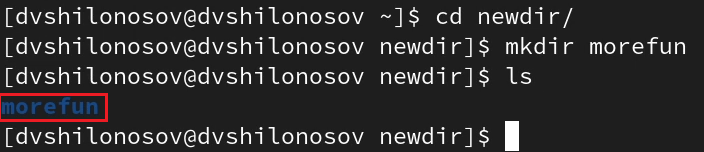{#fig:008 width=100%}

# Создание и удаление нескольких каталогов одной командой

В домашнем каталоге создадим одной командой три новых каталога с именами letters, memos, misk. Затем удалим эти каталоги одной командой

## Создание каталогов с именами letters, memos, misk в домашнем каталоге

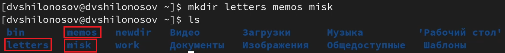{#fig:009 width=100%}

## Удаление каталогов letters, memos, misk

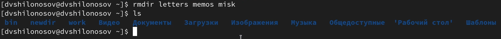{#fig:010 width=100%}

## Попытка удалить каталог ~/newdir

Попробуем удалить ранее созданный каталог ~/newdir командой rm

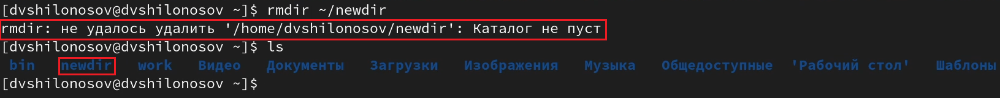{#fig:011 width=100%}

Заметим, что каталог ~/newdir/ не удалось удалить, поскольку он не пуст.

## Удаление каталога ~/newdir/morefun

Удалим каталог ~/newdir/morefun. Проверим, был ли каталог удалён

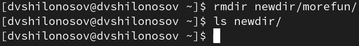{#fig:012 width=100%}

Заметим, что каталог ~/newdir/morefun удалось удалить, поскольку он был пуст.

# Получение справки команды с помощью команды man

## man ls (поиск опции рекурсивного вывода содержимого)

С помощью команды man определим, какую опцию команды ls нужно использовать для просмотра содержимого не только указанного каталога, но и подкаталогов, входящих в него

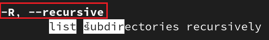{#fig:013 width=100%}

## man ls (поиск опции сортировки содержимого по времени последнего изменения)

С помощью команды man определим набор опций команды ls, позволяющей отсортировать по времени последнего изменения выводимый список содержимого каталога с развёрнутым описанием файлов

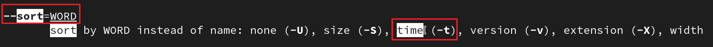{#fig:014 width=100%}

# man cd (pwd, mkdir, rmdir, rm)

Используем команду man для просмотра описания следующих команд: cd, pwd, mkdir, rmdir, rm

## man cd

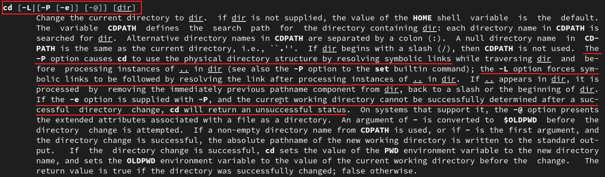{#fig:015 width=100%}

## man pwd

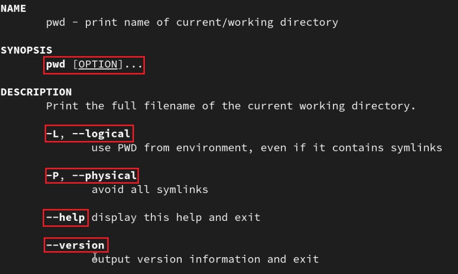{#fig:016 width=100%}

## man mkdir

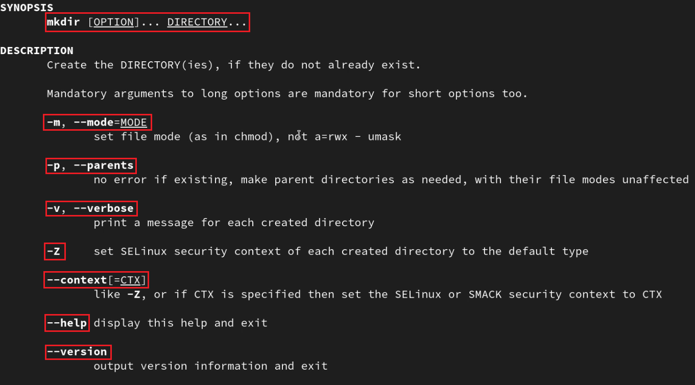{#fig:017 width=100%}

## man rmdir

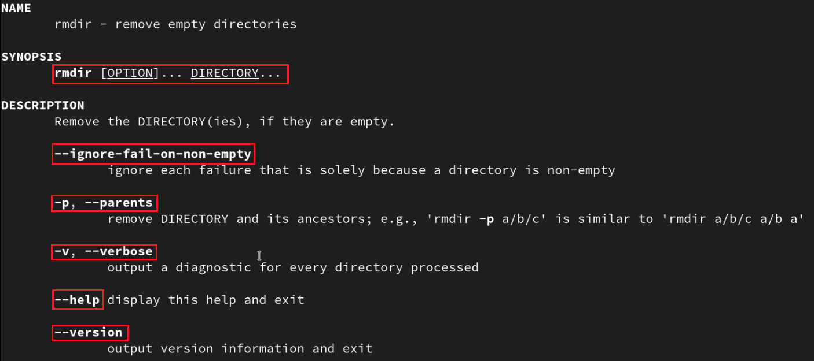{#fig:018 width=100%}

## man rm

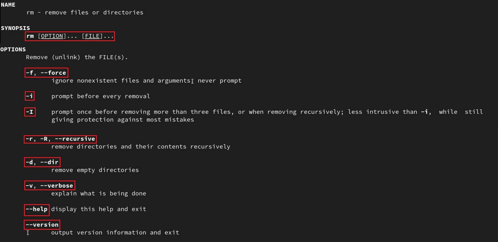{#fig:019 width=100%}

# Модификация и исполнение нескольких команд из буфера команд

Используем информацию, полученную при помощи команды history, выполним модификацию и исполнение нескольких команд из буфера команд

## ls -R work/ модифицируем в ls -l work/

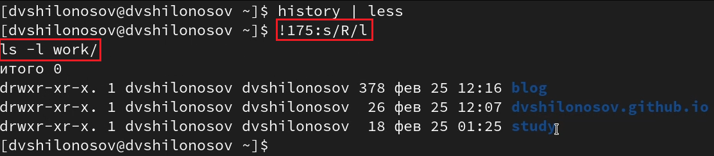{#fig:020 width=100%}

## ls --sort=time -l модифицируем в ls --size=time -l

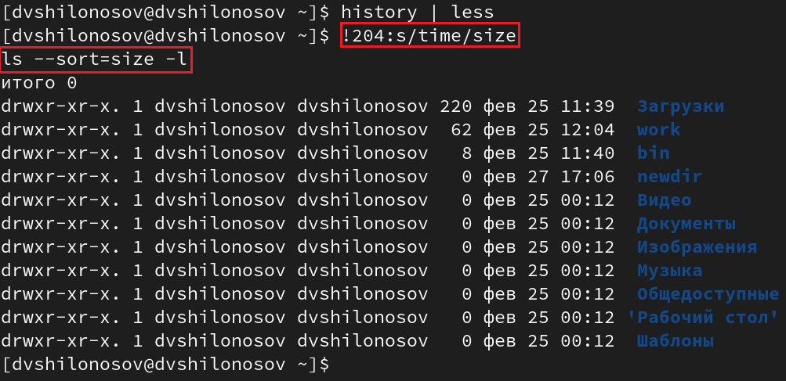{#fig:021 width=100%}

# Результаты

## Выводы

В процессе работы были приобретены практические навыки взаимодействия пользователя с системой посредством командной строки.
