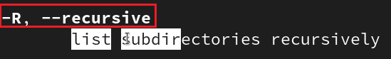

---
## Front matter
title: "ОТЧЕТ О ВЫПОЛНЕНИИ ЛАБОРАТОРНОЙ РАБОТЫ №4"
subtitle: "_дисциплина: Операционные системы_"
author: "Шилоносов Данил Вячеславович"

## Generic otions
lang: ru-RU
toc-title: "Содержание"

## Bibliography
bibliography: bib/cite.bib
csl: pandoc/csl/gost-r-7-0-5-2008-numeric.csl

## Pdf output format
toc: true # Table of contents
toc-depth: 2
lof: true # List of figures
lot: false # List of tables
fontsize: 12pt
linestretch: 1.5
papersize: a4
documentclass: scrreprt
## I18n polyglossia
polyglossia-lang:
  name: russian
  options:
	- spelling=modern
	- babelshorthands=true
polyglossia-otherlangs:
  name: english
## I18n babel
babel-lang: russian
babel-otherlangs: english
## Fonts
mainfont: PT Serif
romanfont: PT Serif
sansfont: PT Sans
monofont: PT Mono
mainfontoptions: Ligatures=TeX
romanfontoptions: Ligatures=TeX
sansfontoptions: Ligatures=TeX,Scale=MatchLowercase
monofontoptions: Scale=MatchLowercase,Scale=0.9
## Biblatex
biblatex: true
biblio-style: "gost-numeric"
biblatexoptions:
  - parentracker=true
  - backend=biber
  - hyperref=auto
  - language=auto
  - autolang=other*
  - citestyle=gost-numeric
## Pandoc-crossref LaTeX customization
figureTitle: "Рис."
tableTitle: "Таблица"
listingTitle: "Листинг"
lofTitle: "Список иллюстраций"
lotTitle: "Список таблиц"
lolTitle: "Листинги"
## Misc options
indent: true
header-includes:
  - \usepackage{indentfirst}
  - \usepackage{float} # keep figures where there are in the text
  - \floatplacement{figure}{H} # keep figures where there are in the text
---

# Цель работы

Приобретение практических навыков взаимодействия пользователя с системой посредством командной строки.

# Задачи

1. Определить полное имя домашнего каталога.
2. Выполнить следующие действия:
   1. Перейти в каталог /tmp.
   2. Вывести на экран содержимое каталога /tmp. Для этого использовать команду ls с различными опциями. Пояснить разницу в выводимой на экран информации.
   3. Определить, есть ли в каталоге /var/spool подкаталог с именем cron?
   4. Перейти в домашний каталог и вывести на экран его содержимое. Определить, кто является владельцем файлов и подкаталогов?
3. Выполнить следующие действия:
   1. В домашнем каталоге создать новый каталог с именем newdir.
   2. В каталоге ~/newdir создать новый каталог с именем morefun.
   3. В домашнем каталоге создать одной командой три новых каталога с именами letters, memos, misk. Затем удалить эти каталоги одной командой.
   4. Попробовать удалить ранее созданный каталог ~/newdir командой rm. Проверить, был ли каталог удалён.
   5. Удалить каталог ~/newdir/morefun из домашнего каталога. Проверить, был ли каталог удалён.
4. С помощью команды man определить, какую опцию команды ls нужно использовать для просмотра содержимого не только указанного каталога, но и подкаталогов, входящих в него.
5. С помощью команды man определить набор опций команды ls, позволяющей отсортировать по времени последнего изменения выводимый список содержимого каталога с развёрнутым описанием файлов.
6. Использовать команду man для просмотра описания следующих команд: cd, pwd, mkdir, rmdir, rm. Пояснить основные опции этих команд.
7. Используя информацию, полученную при помощи команды history, выполнить модификацию и исполнение нескольких команд из буфера команд.

# Теоретическое введение

## Формат команды. 
Командой в операционной системе называется записанный по специальным правилам текст (возможно с аргументами), представляющий собой указание на выполнение какой-либо функций (или действий) в операционной системе. Обычно первым словом идёт имя команды, остальной текст — аргументы или опции, конкретизирующие действие. 
Общий формат команд можно представить следующим образом: <имя_команды><разделитель><аргументы>

## Команда man.
Команда man используется для просмотра (оперативная помощь) в диалоговом режиме руководства (manual) по основным командам операционной системы типа Linux.
Формат команды: man <команда>

Для управления просмотром результата выполнения команды man можно использовать следующие клавиши:
Space - перемещение по документу на одну страницу вперёд;
Enter - перемещение по документу на одну строку вперёд;
q - выход из режима просмотра описания.

## Команда cd. 
Команда cd используется для перемещения по файловой системе операционной системы типа Linux.

### Замечание 1. 
Файловая система ОС типа Linux — иерархическая система каталогов, подкаталогов и файлов, которые обычно организованы и сгруппированы по функциональному признаку. Самый верхний каталог в иерархии называется корневым и обозначается символом /. Корневой каталог содержит системные файлы и другие каталоги.
Формат команды: cd [путь_к_каталогу]
Для перехода в домашний каталог пользователя следует использовать команду cd без параметров или cd ~.

## Команда pwd. 
Для определения абсолютного пути к текущему каталогу используется команда pwd (print working directory).

## Сокращения имён файлов.
В работе с командами, в качестве аргументов которых выступает путь к какому-либо каталогу или файлу, можно использовать сокращённую запись пути.

## Команда ls.
Команда ls используется для просмотра содержимого каталога.
Формат команды: ls [-опции] [путь]
Некоторые файлы в операционной системе скрыты от просмотра и обычно используются для настройки рабочей среды. Имена таких файлов начинаются с точки. Для того, чтобы отобразить имена скрытых файлов, необходимо использовать команду ls с опцией a: ls -a.
Можно также получить информацию о типах файлов (каталог, исполняемый файл, ссылка), для чего используется опция F. При использовании этой опции в поле имени выводится символ, который определяет тип файла.
Чтобы вывести на экран подробную информацию о файлах и каталогах, необходимо
использовать опцию l. При этом о каждом файле и каталоге будет выведена следующая
информация:
- тип файла,
- право доступа,
- число ссылок,
- владелец,
- размер,
- дата последней ревизии,
- имя файла или каталога.

## Команда mkdir.
Команда mkdir используется для создания каталогов.
Формат команды: mkdir имя_каталога1 [имя_каталога2...]

### Замечание 2. 
Для того чтобы создать каталог в определённом месте файловой системы, должны быть правильно установлены права доступа.

Можно создать также подкаталог в существующем подкаталоге:
mkdir parentdir
mkdir parentdir/dir
При задании нескольких аргументов создаётся несколько каталогов:
cd parentdir
mkdir dir1 dir2 dir3

Интересны следующие опции:
- --mode (или -m) — установка атрибутов доступа;
- --parents (или -p) — создание каталога вместе с родительскими по отношению к нему
каталогами.
Атрибуты задаются в численной или символьной нотации.

## Команда rm.
Команда rm используется для удаления файлов и/или каталогов.
Формат команды: rm [-опции] [файл]
Если требуется, чтобы выдавался запрос подтверждения на удаление файла, то необходимо использовать опцию i.
Чтобы удалить каталог, содержащий файлы, нужно использовать опцию r. Без указания этой опции команда не будет выполняться.
Если каталог пуст, то можно воспользоваться командой rmdir. Если удаляемый каталог содержит файлы, то команда не будет выполнена — нужно использовать rm -r имя_каталога.

## Команда history.
Для вывода на экран списка ранее выполненных команд используется команда history. Выводимые на экран команды в списке нумеруются. К любой команде из выведенного на экран списка можно обратиться по её номеру в списке, воспользовавшись конструкцией !<номер_команды>
Можно модифицировать команду из выведенного на экран списка при помощи следующей конструкции: !<номер_команды>:s/<что_меняем>/<на_что_меняем>

### Замечание 3. 
Если в заданном контексте встречаются специальные символы (типа «.», «/», «*» и т.д.), надо перед ними поставить символ экранирования \ (обратный слэш).

## Использование символа «;». 
Если требуется выполнить последовательно несколько команд, записанный в одной строке, то для этого используется символ точка с запятой.

# Выполнение лабораторной работы

Определим полное имя домашнего каталога (рис. [-@fig:001])

{#fig:001 width=100%}

Выполним следующие действия:

Перейдем в каталог /tmp и выведем его содержимое на экран командой, используя команду ls с различными опциями (рис. [-@fig:002], [-@fig:003], [-@fig:004])

{#fig:002 width=100%}

{#fig:003 width=100%}

{#fig:004 width=100%}

Определим, есть ли в каталоге /var/spool подкаталог с именем cron (рис. [-@fig:005])

{#fig:005 width=100%}

Как можно заметить по рис. [-@fig:005], то каталог /var/spool не имеет подкаталога с именем cron.

Перейдем в домашний каталог и выведем на экран его содержимое (рис. [-@fig:006])

{#fig:006 width=100%}

Заметим, что владельцем файлов и подкаталогов является dvshilonosov (рис. [-@fig:006]).

Выполним следующие действия:

В домашнем каталоге создадим новый каталог с именем newdir (рис. [-@fig:007])

{#fig:007 width=100%}

В каталоге ~/newdir создадим новый каталог с именем morefun (рис. [-@fig:008])

{#fig:008 width=100%}

В домашнем каталоге создадим одной командой три новых каталога с именами letters, memos, misk (рис. [-@fig:009]). Затем удалим эти каталоги одной командой (рис. [-@fig:010])

{#fig:009 width=100%}

{#fig:010 width=100%}

Попробуем удалить ранее созданный каталог ~/newdir командой rm (рис. [-@fig:011])

{#fig:011 width=100%}

Заметим, что каталог ~/newdir/ не удалось удалить, поскольку он не пуст.

Удалим каталог ~/newdir/morefun. Проверим, был ли каталог удалён (рис. [-@fig:012])

{#fig:012 width=100%}

Заметим, что каталог ~/newdir/morefun удалось удалить, поскольку он был пуст.

С помощью команды man определим, какую опцию команды ls нужно использовать для просмотра содержимого не только указанного каталога, но и подкаталогов, входящих в него (рис. [-@fig:013])

{#fig:013 width=100%}

С помощью команды man определим набор опций команды ls, позволяющей отсортировать по времени последнего изменения выводимый список содержимого каталога с развёрнутым описанием файлов (рис. [-@fig:014])

{#fig:014 width=100%}

Используем команду man для просмотра описания следующих команд: cd (рис. [-@fig:015]), pwd (рис. [-@fig:016]), mkdir (рис. [-@fig:017]), rmdir (рис. [-@fig:018]), rm (рис. [-@fig:019])

{#fig:015 width=100%}

{#fig:016 width=100%}

{#fig:017 width=100%}

{#fig:018 width=100%}

{#fig:019 width=100%}

Используем информацию, полученную при помощи команды history, выполним модификацию и исполнение нескольких команд из буфера команд (рис. [-@fig:020], [-@fig:021])

{#fig:020 width=100%}

{#fig:021 width=100%}

# Выводы

В процессе работы были приобретены практические навыки взаимодействия пользователя с системой посредством командной строки.
