---
## Front matter
lang: ru-RU
title: Лабораторная работа №5
subtitle: Курс "Операционные Системы"
author:
  - Шилоносов Д.В. , НКАбд-03-22
institute:
  - Российский университет дружбы народов, Москва, Россия
  
date: 11 марта 2023

## i18n babel
babel-lang: russian
babel-otherlangs: english

## Formatting pdf
toc: false
toc-title: Содержание
slide_level: 2
aspectratio: 169
section-titles: true
theme: metropolis
header-includes:
 - \metroset{progressbar=frametitle,sectionpage=progressbar,numbering=fraction}
 - '\makeatletter'
 - '\beamer@ignorenonframefalse'
 - '\makeatother'
---

# Информация

## Докладчик

:::::::::::::: {.columns align=center}
::: {.column width="70%"}

  * Шилоносов Данил Вячеславович
  * студент группы НКАбд-03-22
  * кафедры Компьютерные и информационные науки 
  * Российский университет дружбы народов
  * [1132221810@pfur.ru](mailto:1132221810@pfur.ru)
  

:::
::: {.column width="30%"}

:::
::::::::::::::

## Цели и задачи

**Целью работы** является приобретение практических навыков взаимодействия пользователя с системой посредством командной строки.

**Задачи:**

1. Выполните все примеры, приведённые в первой части описания лабораторной работы.
2. Выполните следующие действия, зафиксировав в отчёте по лабораторной работе используемые при этом команды и результаты их выполнения:
   1. Скопируйте файл /usr/include/sys/io.h в домашний каталог и назовите его equipment. Если файла io.h нет, то используйте любой другой файл в каталоге /usr/include/sys/ вместо него.
   2. В домашнем каталоге создайте директорию ~/ski.plases.
   3. Переместите файл equipment в каталог ~/ski.plases.
   4. Переименуйте файл ~/ski.plases/equipment в ~/ski.plases/equiplist.
   
## Цели и задачи

   5. Создайте в домашнем каталоге файл abc1 и скопируйте его в каталог ~/ski.plases, назовите его equiplist2.
   6. Создайте каталог с именем equipment в каталоге ~/ski.plases.
   7. Переместите файлы ~/ski.plases/equiplist и equiplist2 в каталог ~/ski.plases/equipment.
   8. Создайте и переместите каталог ~/newdir в каталог ~/ski.plases и назовите его plans.
   
## Цели и задачи

3. Определите опции команды chmod, необходимые для того, чтобы присвоить перечисленным ниже файлам выделенные права доступа, считая, что в начале таких прав нет:
   1. drwxr--r-- ... australia
   2. drwx--x--x ... play
   3. -r-xr--r-- ... my_os
   4. -rw-rw-r-- ... feathers
   5. Переместите каталог ~/fun в каталог ~/play и назовите его games.

## Цели и задачи

4. Проделайте приведённые ниже упражнения, записывая в отчёт по лабораторной работе используемые при этом команды:
   1. Просмотрите содержимое файла /etc/password.
   2. Скопируйте файл ~/feathers в файл ~/file.old.
   3. Переместите файл ~/file.old в каталог ~/play.
   4. Скопируйте каталог ~/play в каталог ~/fun.
   5. Переместите каталог ~/fun в каталог ~/play и назовите его games.

## Цели и задачи

   6. Лишите владельца файла ~/feathers права на чтение.
   7. Что произойдёт, если вы попытаетесь просмотреть файл ~/feathers командой cat?
   8. Что произойдёт, если вы попытаетесь скопировать файл ~/feathers?
   9. Дайте владельцу файла ~/feathers право на чтение.
   10. Лишите владельца каталога ~/play права на выполнение.
   11. Перейдите в каталог ~/play. Что произошло?
   12. Дайте владельцу каталога ~/play право на выполнение.
5. Прочитайте man по командам mount, fsck, mkfs, kill и кратко их охарактеризуйте.

# Выполнение лабораторной работы

1. Выполним все примеры, приведённые в первой части описания лабораторной работы.

# Копирование файлов и каталогов

**Примеры:**

## Копирование файла в текущем каталоге

   1. Скопируем файл ~/abc1 в файл april и в файл may
   
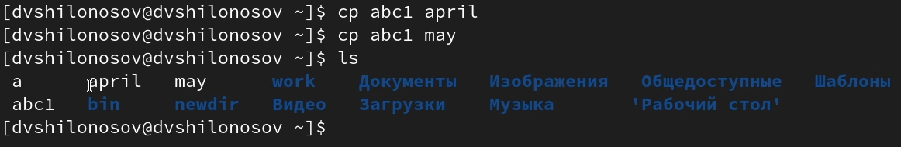{#fig:001 width=100%}
   
## Копирование файлов в произвольном каталоге
   
   2. Скопируем файл monthly/may в файл с именем june
   
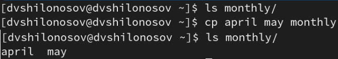{#fig:002 width=100%}
   
## Копирование каталогов в текущем каталоге   

   3. Скопируем каталог monthly в каталог monthly.00
   
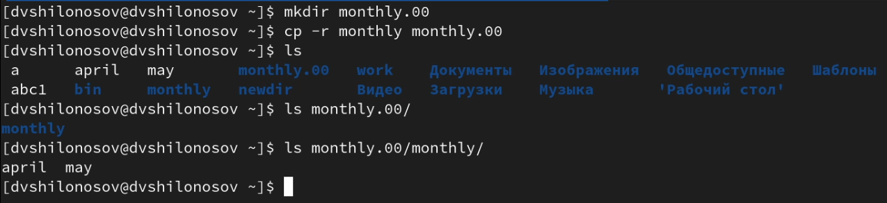{#fig:003 width=100%}
   
## Копирование каталогов в произвольном каталоге
   
   4. Скопируем каталог monthly.00 в каталог /tmp
   
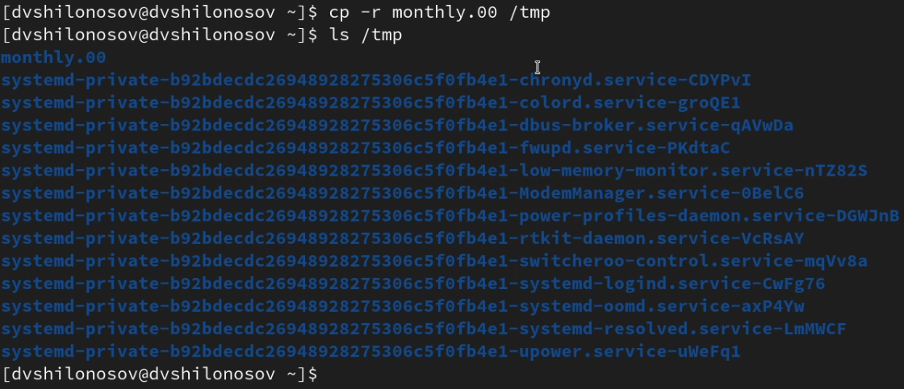{#fig:004 width=100%}

# Перемещение и переименование файлов и каталогов

**Примеры:**

## Переименование файлов в текущем каталоге

   1. Изменим название файла april на july в домашнем каталоге
   
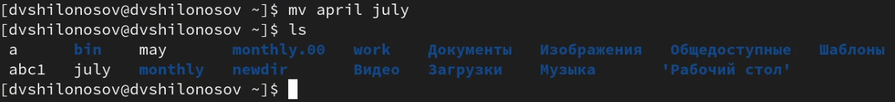{#fig:005 width=100%}

## Перемещение файлов в другой каталог

   2. Переместим файл july в каталог monthly.00
   
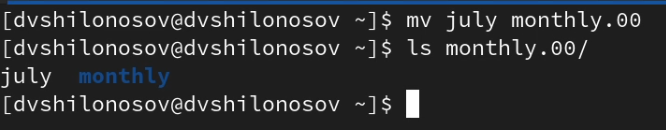{#fig:006 width=100%}
   
## Переименование каталогов в текущем каталоге
   
   3. Переименуем каталог monthly.00 в monthly.01
   
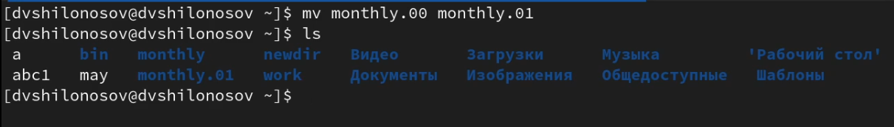{#fig:007 width=100%}
   
## Перемещение каталога в другой каталог
   
   4. Переместим каталог monthly.01в каталог reports
   
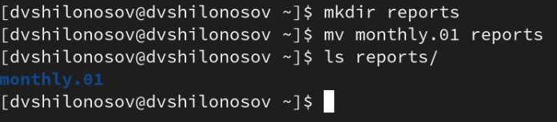{#fig:008 width=100%}
   
## Переименование каталога, не являющегося текущим
   
   5. Переименуем каталог reports/monthly.01 в reports/monthly
   
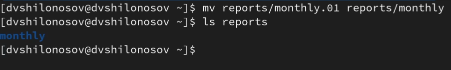{#fig:009 width=100%}

# Изменение прав доступа

**Примеры:**

## Создание файла с правом выполнения для владельца

   1. Требуется создать файл ~/may с правом выполнения для владельца
   
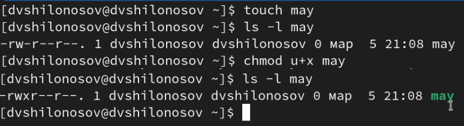{#fig:010 width=100%}
   
## Лишение владельца файла права на выполнение
   
   2. Требуется лишить владельца файла ~/may права на выполнение
   
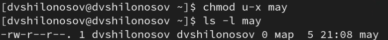{#fig:011 width=100%}
   
## Создание каталога с запретом на чтение для членов группы и всех остальных пользователей
   
   3. Требуется создать каталог monthly с запретом на чтение для членов группы и всех остальных пользователей
   
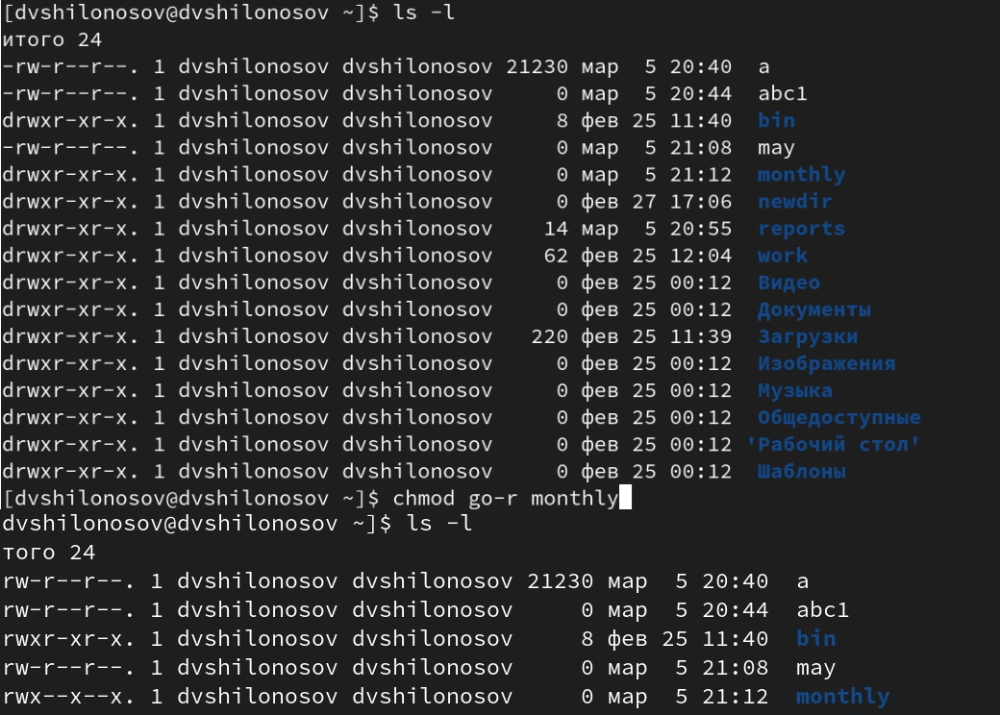{#fig:012 width=100%}
   
## Создание файла с правом записи для членов группы
   
   4. Требуется создать файл ~/abc1 с правом записи для членов группы
   
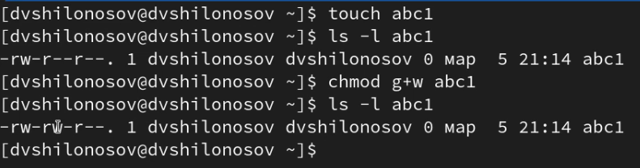{#fig:013 width=100%}

# Выполнение лабораторной работы

2. Выполним следующие действия, зафиксировав в отчёте по лабораторной работе используемые при этом команды и результаты их выполнения:

## Копирование файла .../io.h в домашний каталог

   1. Скопируем файл /usr/include/sys/io.h в домашний каталог и назовем его equipment
   
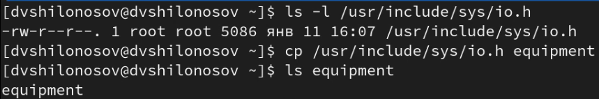{#fig:014 width=100%}
   
## Создание директории
   
   2. В домашнем каталоге создадим директорию ~/ski.plases
   
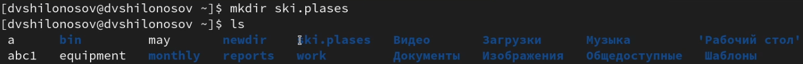{#fig:015 width=100%}
   
## Перемещение файла в каталог
   
   3. Переместим файл equipment в каталог ~/ski.plases
   
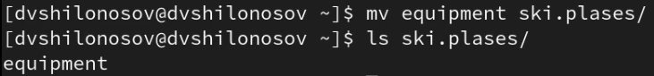{#fig:016 width=100%}
   
## Переименование файла
   
   4. Переименуем файл ~/ski.plases/equipment в ~/ski.plases/equiplist
   
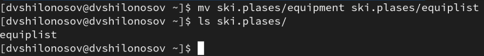{#fig:017 width=100%}
   
## Создание файла в домашней директории и копирование его в каталог
   
   5. Создадим в домашнем каталоге файл abc1 и скопируем его в каталог ~/ski.plases, назовем его equiplist2
   
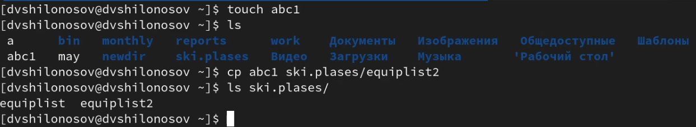{#fig:018 width=100%}
   
## Создание каталога в каталоге
   
   6. Создадим каталог с именем equipment в каталоге ~/ski.plases
   
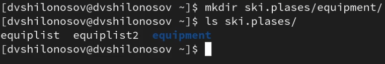{#fig:019 width=100%}
   
## Перемещение файлов в каталог
   
   7. Переместим файлы ~/ski.plases/equiplist и equiplist2 в каталог ~/ski.plases/equipment
   
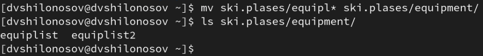{#fig:020 width=100%}
   
## Создание и перемещение каталога в каталог
   
   8. Создадим и переместим каталог ~/newdir в каталог ~/ski.plases и назовем его plans
   
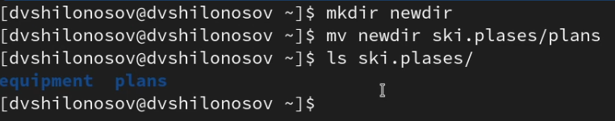{#fig:021 width=100%}

## Создание файлов и манипуляция правами доступа к ним

3. Определим опции команды chmod, необходимые для того, чтобы присвоить перечисленным ниже файлам выделенные права доступа, считая, что в начале таких прав нет:
3.1. drwxr--r-- ... australia
3.2. drwx--x--x ... play
3.3. -r-xr--r-- ... my_os
3.4. -rw-rw-r-- ... feathers

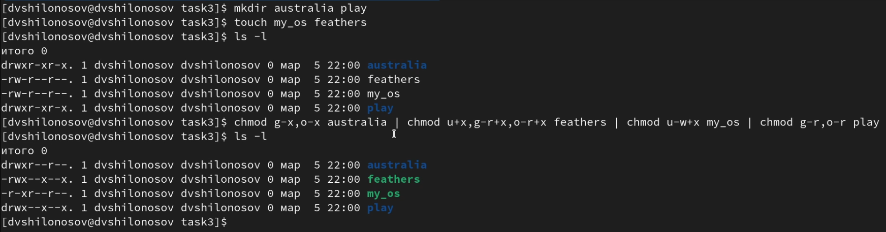{#fig:022 width=100%}

# Выполнение лабораторной работы

4. Проделаем приведённые ниже упражнения, записывая в отчёт по лабораторной работе используемые при этом команды:

## Просмотр содержимого файла

   1. Просмотрим содержимое файла /etc/password
   
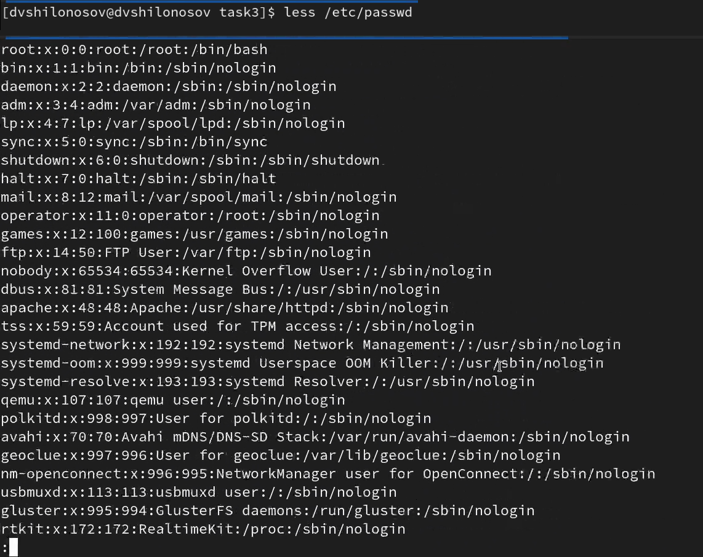{#fig:023 width=100%}
   
## Копирование файла
   
   2. Скопируем файл ~/feathers в файл ~/file.old
   
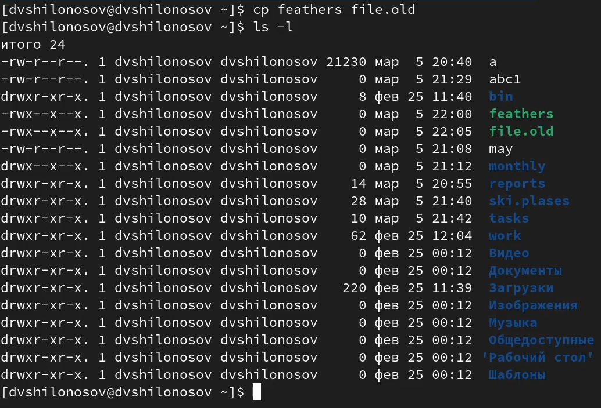{#fig:024 width=100%}
   
## Перемещение файла в каталог
   
   3. Переместим файл ~/file.old в каталог ~/play
   
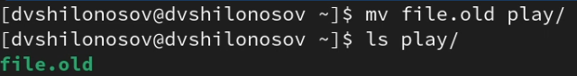{#fig:025 width=100%}
   
## Копирование каталога в каталог
   
   4. Скопируем каталог ~/play в каталог ~/fun
   
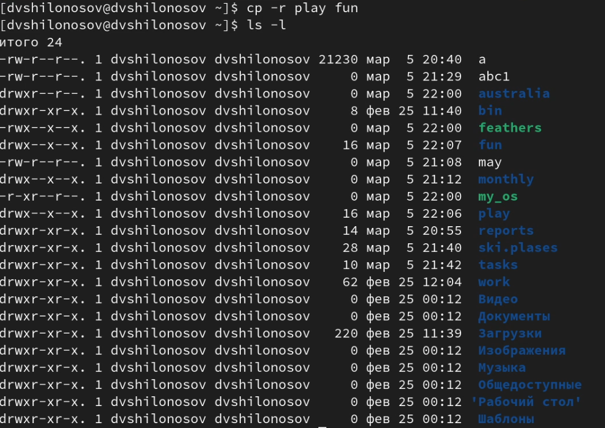{#fig:026 width=100%}
   
## Перемещение каталога в каталог
   
   5. Переместим каталог ~/fun в каталог ~/play и назовем его games
   
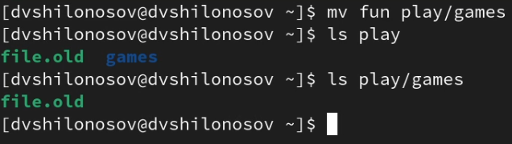{#fig:027 width=100%}
   
## Лишение владельца файла права на чтение
   
   6. Лишим владельца файла ~/feathers права на чтение
   
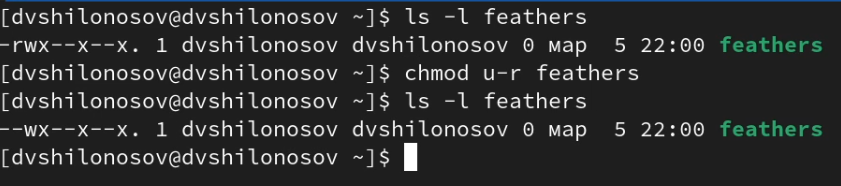{#fig:028 width=100%}
   
## Невозможно открыть файл для чтения: Отказано в доступе
   
   7. Если мы попытаемся просмотреть файл ~/feathers командой cat, то у нас это не получится
   
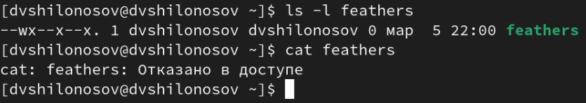{#fig:029 width=100%}
   
## Невозможно открыть файл для чтения: Отказано в доступе
   
   8. Если мы попытаемся скопировать файл ~/feathers, то у нас это не получится
   
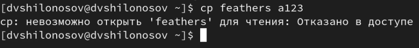{#fig:030 width=100%}
   
## Добавление владельцу файла права на чтение
   
   9. Дадим владельцу файла ~/feathers право на чтение
   
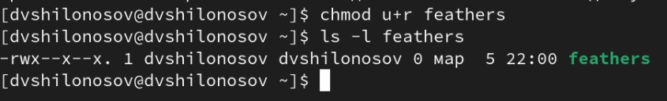{#fig:031 width=100%}
   
## Лишение владельца каталога права на выполнение
   
   10. Лишим владельца каталога ~/play права на выполнение
   
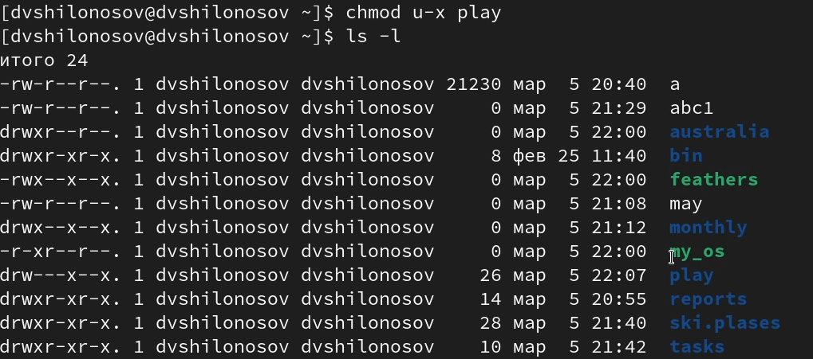{#fig:032 width=100%}
   
## cd: Отказано в доступе
   
   11. Перейти в каталог ~/play не удастся, так как недостаточно прав
   
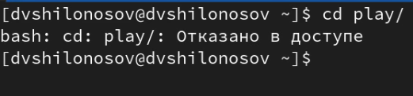{#fig:033 width=100%}
   
## Добавление владельцу каталога права на выполнение
   
   12. Дадим владельцу каталога ~/play право на выполнение
   
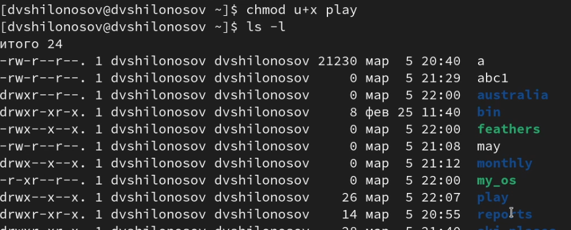{#fig:034 width=100%}
   
# man ...
   
5. Прочитаем man по командам mount, fsck, mkfs, kill и кратко их охарактеризуем
   
## man mount
   
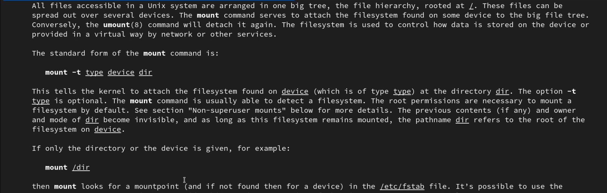{#fig:035 width=100%}
   
## man fsck
   
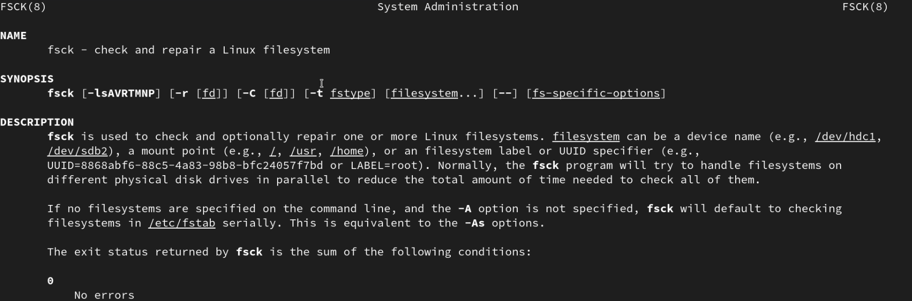{#fig:036 width=100%}
       
## man mkfs
       
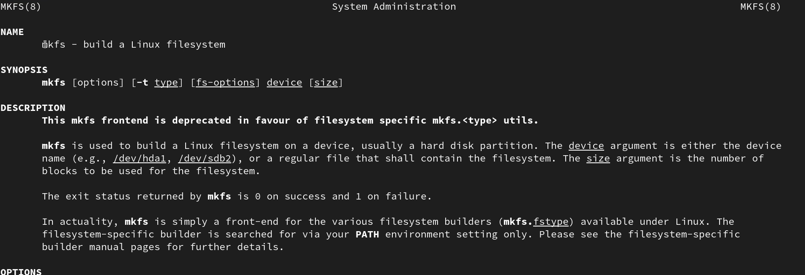{#fig:037 width=100%}
        
## man kill
        
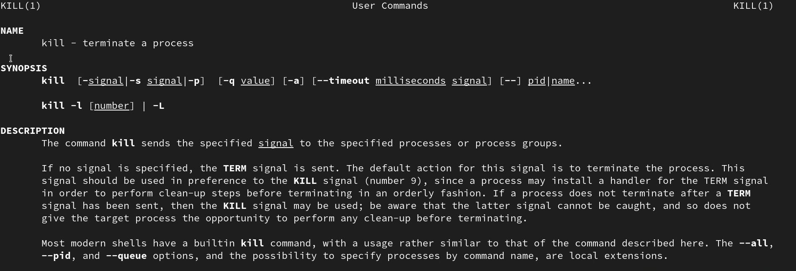{#fig:038 width=100%}
    
# Результаты

## Выводы

В процессе работы мы ознакомились с файловой системой Linux, её структурой, именами и содержанием каталогов. Были приобретены практические навыки по применению команд для работы с файлами и каталогами, по управлению процессами (и работами), по проверке использования диска и обслуживанию файловой системы.
