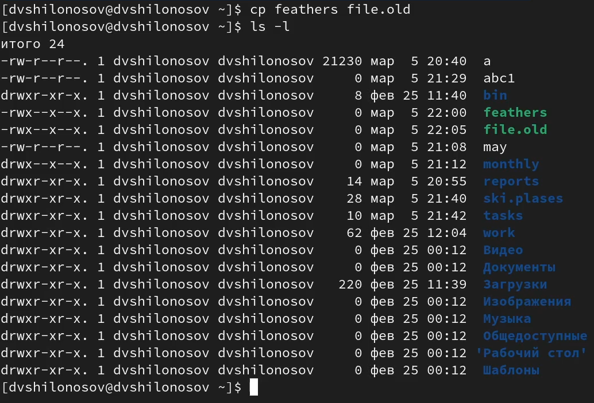

---
## Front matter
title: "ОТЧЕТ О ВЫПОЛНЕНИИ ЛАБОРАТОРНОЙ РАБОТЫ №5"
subtitle: "_дисциплина: Операционные системы_"
author: "Шилоносов Данил Вячеславович"

## Generic otions
lang: ru-RU
toc-title: "Содержание"

## Bibliography
bibliography: bib/cite.bib
csl: pandoc/csl/gost-r-7-0-5-2008-numeric.csl```

## Pdf output format
toc: true # Table of contents
toc-depth: 2
lof: true # List of figures
lot: false # List of tables
fontsize: 12pt
linestretch: 1.5
papersize: a4
documentclass: scrreprt
## I18n polyglossia
polyglossia-lang:
  name: russian
  options:
	- spelling=modern
	- babelshorthands=true
polyglossia-otherlangs:
  name: english
## I18n babel
babel-lang: russian
babel-otherlangs: english
## Fonts
mainfont: PT Serif
romanfont: PT Serif
sansfont: PT Sans
monofont: PT Mono
mainfontoptions: Ligatures=TeX
romanfontoptions: Ligatures=TeX
sansfontoptions: Ligatures=TeX,Scale=MatchLowercase
monofontoptions: Scale=MatchLowercase,Scale=0.9
## Biblatex
biblatex: true
biblio-style: "gost-numeric"
biblatexoptions:
  - parentracker=true
  - backend=biber
  - hyperref=auto
  - language=auto
  - autolang=other*
  - citestyle=gost-numeric
## Pandoc-crossref LaTeX customization
figureTitle: "Рис."
tableTitle: "Таблица"
listingTitle: "Листинг"
lofTitle: "Список иллюстраций"
lotTitle: "Список таблиц"
lolTitle: "Листинги"
## Misc options
indent: true
header-includes:
  - \usepackage{indentfirst}
  - \usepackage{float} # keep figures where there are in the text
  - \floatplacement{figure}{H} # keep figures where there are in the text
---

# Цель работы

Ознакомление с файловой системой Linux, её структурой, именами и содержанием каталогов. Приобретение практических навыков по применению команд для работы с файлами и каталогами, по управлению процессами (и работами), по проверке использования диска и обслуживанию файловой системы.

# Задачи

1. Выполните все примеры, приведённые в первой части описания лабораторной работы.
2. Выполните следующие действия, зафиксировав в отчёте по лабораторной работе используемые при этом команды и результаты их выполнения:
   1. Скопируйте файл /usr/include/sys/io.h в домашний каталог и назовите его equipment. Если файла io.h нет, то используйте любой другой файл в каталоге /usr/include/sys/ вместо него.
   2. В домашнем каталоге создайте директорию ~/ski.plases.
   3. Переместите файл equipment в каталог ~/ski.plases.
   4. Переименуйте файл ~/ski.plases/equipment в ~/ski.plases/equiplist.
   5. Создайте в домашнем каталоге файл abc1 и скопируйте его в каталог ~/ski.plases, назовите его equiplist2.
   6. Создайте каталог с именем equipment в каталоге ~/ski.plases.
   7. Переместите файлы ~/ski.plases/equiplist и equiplist2 в каталог ~/ski.plases/equipment.
   8. Создайте и переместите каталог ~/newdir в каталог ~/ski.plases и назовите его plans.
3. Определите опции команды chmod, необходимые для того, чтобы присвоить перечисленным ниже файлам выделенные права доступа, считая, что в начале таких прав нет:
   1. drwxr--r-- ... australia
   2. drwx--x--x ... play
   3. -r-xr--r-- ... my_os
   4. -rw-rw-r-- ... feathers
При необходимости создайте нужные файлы.
4. Проделайте приведённые ниже упражнения, записывая в отчёт по лабораторной работе используемые при этом команды:
   1. Просмотрите содержимое файла /etc/password.
   2. Скопируйте файл ~/feathers в файл ~/file.old.
   3. Переместите файл ~/file.old в каталог ~/play.
   4. Скопируйте каталог ~/play в каталог ~/fun.
   5. Переместите каталог ~/fun в каталог ~/play и назовите его games.
   6. Лишите владельца файла ~/feathers права на чтение.
   7. Что произойдёт, если вы попытаетесь просмотреть файл ~/feathers командой cat?
   8. Что произойдёт, если вы попытаетесь скопировать файл ~/feathers?
   9. Дайте владельцу файла ~/feathers право на чтение.
   10. Лишите владельца каталога ~/play права на выполнение.
   11. Перейдите в каталог ~/play. Что произошло?
   12. Дайте владельцу каталога ~/play право на выполнение.
5. Прочитайте man по командам mount, fsck, mkfs, kill и кратко их охарактеризуйте.

# Теоретическое введение

## Команды для работы с файлами и каталогами

Для создания текстового файла можно использовать команду touch.
Формат команды:
1 touch имя-файла
Для просмотра файлов небольшого размера можно использовать команду cat.
Формат команды:
1 cat имя-файла
Для просмотра файлов постранично удобнее использовать команду less.
Формат команды:
1 less имя-файла
Следующие клавиши используются для управления процессом просмотра:
– Space — переход к следующей странице,
– ENTER — сдвиг вперёд на одну строку,
– b — возврат на предыдущую страницу,
– h — обращение за подсказкой,
– q — выход из режима просмотра файла.
Команда head выводит по умолчанию первые 10 строк файла.
Формат команды:
1 head [-n] имя-файла,
где n — количество выводимых строк.
Команда tail выводит умолчанию 10 последних строк файла.
Формат команды:
1 tail [-n] имя-файла,
где n — количество выводимых строк.

## Копирование файлов и каталогов

Команда cp используется для копирования файлов и каталогов.
Формат команды:
1 cp [-опции] исходный_файл целевой_файл
Примеры:

1. Копирование файла в текущем каталоге. Скопировать файл ~/abc1 в файл april и в файл may:
1 cd
2 touch abc1
3 cp abc1 april
4 cp abc1 may

2. Копирование нескольких файлов в каталог. Скопировать файлы april и may в каталог monthly:
1 mkdir monthly
2 cp april may monthly

3. Копирование файлов в произвольном каталоге. Скопировать файл monthly/may в файл с именем june:
1 cp monthly/may monthly/june
2 ls monthly
Опция i в команде cp выведет на экран запрос подтверждения о перезаписи файла. Для рекурсивного копирования каталогов, содержащих файлы, используется команда cp с опцией r.
Примеры:

1. Копирование каталогов в текущем каталоге. Скопировать каталог monthly в каталог monthly.00:
1 mkdir monthly.00
2 cp -r monthly monthly.00

2. Копирование каталогов в произвольном каталоге. Скопировать каталог monthly.00 в каталог /tmp
1 cp -r monthly.00 /tmp

## Перемещение и переименование файлов и каталогов

Команды mv и mvdir предназначены для перемещения и переименования файлов и каталогов.
Формат команды mv:
mv [-опции] старый_файл новый_файл
Примеры:

1. Переименование файлов в текущем каталоге. Изменить название файла april на july в домашнем каталоге:
1 cd
2 mv april july

2. Перемещение файлов в другой каталог. Переместить файл july в каталог monthly.00:
1 mv july monthly.00
2 ls monthly.00
Результат:
1 april july june may
Если необходим запрос подтверждения о перезаписи файла, то нужно использовать опцию i.

3. Переименование каталогов в текущем каталоге. Переименовать каталог monthly.00 в monthly.01
1 mv monthly.00 monthly.01

4. Перемещение каталога в другой каталог. Переместить каталог monthly.01в каталог reports:
1 mkdir reports
2 mv monthly.01 reports

5. Переименование каталога, не являющегося текущим. Переименовать каталог reports/monthly.01 в reports/monthly:
1 mv reports/monthly.01 reports/monthly

## Права доступа

Каждый файл или каталог имеет права доступа.
В сведениях о файле или каталоге указываются:
– тип файла (символ (-) обозначает файл, а символ (d) — каталог);
– права для владельца файла (r — разрешено чтение, w — разрешена запись, x — разрешено выполнение, - — право доступа отсутствует);
– права для членов группы (r — разрешено чтение, w — разрешена запись, x — разрешено выполнение, - — право доступа отсутствует);
– права для всех остальных (r — разрешено чтение, w — разрешена запись, x — разрешено выполнение, - — право доступа отсутствует).
Примеры:
1. Для файла (крайнее левое поле имеет значение -) владелец файла имеет право на чтение и запись (rw-), группа, в которую входит владелец файла, может читать файл (r--), все остальные могут читать файл (r--):
1 -rw-r--r--
2. Только владелец файла имеет право на чтение, изменение и выполнение файла:
1 -rwx------
3. Владелец каталога (крайнее левое поле имеет значение d) имеет право на просмотр, изменение и доступа в каталог, члены группы могут входить и просматривать его, все остальные — только входить в каталог:
1 drwxr-x--x

## Изменение прав доступа

Права доступа к файлу или каталогу можно изменить, воспользовавшись командой chmod. Сделать это может владелец файла (или каталога) или пользователь с правами администратора.
Формат команды:
1 chmod режим имя_файла
Режим (в формате команды) имеет следующие компоненты структуры и способ записи:
= установить право
- лишить права
+ дать право
r чтение
w запись
x выполнение
u (user) владелец файла
g (group) группа, к которой принадлежит владелец файла
o (others) все остальные
В работе с правами доступа можно использовать их цифровую запись (восьмеричное значение) вместо символьной.

Примеры:
1. Требуется создать файл ~/may с правом выполнения для владельца:
1 cd
2 touch may
3 ls -l may
4 chmod u+x may
5 ls -l may
2. Требуется лишить владельца файла ~/may права на выполнение:
1 chmod u-x may
2 ls -l may
3. Требуется создать каталог monthly с запретом на чтение для членов группы и всех
остальных пользователей:
1 cd
2 mkdir monthly
3 chmod g-r, o-r monthly
4. Требуется создать файл ~/abc1 с правом записи для членов группы:
1 cd
2 touch abc1
3 chmod g+w abc1

## Анализ файловой системы

Файловая система в Linux состоит из фалов и каталогов. Каждому физическому носителю соответствует своя файловая система.
Существует несколько типов файловых систем. Перечислим наиболее часто встречающиеся типы:
– ext2fs (second extended filesystem);
– ext2fs (third extended file system);
– ext4 (fourth extended file system);
– ReiserFS;
– xfs;
– fat (file allocation table);
– ntfs (new technology file system).
Для просмотра используемых в операционной системе файловых систем можно воспользоваться командой mount без параметров. В результате её применения можно получить примерно следующее:
1 mount
2
3 proc on /proc type proc (rw)
4 sysfs on /sys type sysfs (rw,nosuid,nodev,noexec)
5 udev on /dev type tmpfs (rw,nosuid)
6 devpts on /dev/pts type devpts (rw,nosuid,noexec)
7 /dev/sda1 on /mnt/a type ext3 (rw,noatime)
8 /dev/sdb2 on /mnt/docs type reiserfs (rw,noatime)
9 shm on /dev/shm type tmpfs (rw,noexec,nosuid,nodev)
10 usbfs on /proc/bus/usb type usbfs
11 (rw,noexec,nosuid,devmode=0664,devgid=85)
12 binfmt_misc on /proc/sys/fs/binfmt_misc type binfmt_misc
13 (rw,noexec,nosuid,nodev)
14 nfsd on /proc/fs/nfs type nfsd (rw,noexec,nosuid,nodev)
15
В данном случае указаны имена устройств, названия соответствующих им точек мон-
тирования (путь), тип файловой системы и параметрами монтирования.
В контексте команды mount устройство — специальный файл устройства, с помощью которого операционная система получает доступ к аппаратному устройству. Файлы устройств обычно располагаются в каталоге /dev, имеют сокращённые имена (например, sdaN, sdbN или hdaN, hdbN, где N — порядковый номер устройства, sd — устройства SCSI, hd — устройства MFM/IDE).
Точка монтирования — каталог (путь к каталогу), к которому присоединяются файлы устройств.
Другой способ определения смонтированных в операционной системе файловых систем — просмотр файла/etc/fstab. Сделать это можно например с помощью команды cat:
1 cat /etc/fstab
2
3 /dev/hda1 / ext2 defaults 1 1
4 /dev/hda5 /home ext2 defaults 1 2
5 /dev/hda6 swap swap defaults 0 0
6 /dev/hdc /mnt/cdrom auto umask=0,user,noauto,ro,exec,users 0 0
7 none /mnt/floppy supermount dev=/dev/fd0,fs=ext2:vfat,--,
8 sync,umask=0 0 0
9 none /proc proc defaults 0 0
10 none /dev/pts devpts mode=0622 0 0
В каждой строке этого файла указано:
– имя устройство;
– точка монтирования;
– тип файловой системы;
– опции монтирования;
– специальные флаги для утилиты dump;
– порядок проверки целостности файловой системы с помощью утилиты fsck.
Для определения объёма свободного пространства на файловой системе можно воспользоваться командой df, которая выведет на экран список всех файловых систем в соответствии с именами устройств, с указанием размера и точки монтирования. На-
пример:
1 df
2
3 Filesystem 1024-blocks Used Available Capacity Mounted on
4 /dev/hda3 297635 169499 112764 60% /
С помощью команды fsck можно проверить (а в ряде случаев восстановить) целостность файловой системы:
Формат команды:
1 fsck имя_устройства
Пример:
1 fsck /dev/sda1

# Выполнение лабораторной работы

1. Выполним все примеры, приведённые в первой части описания лабораторной работы.

## Копирование файлов и каталогов

**Примеры:**

   1. Скопируем файл ~/abc1 в файл april и в файл may (рис. [-@fig:001])
   
{#fig:001 width=100%}
   
   2. Скопируем файл monthly/may в файл с именем june (рис. [-@fig:002])
   
{#fig:002 width=100%}
   
   3. Скопируем каталог monthly в каталог monthly.00 (рис. [-@fig:003])
   
{#fig:003 width=100%}
   
   4. Скопируем каталог monthly.00 в каталог /tmp (рис. [-@fig:004])
   
{#fig:004 width=100%}

## Перемещение и переименование файлов и каталогов

**Примеры:**

   1. Изменим название файла april на july в домашнем каталоге (рис. [-@fig:005])
   
{#fig:005 width=100%}
   
   2. Переместим файл july в каталог monthly.00 (рис. [-@fig:006])
   
{#fig:006 width=100%}
   
   3. Переименуем каталог monthly.00 в monthly.01 (рис. [-@fig:007])
   
{#fig:007 width=100%}
   
   4. Переместим каталог monthly.01в каталог reports (рис. [-@fig:008])
   
{#fig:008 width=100%}
   
   5. Переименуем каталог reports/monthly.01 в reports/monthly (рис. [-@fig:009])
   
{#fig:009 width=100%}

## Изменение прав доступа

**Примеры:**

   1. Требуется создать файл ~/may с правом выполнения для владельца (рис. [-@fig:010])
   
{#fig:010 width=100%}
   
   2. Требуется лишить владельца файла ~/may права на выполнение (рис. [-@fig:011])
   
{#fig:011 width=100%}
   
   3. Требуется создать каталог monthly с запретом на чтение для членов группы и всех остальных пользователей (рис. [-@fig:012])
   
{#fig:012 width=100%}
   
   4. Требуется создать файл ~/abc1 с правом записи для членов группы (рис. [-@fig:013])
   
{#fig:013 width=100%}

2. Выполним следующие действия, зафиксировав в отчёте по лабораторной работе используемые при этом команды и результаты их выполнения:
   1. Скопируем файл /usr/include/sys/io.h в домашний каталог и назовем его equipment (рис. [-@fig:014])
   
    {#fig:014 width=100%}
   
   2. В домашнем каталоге создадим директорию ~/ski.plases (рис. [-@fig:015])
   
    {#fig:015 width=100%}
   
   3. Переместим файл equipment в каталог ~/ski.plases (рис. [-@fig:016])
   
    {#fig:016 width=100%}
   
   4. Переименуем файл ~/ski.plases/equipment в ~/ski.plases/equiplist (рис. [-@fig:017])
   
    {#fig:017 width=100%}
   
   5. Создадим в домашнем каталоге файл abc1 и скопируем его в каталог ~/ski.plases, назовем его equiplist2 (рис. [-@fig:018])
   
    {#fig:018 width=100%}
   
   6. Создадим каталог с именем equipment в каталоге ~/ski.plases (рис. [-@fig:019])
   
    {#fig:019 width=100%}
   
   7. Переместим файлы ~/ski.plases/equiplist и equiplist2 в каталог ~/ski.plases/equipment (рис. [-@fig:020])
   
    {#fig:020 width=100%}
   
   8. Создадим и переместим каталог ~/newdir в каталог ~/ski.plases и назовем его plans (рис. [-@fig:021])
   
    {#fig:021 width=100%}

3. Определим опции команды chmod, необходимые для того, чтобы присвоить перечисленным ниже файлам выделенные права доступа, считая, что в начале таких прав нет (рис. [-@fig:022]):
3.1. drwxr--r-- ... australia
3.2. drwx--x--x ... play
3.3. -r-xr--r-- ... my_os
3.4. -rw-rw-r-- ... feathers

    {#fig:022 width=100%}

4. Проделаем приведённые ниже упражнения, записывая в отчёт по лабораторной работе используемые при этом команды:
   1. Просмотрим содержимое файла /etc/password (рис. [-@fig:023])
   
    {#fig:023 width=100%}
   
   2. Скопируем файл ~/feathers в файл ~/file.old (рис. [-@fig:024])
   
    {#fig:024 width=100%}
   
   3. Переместим файл ~/file.old в каталог ~/play (рис. [-@fig:025])
   
    {#fig:025 width=100%}
   
   4. Скопируем каталог ~/play в каталог ~/fun (рис. [-@fig:026])
   
    {#fig:026 width=100%}
   
   5. Переместим каталог ~/fun в каталог ~/play и назовем его games (рис. [-@fig:027])
   
    {#fig:027 width=100%}
   
   6. Лишим владельца файла ~/feathers права на чтение (рис. [-@fig:028])
   
    {#fig:028 width=100%}
   
   7. Если мы попытаемся просмотреть файл ~/feathers командой cat, то у нас это не получится (рис. [-@fig:029])
   
    {#fig:029 width=100%}
   
   8. Если мы попытаемся скопировать файл ~/feathers, то у нас это не получится (рис. [-@fig:030])
   
    {#fig:030 width=100%}
   
   9. Дадим владельцу файла ~/feathers право на чтение (рис. [-@fig:031])
   
    {#fig:031 width=100%}
   
   10. Лишим владельца каталога ~/play права на выполнение (рис. [-@fig:032])
   
    {#fig:032 width=100%}
   
   11. Перейти в каталог ~/play не удастся, так как недостаточно прав (рис. [-@fig:033])
   
    {#fig:033 width=100%}
   
   12. Дадим владельцу каталога ~/play право на выполнение (рис. [-@fig:034])
   
    {#fig:034 width=100%}
   
5. Прочитаем man по командам mount, fsck, mkfs, kill и кратко их охарактеризуем. (рис. [-@fig:035], [-@fig:036], [-@fig:037], [-@fig:038])
   
    {#fig:035 width=100%}
   
    {#fig:036 width=100%}
       
    {#fig:037 width=100%}
           
    {#fig:038 width=100%}
   
# Выводы

В процессе работы мы ознакомились с файловой системой Linux, её структурой, именами и содержанием каталогов. Были приобретены практические навыки по применению команд для работы с файлами и каталогами, по управлению процессами (и работами), по проверке использования диска и обслуживанию файловой системы.

