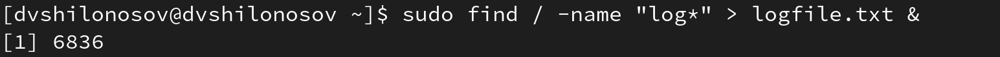
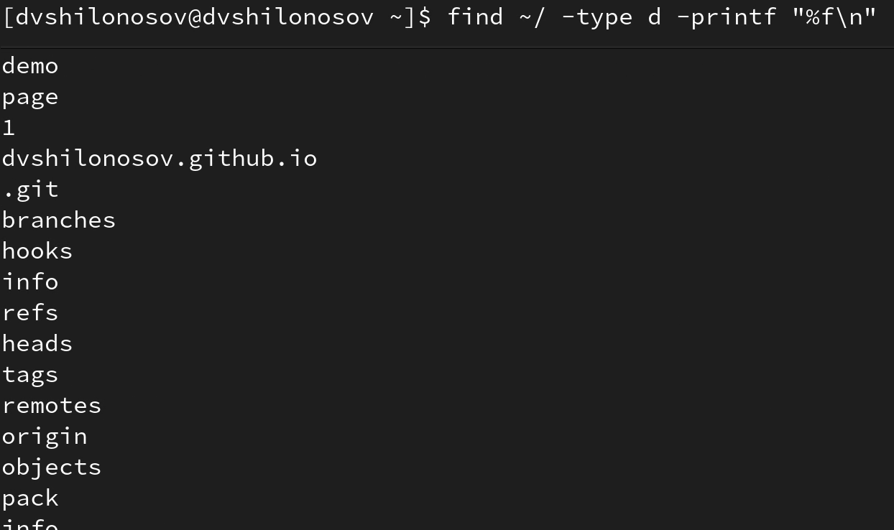

---
## Front matter
lang: ru-RU
title: Лабораторная работа №6
subtitle: Курс "Операционные Системы"
author:
  - Шилоносов Д.В. , НКАбд-03-22
institute:
  - Российский университет дружбы народов, Москва, Россия
  
date: 14 марта 2023

## i18n babel
babel-lang: russian
babel-otherlangs: english

## Formatting pdf
toc: false
toc-title: Содержание
slide_level: 2
aspectratio: 169
section-titles: true
theme: metropolis
header-includes:
 - \metroset{progressbar=frametitle,sectionpage=progressbar,numbering=fraction}
 - '\makeatletter'
 - '\beamer@ignorenonframefalse'
 - '\makeatother'
---

# Информация

## Докладчик

:::::::::::::: {.columns align=center}
::: {.column width="70%"}

  * Шилоносов Данил Вячеславович
  * студент группы НКАбд-03-22
  * кафедры Компьютерные и информационные науки 
  * Российский университет дружбы народов
  * [1132221810@pfur.ru](mailto:1132221810@pfur.ru)
  

:::
::: {.column width="30%"}

:::
::::::::::::::

## Цели и задачи
**Целью работы** является ознакомление с инструментами поиска файлов и фильтрации текстовых данных. Приобретение практических навыков: по управлению процессами (и заданиями), по проверке использования диска и обслуживанию файловых систем.

**Задачи:**

1. Осуществим вход в систему, используя соответствующее имя пользователя.
2. Запишем в файл file.txt названия файлов, содержащихся в каталоге /etc. Допишем в этот же файл названия файлов, содержащихся в вашем домашнем каталоге.
3. Выведем имена всех файлов из file.txt, имеющих расширение .conf, после чего запишем их в новый текстовой файл conf.txt.
4. Определим, какие файлы в вашем домашнем каталоге имеют имена, начинавшиеся с символа c. Предложим несколько вариантов, как это сделать.
5. Выведем на экран (по странично) имена файлов из каталога /etc, начинающиеся с символа h.

   
## Цели и задачи
6. Запустим в фоновом режиме процесс, который будет записывать в файл ~/logfile файлы, имена которых начинаются с log.
7. Удалим файл ~/logfile.
8. Запустим из консоли в фоновом режиме редактор gedit.
9. Определим идентификатор процесса gedit, используя команду ps, конвейер и фильтр grep. Узнаем, как ещё можно определить идентификатор процесса.
10. Прочтем справку (man) команды kill, после чего используем её для завершения процесса gedit.
11. Выполним команды df и du, предварительно получив более подробную информацию об этих командах, с помощью команды man.
12. Воспользовавшись справкой команды find, выведем имена всех директорий, имеющихся в вашем домашнем каталоге.

# Выполнение лабораторной работы

## №1
1. Осуществим вход в систему, используя соответствующее имя пользователя

{#fig:001 width=100%}

## №2
2. Запишем в файл file.txt названия файлов, содержащихся в каталоге /etc. Допишем в этот же файл названия файлов, содержащихся в вашем домашнем каталоге

{#fig:002 width=100%}

## №3
3. Выведем имена всех файлов из file.txt, имеющих расширение .conf, после чего запишем их в новый текстовой файл conf.txt

{#fig:003 width=100%}

## №4
4. Определим, какие файлы в вашем домашнем каталоге имеют имена, начинавшиеся с символа c. Предложим несколько вариантов, как это сделать

{#fig:004 width=100%}

## №5
5. Выведем на экран (по странично) имена файлов из каталога /etc, начинающиеся с символа h

{#fig:005 width=100%}

## №6
6. Запустим в фоновом режиме процесс, который будет записывать в файл ~/logfile файлы, имена которых начинаются с log

{#fig:006 width=100%}

## №7
7. Удалим файл ~/logfile

{#fig:007 width=100%}

## №8
8. Запустим из консоли в фоновом режиме редактор gedit

{#fig:008 width=100%}

## №9
9. Определим идентификатор процесса gedit, используя команду ps, конвейер и фильтр grep. Узнаем, как ещё можно определить идентификатор процесса

{#fig:009 width=100%}

## №10
10. Прочтем справку (man) команды kill, после чего используем её для завершения процесса gedit

{#fig:010 width=100%}

## №11
11. Выполним команды df и du, предварительно получив более подробную информацию об этих командах, с помощью команды man

{#fig:011 width=100%}

## №12
12. Воспользовавшись справкой команды find, выведем имена всех директорий, имеющихся в вашем домашнем каталоге

{#fig:012 width=100%}
    
# Результаты

## Выводы
В процессе работы мы ознакомились с инструментами поиска файлов и фильтрации текстовых данных. Были приобретены практические навыки по управлению процессами (и заданиями), по проверке использования диска и обслуживанию файловых систем.
