---
## Front matter
lang: ru-RU
title: Лабораторная работа №7
subtitle: Курс "Операционные Системы"
author:
  - Шилоносов Д.В., НКАбд-03-22
institute:
  - Российский университет дружбы народов, Москва, Россия
  
date: 23 марта 2023

## i18n babel
babel-lang: russian
babel-otherlangs: english

## Formatting pdf
toc: false
toc-title: Содержание
slide_level: 2
aspectratio: 169
section-titles: true
theme: metropolis
header-includes:
 - \metroset{progressbar=frametitle,sectionpage=progressbar,numbering=fraction}
 - '\makeatletter'
 - '\beamer@ignorenonframefalse'
 - '\makeatother'
---

# Информация

## Докладчик

:::::::::::::: {.columns align=center}
::: {.column width="70%"}

  * Шилоносов Данил Вячеславович
  * студент группы НКАбд-03-22
  * кафедры Компьютерные и информационные науки 
  * Российский университет дружбы народов
  * [1132221810@pfur.ru](mailto:1132221810@pfur.ru)
  

:::
::: {.column width="30%"}

:::
::::::::::::::

## Цель работы
Освоение основных возможностей командной оболочки Midnight Commander. Приобретение навыков практической работы по просмотру каталогов и файлов, манипуляций с ними.

## Задание по mc
1. Изучите информацию о mc, вызвав в командной строке man mc.
2. Запустите из командной строки mc, изучите его структуру и меню.
3. Выполните несколько операций в mc, используя управляющие клавиши (операции с панелями; выделение/отмена выделения файлов, копирование/перемещение файлов, получение информации о размере и правах доступа на файлы и/или каталоги и т.п.)
4. Выполните основные команды меню левой (или правой) панели. Оцените степень подробности вывода информации о файлах.
   
## Задание по mc
5. Используя возможности подменю Файл , выполните:
   - просмотр содержимого текстового файла;
   - редактирование содержимого текстового файла (без сохранения результатов редактирования);
   - создание каталога;

## Задание по mc
6. С помощью соответствующих средств подменю Команда осуществите:
   - поиск в файловой системе файла с заданными условиями (например, файла с расширением .c или .cpp, содержащего строку main);
   - выбор и повторение одной из предыдущих команд;
   - переход в домашний каталог;
   - анализ файла меню и файла расширений.
7. Вызовите подменю Настройки . Освойте операции, определяющие структуру экрана mc (Full screen, Double Width, Show Hidden Files и т.д.)

## Задание по встроенному редактору mc
1. Создайте текстовой файл text.txt.
2. Откройте этот файл с помощью встроенного в mc редактора.
3. Вставьте в открытый файл небольшой фрагмент текста, скопированный из любого другого файла или Интернета.
4. Проделайте с текстом следующие манипуляции, используя горячие клавиши:
   1. Удалите строку текста.
   2. Выделите фрагмент текста и скопируйте его на новую строку.
   3. Выделите фрагмент текста и перенесите его на новую строку.
   
## Задание по встроенному редактору mc
   4. Сохраните файл.
   5. Отмените последнее действие.
   6. Перейдите в конец файла (нажав комбинацию клавиш) и напишите некоторый текст.
   7. Перейдите в начало файла (нажав комбинацию клавиш) и напишите некоторый текст.
   8. Сохраните и закройте файл.
5. Откройте файл с исходным текстом на некотором языке программирования (например C или Java).
6. Используя меню редактора, включите подсветку синтаксиса, если она не включена, или выключите, если она включена.
   
# Выполнение лабораторной работы
Задание по mc

## №1
1. Изучите информацию о mc, вызвав в командной строке man mc

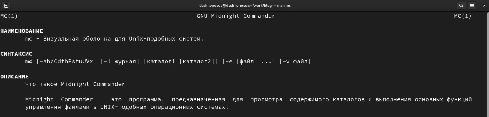{#fig:001 width=100%}

## №2
2. Запустите из командной строки mc, изучите его структуру и меню

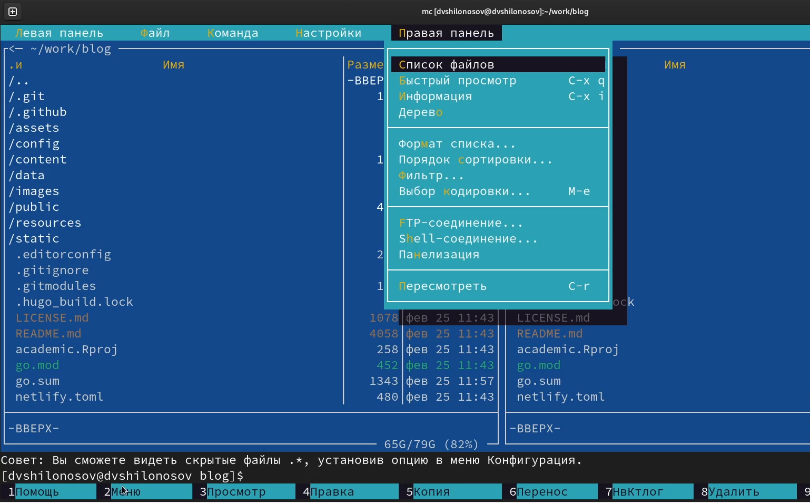{#fig:002 width=100%}

## №3
3. Выполните несколько операций в mc, используя управляющие клавиши (операции с панелями; выделение/отмена выделения файлов, копирование/перемещение файлов, получение информации о размере и правах доступа на файлы и/или каталоги и т.п.)

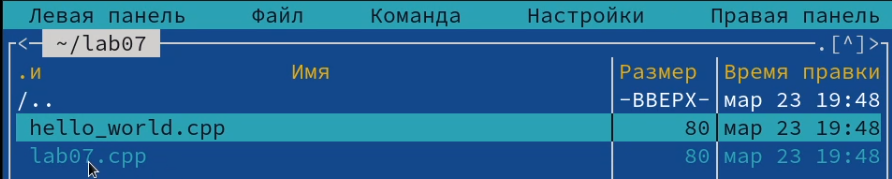{#fig:003 width=100%}

## №4
4. Выполните основные команды меню левой (или правой) панели. Оцените степень подробности вывода информации о файлах

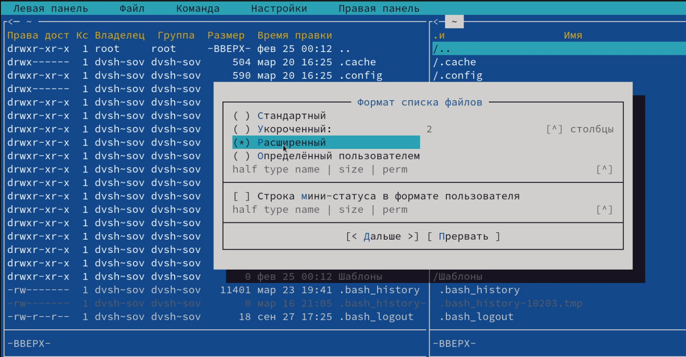{#fig:004 width=100%}

## №5.1
5. Используя возможности подменю Файл , выполните:
   - просмотр содержимого текстового файла;
   
   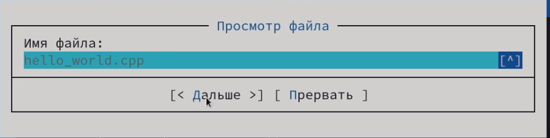{#fig:005 width=100%}

## №5.2
   - редактирование содержимого текстового файла (без сохранения результатов редактирования);
   
   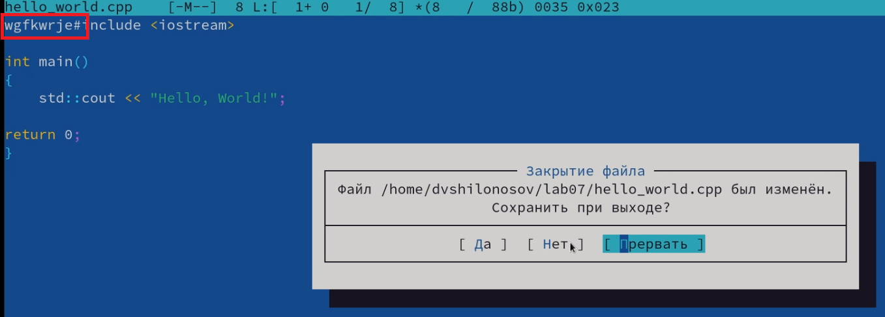{#fig:006 width=100%}

## №5.3
   - создание каталога;
   
   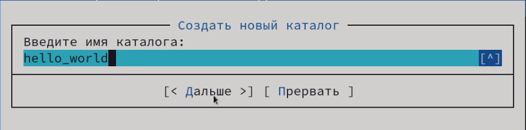{#fig:007 width=100%}

## №5.4
   - копирование в файлов в созданный каталог.
   
   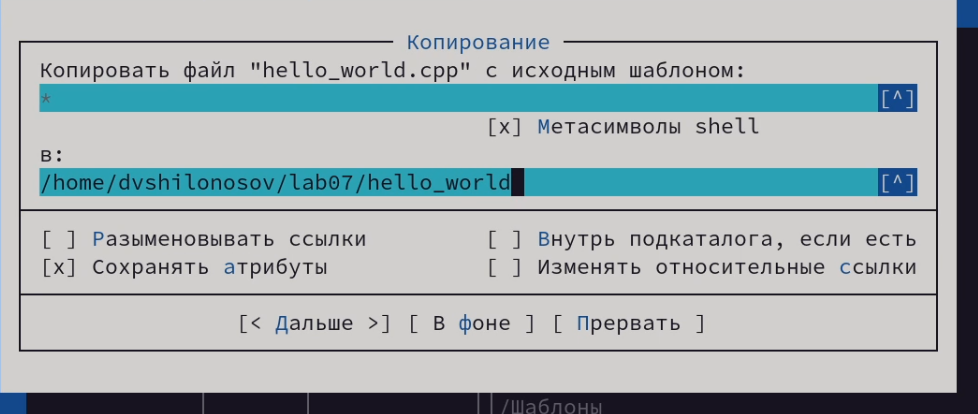{#fig:008 width=100%}

## №6.1
6. С помощью соответствующих средств подменю Команда осуществите:
   - поиск в файловой системе файла с заданными условиями (например, файла с расширением .c или .cpp, содержащего строку main);
   
   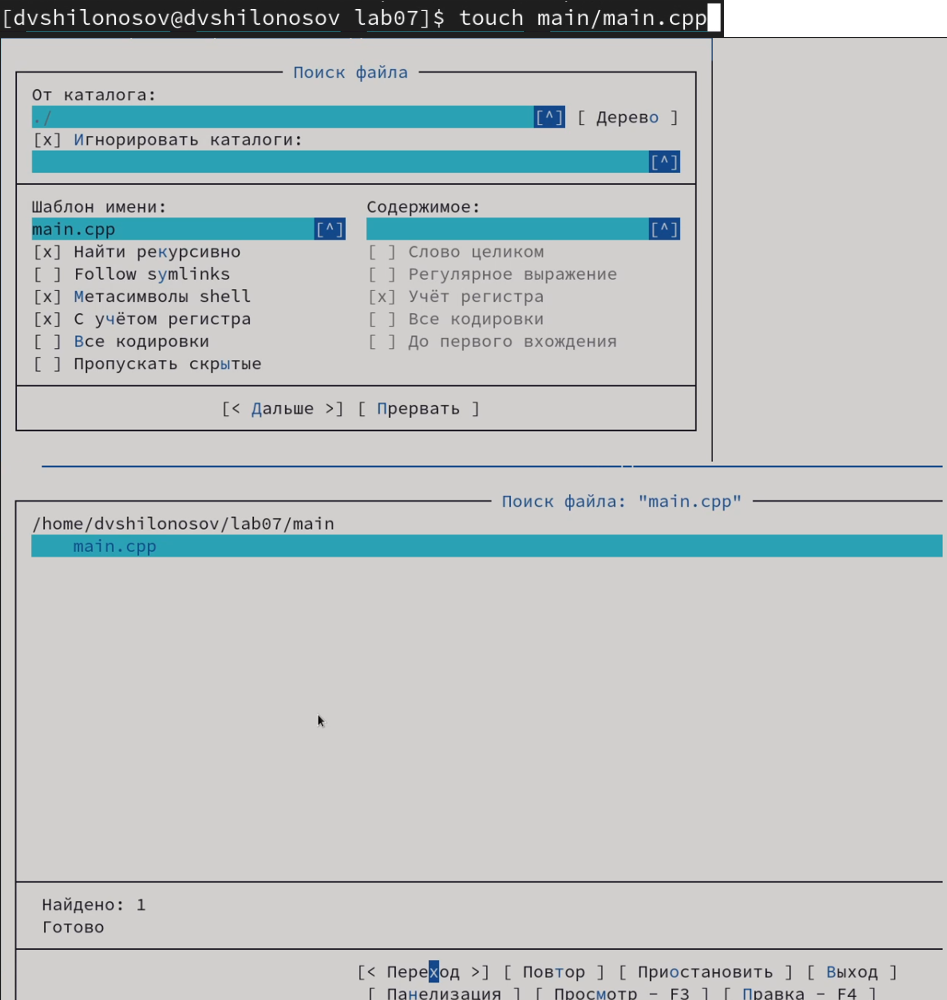{#fig:009 width=100%}

## №6.2  
   - выбор и повторение одной из предыдущих команд;
   
   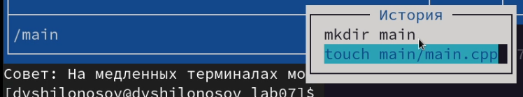{#fig:010 width=100%}

## №6.3  
   - переход в домашний каталог;
   
   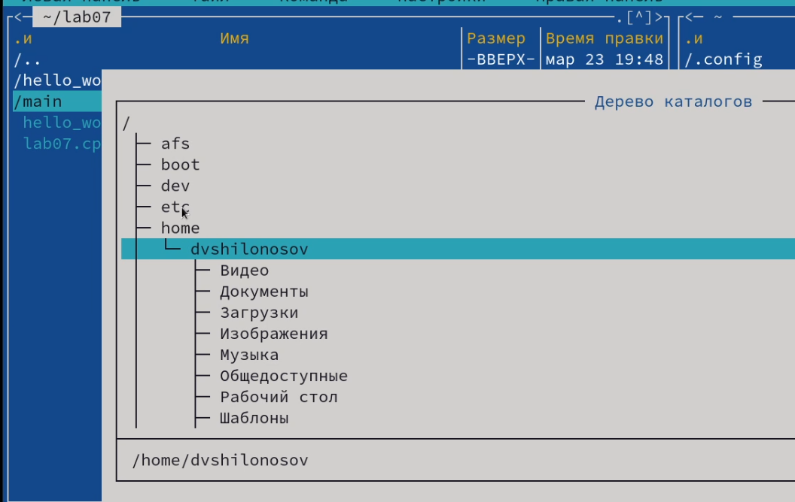{#fig:011 width=100%}

## №6.4   
   - анализ файла меню и файла расширений.
   
   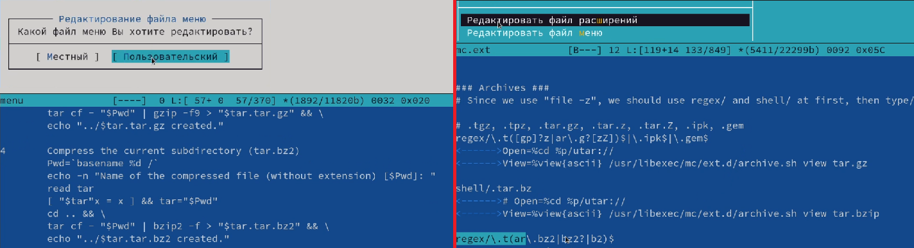{#fig:012 width=100%}

## №7   
7. Вызовите подменю Настройки . Освойте операции, определяющие структуру экрана mc (Full screen, Double Width, Show Hidden Files и т.д.)

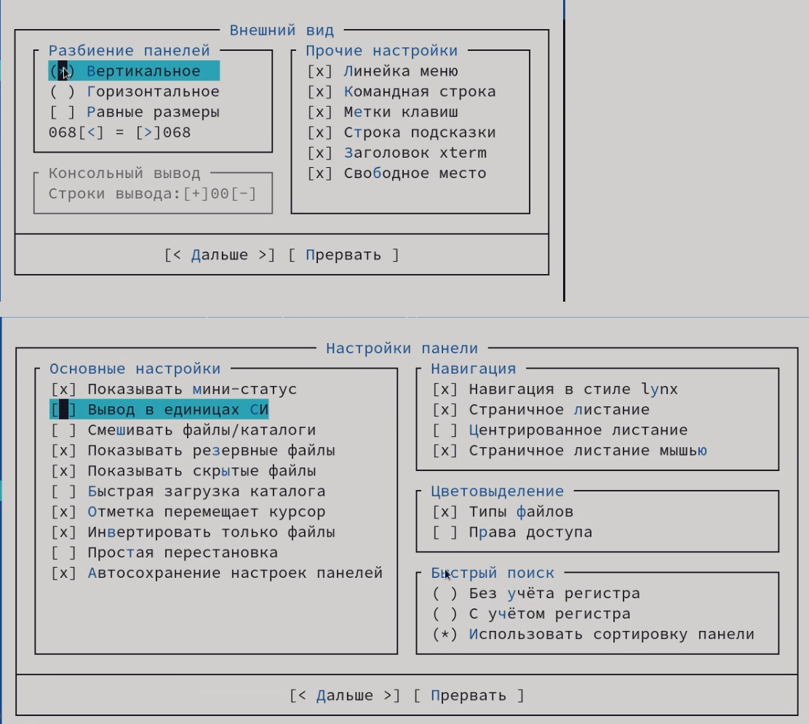{#fig:013 width=100%}

## №8
8. Создайте текстовой файл text.txt.

{#fig:014 width=100%}

## №9
9. Откройте этот файл с помощью встроенного в mc редактора.

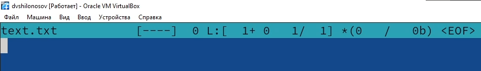{#fig:015 width=100%}

## №10
10. Вставьте в открытый файл небольшой фрагмент текста, скопированный из любого другого файла или Интернета.

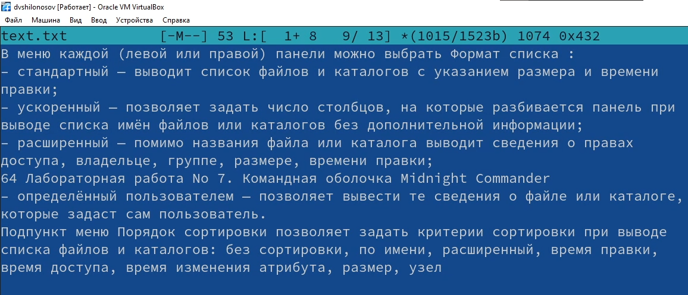{#fig:016 width=100%}

## №11.1
11. Проделайте с текстом следующие манипуляции, используя горячие клавиши:
   1. Удалите строку текста.
   
   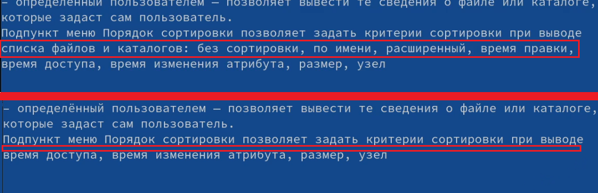{#fig:017 width=100%}
  
## №11.2
   2. Выделите фрагмент текста и скопируйте его на новую строку.
   
   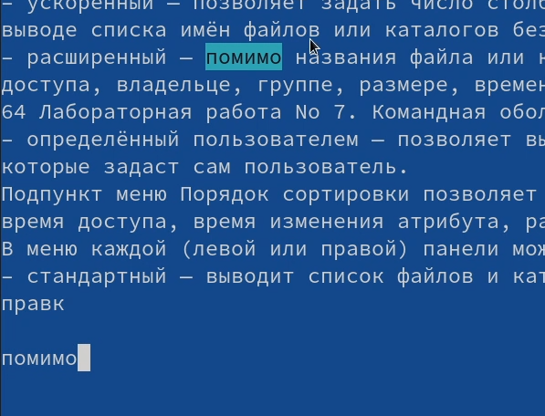{#fig:018 width=100%}
   
## №11.3
   3. Выделите фрагмент текста и перенесите его на новую строку.
   
   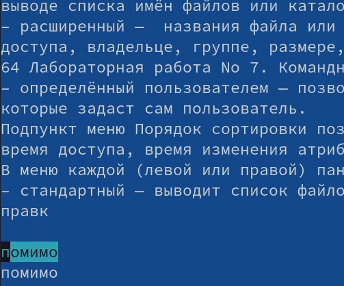{#fig:019 width=100%}
   
## №11.4
   4. Сохраните файл.
   
   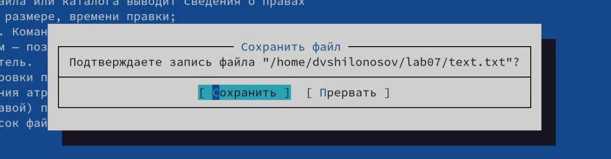{#fig:020 width=100%}
   
## №11.5
   5. Отмените последнее действие.
   
   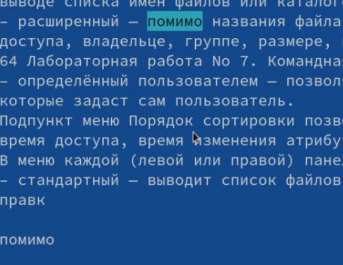{#fig:021 width=100%}
   
## №11.6
   6. Перейдите в конец файла (нажав комбинацию клавиш) и напишите некоторый текст.
   
   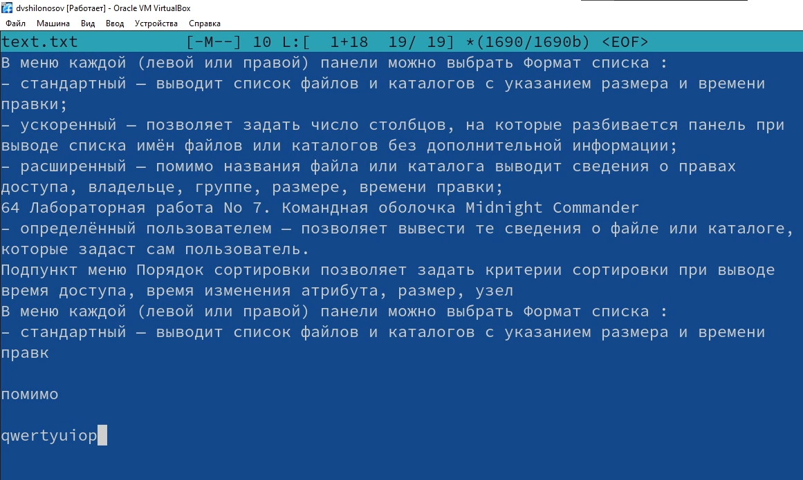{#fig:022 width=100%}
   
## №11.7
   7. Перейдите в начало файла (нажав комбинацию клавиш) и напишите некоторый текст.
   
   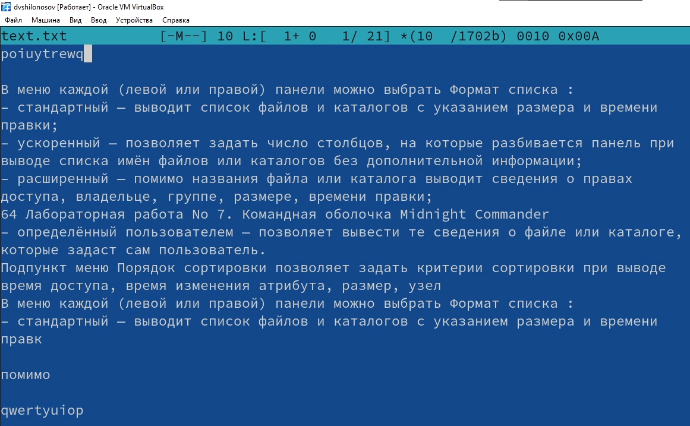{#fig:023 width=100%}
   
## №11.8
   8. Сохраните и закройте файл.
   
   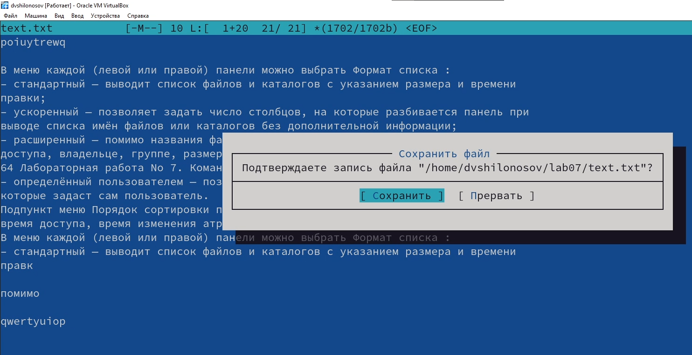{#fig:024 width=100%}

## №12
12. Откройте файл с исходным текстом на некотором языке программирования (например C или Java).

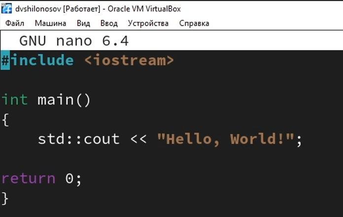{#fig:025 width=100%}

## №13
13. Используя меню редактора, включите подсветку синтаксиса, если она не включена, или выключите, если она включена.

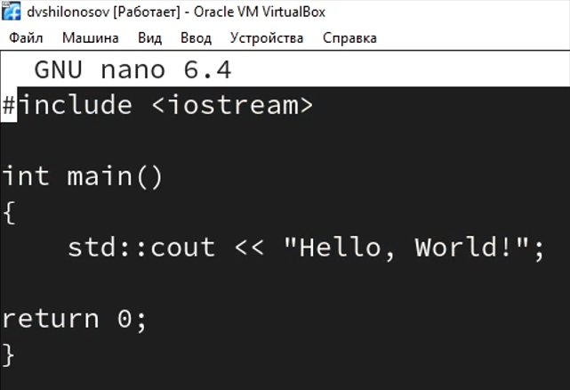{#fig:026 width=100%}

# Результаты

## Выводы
В процессе выполнения лабораторной работы были освоены основные возможности командной оболочки Midnight Commander, были приобретены навыки практической работы по просмотру каталогов и файлов, манипуляций с ними.
