---
## Front matter
title: "ОТЧЕТ О ВЫПОЛНЕНИИ ЛАБОРАТОРНОЙ РАБОТЫ №7"
subtitle: "_дисциплина: Операционные системы_"
author: "Шилоносов Данил Вячеславович"

## Generic otions
lang: ru-RU
toc-title: "Содержание"

## Bibliography
bibliography: bib/cite.bib
csl: pandoc/csl/gost-r-7-0-5-2008-numeric.csl```

## Pdf output format
toc: true # Table of contents
toc-depth: 2
lof: true # List of figures
lot: false # List of tables
fontsize: 12pt
linestretch: 1.5
papersize: a4
documentclass: scrreprt
## I18n polyglossia
polyglossia-lang:
  name: russian
  options:
	- spelling=modern
	- babelshorthands=true
polyglossia-otherlangs:
  name: english
## I18n babel
babel-lang: russian
babel-otherlangs: english
## Fonts
mainfont: PT Serif
romanfont: PT Serif
sansfont: PT Sans
monofont: PT Mono
mainfontoptions: Ligatures=TeX
romanfontoptions: Ligatures=TeX
sansfontoptions: Ligatures=TeX,Scale=MatchLowercase
monofontoptions: Scale=MatchLowercase,Scale=0.9
## Biblatex
biblatex: true
biblio-style: "gost-numeric"
biblatexoptions:
  - parentracker=true
  - backend=biber
  - hyperref=auto
  - language=auto
  - autolang=other*
  - citestyle=gost-numeric
## Pandoc-crossref LaTeX customization
figureTitle: "Рис."
tableTitle: "Таблица"
listingTitle: "Листинг"
lofTitle: "Список иллюстраций"
lotTitle: "Список таблиц"
lolTitle: "Листинги"
## Misc options
indent: true
header-includes:
  - \usepackage{indentfirst}
  - \usepackage{float} # keep figures where there are in the text
  - \floatplacement{figure}{H} # keep figures where there are in the text
---

# Цель работы
Освоение основных возможностей командной оболочки Midnight Commander. Приобретение навыков практической работы по просмотру каталогов и файлов, манипуляций с ними.

# Задачи

## Задание по mc
1. Изучите информацию о mc, вызвав в командной строке man mc.
2. Запустите из командной строки mc, изучите его структуру и меню.
3. Выполните несколько операций в mc, используя управляющие клавиши (операции с панелями; выделение/отмена выделения файлов, копирование/перемещение файлов, получение информации о размере и правах доступа на файлы и/или каталоги и т.п.)
4. Выполните основные команды меню левой (или правой) панели. Оцените степень подробности вывода информации о файлах.
5. Используя возможности подменю Файл , выполните:
   - просмотр содержимого текстового файла;
   - редактирование содержимого текстового файла (без сохранения результатов редактирования);
   - создание каталога;
   - копирование в файлов в созданный каталог.
6. С помощью соответствующих средств подменю Команда осуществите:
   - поиск в файловой системе файла с заданными условиями (например, файла с расширением .c или .cpp, содержащего строку main);
   - выбор и повторение одной из предыдущих команд;
   - переход в домашний каталог;
   - анализ файла меню и файла расширений.
7. Вызовите подменю Настройки . Освойте операции, определяющие структуру экрана mc (Full screen, Double Width, Show Hidden Files и т.д.)

## Задание по встроенному редактору mc
1. Создайте текстовой файл text.txt.
2. Откройте этот файл с помощью встроенного в mc редактора.
3. Вставьте в открытый файл небольшой фрагмент текста, скопированный из любого другого файла или Интернета.
4. Проделайте с текстом следующие манипуляции, используя горячие клавиши:
   1. Удалите строку текста.
   2. Выделите фрагмент текста и скопируйте его на новую строку.
   3. Выделите фрагмент текста и перенесите его на новую строку.
   4. Сохраните файл.
   5. Отмените последнее действие.
   6. Перейдите в конец файла (нажав комбинацию клавиш) и напишите некоторый текст.
   7. Перейдите в начало файла (нажав комбинацию клавиш) и напишите некоторый текст.
   8. Сохраните и закройте файл.
5. Откройте файл с исходным текстом на некотором языке программирования (например C или Java).
6. Используя меню редактора, включите подсветку синтаксиса, если она не включена, или выключите, если она включена.
    
# Теоретическое введение
## Общие сведения
Командная оболочка — интерфейс взаимодействия пользователя с операционной системой и программным обеспечением посредством команд. Midnight Commander (или mc) — псевдографическая командная оболочка для UNIX/Linux систем. Для запуска mc необходимо в командной строке набрать mc и нажать Enter. Рабочее пространство mc имеет две панели, отображающие по умолчанию списки файлов двух каталогов.

## Режимы отображения панелей и управление ими
Панель в mc отображает список файлов текущего каталога. Абсолютный путь к этому каталогу отображается в заголовке панели. У активной панели заголовок и одна из её строк подсвечиваются. Управление панелями осуществляется с помощью определённых комбинаций клавиш или пунктов меню mc. Панели можно поменять местами. Для этого и используется комбинация клавиш Ctrl-u или команда меню mc Переставить панели . Также можно временно убрать отображение панелей (отключить их) с помощью комбинации клавиш Ctrl-o или команды меню mc Отключить панели. Это может быть полезно, например, если необходимо увидеть вывод какой-то информации на экран после выполнения какой-либо команды shell.
С помощью последовательного применения комбинации клавиш Ctrl-x d есть возможность сравнения каталогов, отображённых на двух панелях. Панели могут дополнительно быть переведены в один из двух режимов: Информация или Дерево. В режиме Информация на панель выводятся сведения о файле и текущей файловой системе, расположенных на активной панели. В режиме Дерево на одной из панелей выводится структура дерева каталогов.
Управлять режимами отображения панелей можно через пункты меню mc Правая панель и Левая панель.

## Меню панелей
Перейти в строку меню панелей mc можно с помощью функциональной клавиши F9.
В строке меню имеются пять меню: Левая панель , Файл , Команда , Настройки и Правая панель.
В меню каждой (левой или правой) панели можно выбрать Формат списка:
– стандартный — выводит список файлов и каталогов с указанием размера и времени правки;
– ускоренный — позволяет задать число столбцов, на которые разбивается панель при выводе списка имён файлов или каталогов без дополнительной информации;
– расширенный — помимо названия файла или каталога выводит сведения о правах доступа, владельце, группе, размере, времени правки;
– определённый пользователем — позволяет вывести те сведения о файле или каталоге, которые задаст сам пользователь.
Подпункт меню Порядок сортировки позволяет задать критерии сортировки при выводе списка файлов и каталогов: без сортировки, по имени, расширенный, время правки, время доступа, время изменения атрибута, размер, узел.

### Меню Файл
В меню Файл содержит перечень команд, которые могут быть применены к одному или нескольким файлам или каталогам.
Команды меню Файл :
– Просмотр ( F3 ) — позволяет посмотреть содержимое текущего (или выделенного) файла без возможности редактирования.
– Просмотр вывода команды ( М + ! ) — функция запроса команды с параметрами (аргумент к текущему выбранному файлу).
– Правка ( F4 ) — открывает текущий (или выделенный) файл для его редактирования.
– Копирование ( F5 ) — осуществляет копирование одного или нескольких файлов или каталогов в указанное пользователем во всплывающем окне место.
– Права доступа ( Ctrl-x c ) — позволяет указать (изменить) права доступа к одному или нескольким файлам или каталогам 
– Жёсткая ссылка ( Ctrl-x l ) — позволяет создать жёсткую ссылку к текущему (или
выделенному) файлу1.
– Символическая ссылка ( Ctrl-x s ) — позволяет создать символическую ссылку к текущему (или выделенному) файлу2.
– Владелец/группа ( Ctrl-x o ) — позволяет задать (изменить) владельца и имя группы для одного или нескольких файлов или каталогов.
– Права (расширенные) — позволяет изменить права доступа и владения для одного или нескольких файлов или каталогов.
– Переименование ( F6 ) — позволяет переименовать (или переместить) один или несколько файлов или каталогов.
– Создание каталога ( F7 ) — позволяет создать каталог.
– Удалить ( F8 ) — позволяет удалить один или несколько файлов или каталогов.
– Выход ( F10 ) — завершает работу mc.

### Меню Команда
В меню Команда содержатся более общие команды для работы с mc.
Команды меню Команда :
– Дерево каталогов — отображает структуру каталогов системы.
– Поиск файла — выполняет поиск файлов по заданным параметрам.
– Переставить панели — меняет местами левую и правую панели.
– Сравнить каталоги ( Ctrl-x d ) — сравнивает содержимое двух каталогов.
– Размеры каталогов — отображает размер и время изменения каталога (по умолчанию в mc размер каталога корректно не отображается).
– История командной строки — выводит на экран список ранее выполненных в оболочке команд.
– Каталоги быстрого доступа ( Ctrl-\ ) — пр вызове выполняется быстрая смена текущего каталога на один из заданного списка.
– Восстановление файлов — позволяет восстановить файлы на файловых системах ext2 и ext3.
– Редактировать файл расширений — позволяет задать с помощью определённого синтаксиса действия при запуске файлов с определённым расширением (например, какое программного обеспечение запускать для открытия или редактирования файлов с расширением doc или docx).
– Редактировать файл меню — позволяет отредактировать контекстное меню пользователя, вызываемое по клавише F2 .
– Редактировать файл расцветки имён — позволяет подобрать оптимальную для пользователя расцветку имён файлов в зависимости от их типа.

### Меню Настройки
Меню Настройки содержит ряд дополнительных опций по внешнему виду и функциональности mc.
Меню Настройки содержит:
– Конфигурация — позволяет скорректировать настройки работы с панелями.
– Внешний вид и Настройки панелей — определяет элементы (строка меню, командная строка, подсказки и прочее), отображаемые при вызове mc, а также геометрию расположения панелей и цветовыделение.
– Биты символов — задаёт формат обработки информации локальным терминалом.
– Подтверждение — позволяет установить или убрать вывод окна с запросом подтверждения действий при операциях удаления и перезаписи файлов, а также при выходе из программы.
– Распознание клавиш — диалоговое окно используется для тестирования функциональных клавиш, клавиш управления курсором и прочее.
– Виртуальные ФС –– настройки виртуальной файловой системы: тайм-аут, пароль и прочее.

## Редактор mc
Встроенный в mc редактор вызывается с помощью функциональной клавиши F4 . В нём
удобно использовать различные комбинации клавиш при редактировании содержимого
(как правило текстового) файла

# Выполнение лабораторной работы
## Задание по mc
1. Изучите информацию о mc, вызвав в командной строке man mc (рис. [-@fig:001])

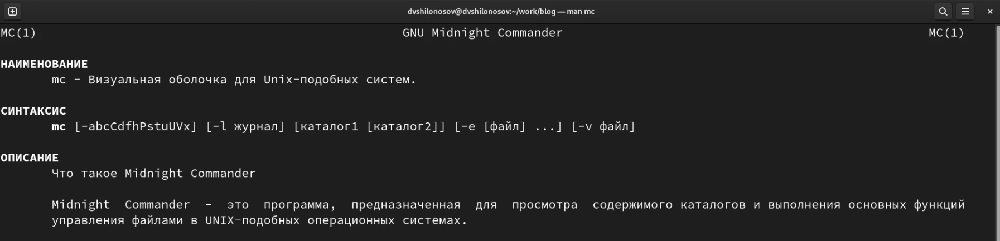{#fig:001 width=100%}

2. Запустите из командной строки mc, изучите его структуру и меню (рис. [-@fig:002])

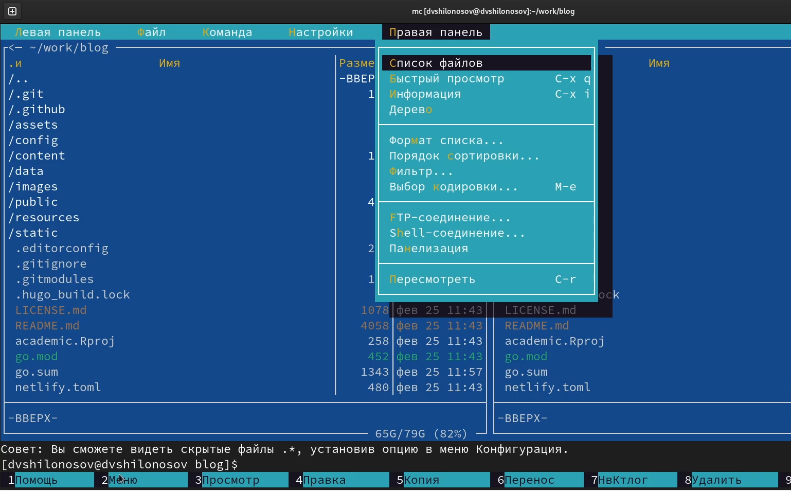{#fig:002 width=100%}

3. Выполните несколько операций в mc, используя управляющие клавиши (операции с панелями; выделение/отмена выделения файлов, копирование/перемещение файлов, получение информации о размере и правах доступа на файлы и/или каталоги и т.п.) (рис. [-@fig:003])

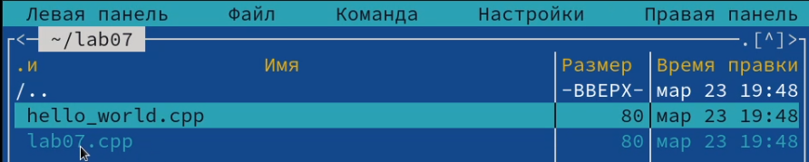{#fig:003 width=100%}

4. Выполните основные команды меню левой (или правой) панели. Оцените степень подробности вывода информации о файлах (рис. [-@fig:004])

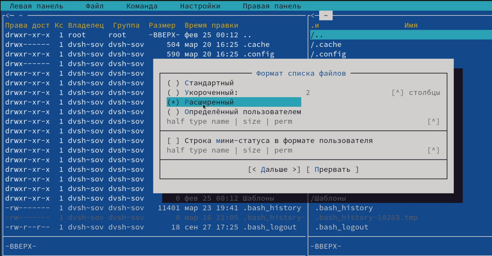{#fig:004 width=100%}

5. Используя возможности подменю Файл , выполните:
   - просмотр содержимого текстового файла; (рис. [-@fig:005])
   
   {#fig:005 width=100%}
   
   - редактирование содержимого текстового файла (без сохранения результатов редактирования); (рис. [-@fig:006])
   
   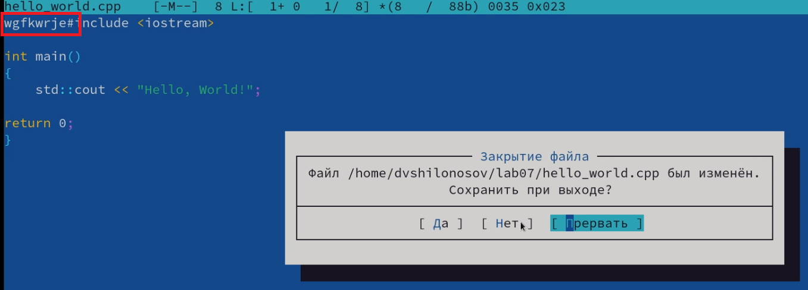{#fig:006 width=100%}
   
   - создание каталога; (рис. [-@fig:007])
   
   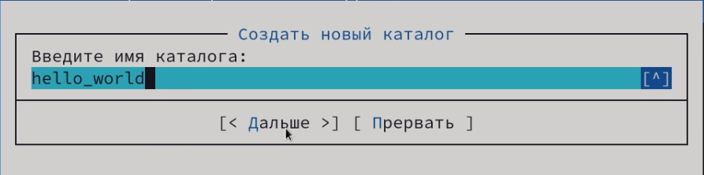{#fig:007 width=100%}
   
   - копирование в файлов в созданный каталог. (рис. [-@fig:008])
   
   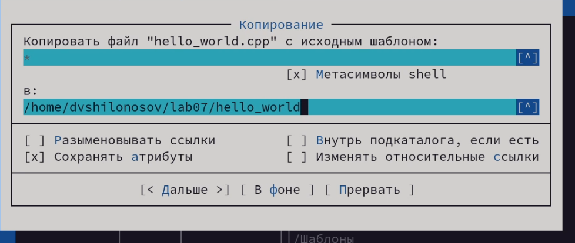{#fig:008 width=100%}
   
6. С помощью соответствующих средств подменю Команда осуществите:
   - поиск в файловой системе файла с заданными условиями (например, файла с расширением .c или .cpp, содержащего строку main); (рис. [-@fig:009])
   
   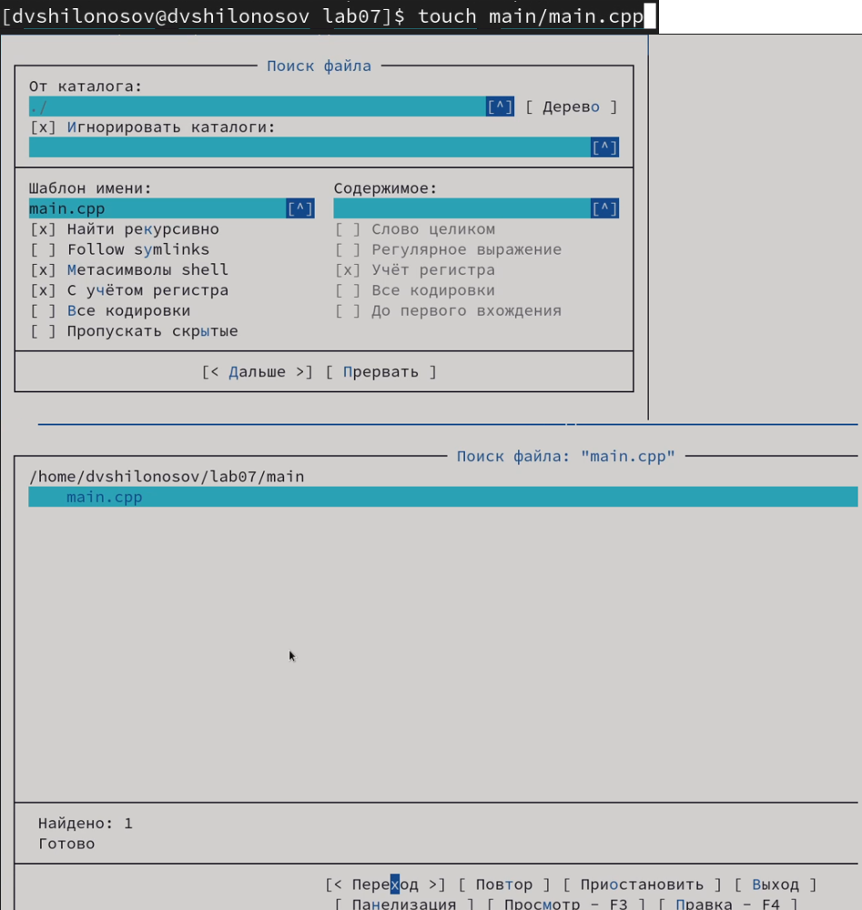{#fig:009 width=100%}
   
   - выбор и повторение одной из предыдущих команд; (рис. [-@fig:010])
   
   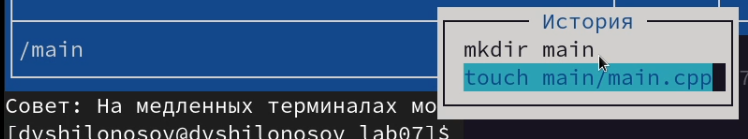{#fig:010 width=100%}
   
   - переход в домашний каталог; (рис. [-@fig:011])
   
   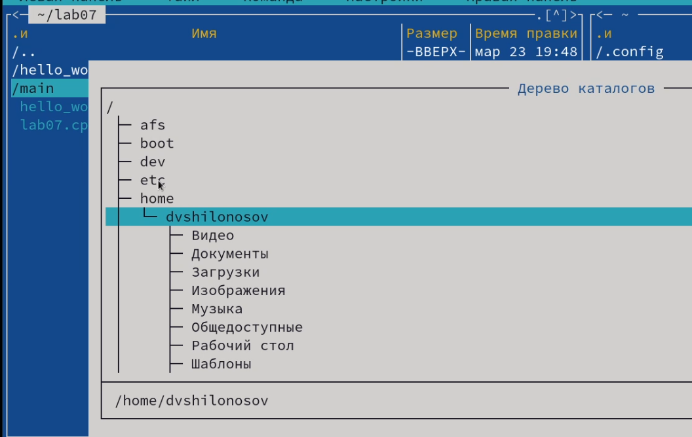{#fig:011 width=100%}
   
   - анализ файла меню и файла расширений. (рис. [-@fig:012])
   
   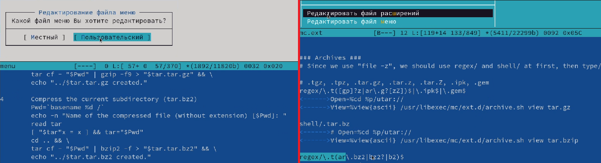{#fig:012 width=100%}
   
7. Вызовите подменю Настройки . Освойте операции, определяющие структуру экрана mc (Full screen, Double Width, Show Hidden Files и т.д.) (рис. [-@fig:013])

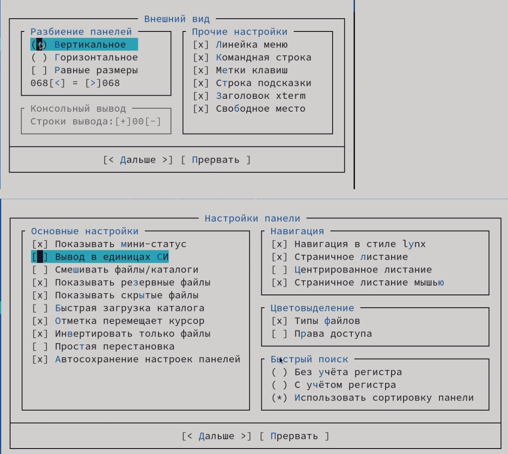{#fig:013 width=100%}

## Задание по встроенному редактору mc
8. Создайте текстовой файл text.txt. (рис. [-@fig:014])

{#fig:014 width=100%}

9. Откройте этот файл с помощью встроенного в mc редактора. (рис. [-@fig:015])

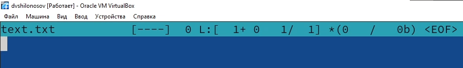{#fig:015 width=100%}

10. Вставьте в открытый файл небольшой фрагмент текста, скопированный из любого другого файла или Интернета. (рис. [-@fig:016])

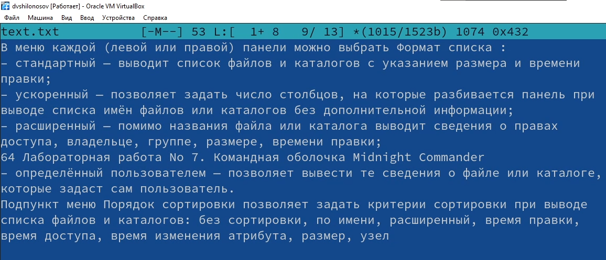{#fig:016 width=100%}

11. Проделайте с текстом следующие манипуляции, используя горячие клавиши:
   1. Удалите строку текста. (рис. [-@fig:017])
   
   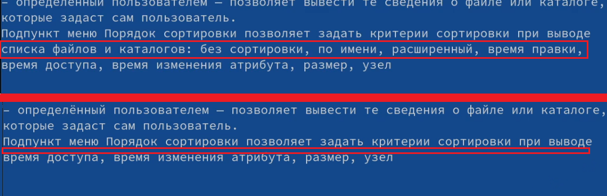{#fig:017 width=100%}
   
   2. Выделите фрагмент текста и скопируйте его на новую строку. (рис. [-@fig:018])
   
   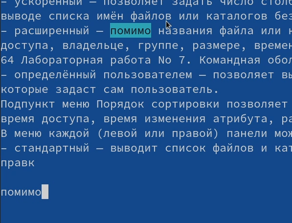{#fig:018 width=100%}
   
   3. Выделите фрагмент текста и перенесите его на новую строку. (рис. [-@fig:019])
   
   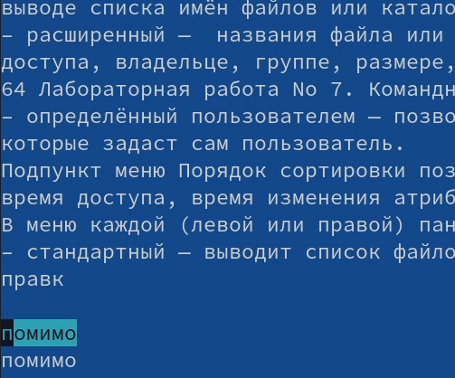{#fig:019 width=100%}
   
   4. Сохраните файл. (рис. [-@fig:020])
   
   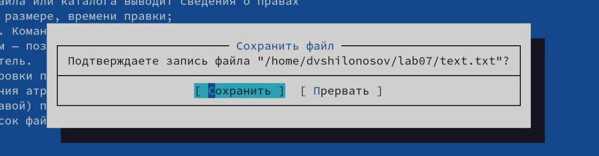{#fig:020 width=100%}
   
   5. Отмените последнее действие. (рис. [-@fig:021])
   
   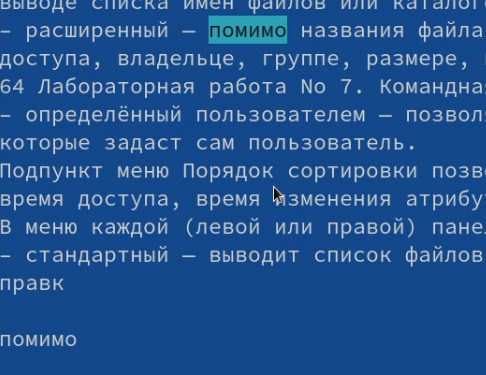{#fig:021 width=100%}
   
   6. Перейдите в конец файла (нажав комбинацию клавиш) и напишите некоторый текст. (рис. [-@fig:022])
   
   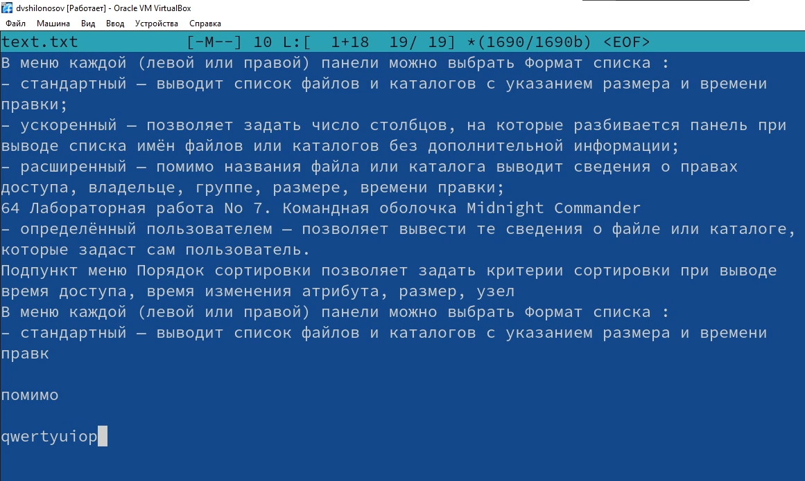{#fig:022 width=100%}
   
   7. Перейдите в начало файла (нажав комбинацию клавиш) и напишите некоторый текст. (рис. [-@fig:023])
   
   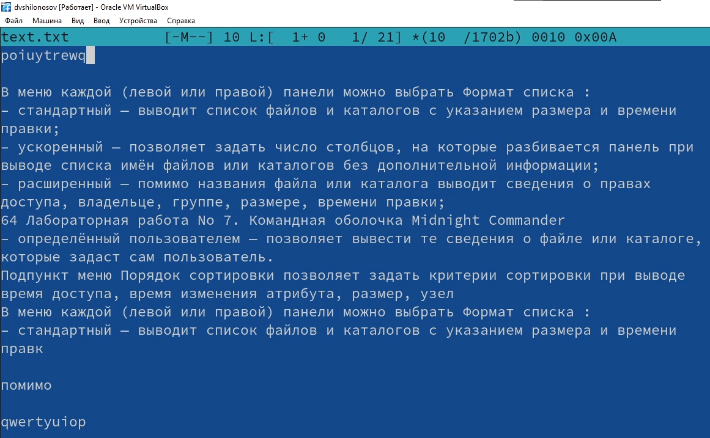{#fig:023 width=100%}
   
   8. Сохраните и закройте файл. (рис. [-@fig:024])
   
   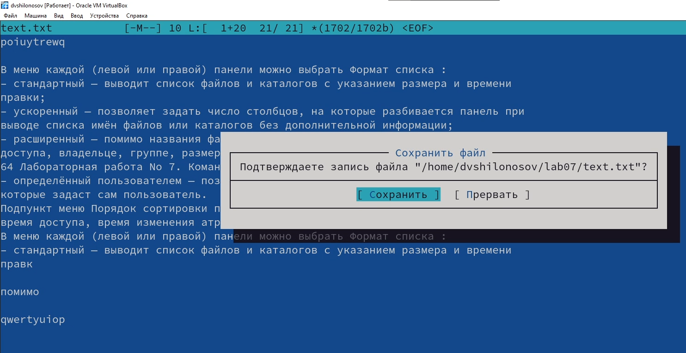{#fig:024 width=100%}
   
12. Откройте файл с исходным текстом на некотором языке программирования (например C или Java). (рис. [-@fig:025])

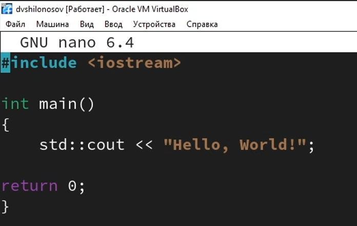{#fig:025 width=100%}

13. Используя меню редактора, включите подсветку синтаксиса, если она не включена, или выключите, если она включена. (рис. [-@fig:026])

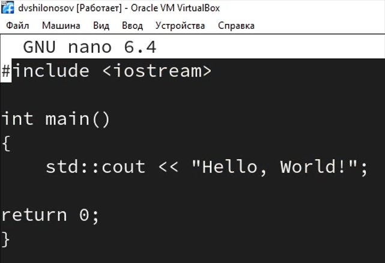{#fig:026 width=100%}

# Выводы
В процессе выполнения лабораторной работы были освоены основные возможности командной оболочки Midnight Commander, были приобретены навыки практической работы по просмотру каталогов и файлов, манипуляций с ними.
