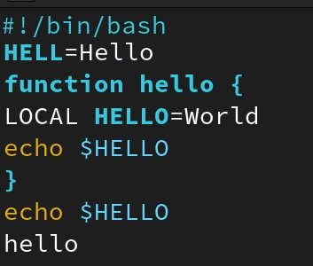
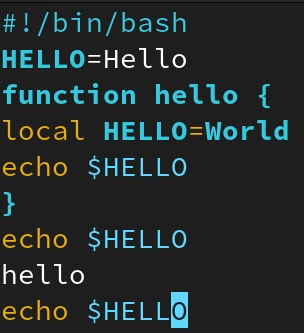

---
## Front matter
lang: ru-RU
title: Лабораторная работа №8
subtitle: Курс "Операционные Системы"
author:
  - Шилоносов Д.В., НКАбд-03-22
institute:
  - Российский университет дружбы народов, Москва, Россия
  
date: 30 марта 2023

## i18n babel
babel-lang: russian
babel-otherlangs: english

## Formatting pdf
toc: false
toc-title: Содержание
slide_level: 2
aspectratio: 169
section-titles: true
theme: metropolis
header-includes:
 - \metroset{progressbar=frametitle,sectionpage=progressbar,numbering=fraction}
 - '\makeatletter'
 - '\beamer@ignorenonframefalse'
 - '\makeatother'
---

# Информация

## Докладчик

:::::::::::::: {.columns align=center}
::: {.column width="70%"}

  * Шилоносов Данил Вячеславович
  * студент группы НКАбд-03-22
  * кафедры Компьютерные и информационные науки 
  * Российский университет дружбы народов
  * [1132221810@pfur.ru](mailto:1132221810@pfur.ru)
  

:::
::: {.column width="30%"}


:::
::::::::::::::

## Цель работы
Получение практических навыков работы с редактором vi, установленным по умолчанию практически во всех дистрибутивах.

## Задачи
1. Ознакомиться с теоретическим материалом.
2. Ознакомиться с редактором vi.
3. Выполнить упражнения, используя команды vi.
   
# Выполнение лабораторной работы
## Задание 1. Создание нового файла с использованием vi
1. Создадим каталог с именем ~/work/os/lab06;
2. Перейдем во вновь созданный каталог;
3. Вызовем vi и создадим файл hello.sh;
```bash
vi hello.sh
```

## Задание 1. Создание нового файла с использованием vi
4. Нажмем клавишу i и введем следующий текст 
```bash
#!/bin/bash
HELL=Hello
function hello {
LOCAL HELLO=World
echo $HELLO
}
echo $HELLO
hello
```

## Задание 1. Создание нового файла с использованием vi
5. Нажмем клавишу Esc для перехода в командный режим после завершения ввода
текста;
6. Нажмем : для перехода в режим последней строки и внизу нашего экрана появится
приглашение в виде двоеточия;
7. Нажмем w (записать) и q (выйти), а затем нажмем клавишу Enter для сохранения
нашего текста и завершения работы

{#fig:001 width=35%}

## Задание 1. Создание нового файла с использованием vi
8. Сделаем файл исполняемым и проверим изменение с помощью команд
```bash
chmod +x hello.sh
ls -l
```

## Задание 2. Редактирование существующего файла
1. Вызовите vi на редактирование файла
```bash
vi ~/work/os/lab08/hello.sh
```
2. Установим курсор в конец слова HELL второй строки;
3. Перейдем в режим вставки и заменим на HELLO. Нажмем Esc для возврата в командный режим;
4. Установим курсор на четвертую строку и сотрите слово LOCAL;
5. Перейдем в режим вставки и наберите следующий текст: local, нажмем Esc для возврата в командный режим;
6. Установим курсор на последней строке файла. Вставим после неё строку, содержащую следующий текст: echo $HELLO;
7. Нажмем Esc для перехода в командный режим;
8. Удалим последнюю строку;


## Задание 2. Редактирование существующего файла
9. Введем команду отмены изменений u для отмены последней команды;
10. Введем символ : для перехода в режим последней строки. Запишем произведённые изменения и выйдем из vi.

Итого

{#fig:002 width=28%}

# Результаты

## Выводы
В процессе выполнения лабораторной работы получены практические навыки работы с редактором vi, установленным по умолчанию практически во всех дистрибутивах.
