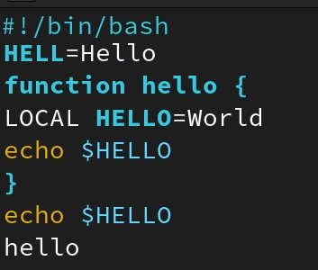
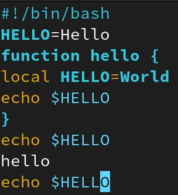

---
## Front matter
title: "ОТЧЕТ О ВЫПОЛНЕНИИ ЛАБОРАТОРНОЙ РАБОТЫ №8"
subtitle: "_дисциплина: Операционные системы_"
author: "Шилоносов Данил Вячеславович"

## Generic otions
lang: ru-RU
toc-title: "Содержание"

## Bibliography
bibliography: bib/cite.bib
csl: pandoc/csl/gost-r-7-0-5-2008-numeric.csl```

## Pdf output format
toc: true # Table of contents
toc-depth: 2
lof: true # List of figures
lot: false # List of tables
fontsize: 12pt
linestretch: 1.5
papersize: a4
documentclass: scrreprt
## I18n polyglossia
polyglossia-lang:
  name: russian
  options:
	- spelling=modern
	- babelshorthands=true
polyglossia-otherlangs:
  name: english
## I18n babel
babel-lang: russian
babel-otherlangs: english
## Fonts
mainfont: PT Serif
romanfont: PT Serif
sansfont: PT Sans
monofont: PT Mono
mainfontoptions: Ligatures=TeX
romanfontoptions: Ligatures=TeX
sansfontoptions: Ligatures=TeX,Scale=MatchLowercase
monofontoptions: Scale=MatchLowercase,Scale=0.9
## Biblatex
biblatex: true
biblio-style: "gost-numeric"
biblatexoptions:
  - parentracker=true
  - backend=biber
  - hyperref=auto
  - language=auto
  - autolang=other*
  - citestyle=gost-numeric
## Pandoc-crossref LaTeX customization
figureTitle: "Рис."
tableTitle: "Таблица"
listingTitle: "Листинг"
lofTitle: "Список иллюстраций"
lotTitle: "Список таблиц"
lolTitle: "Листинги"
## Misc options
indent: true
header-includes:
  - \usepackage{indentfirst}
  - \usepackage{float} # keep figures where there are in the text
  - \floatplacement{figure}{H} # keep figures where there are in the text
---

# Цель работы
Получение практических навыков работы с редактором vi, установленным по умолчанию практически во всех дистрибутивах.

# Задачи
1. Ознакомиться с теоретическим материалом.
2. Ознакомиться с редактором vi.
3. Выполнить упражнения, используя команды vi.
    
# Теоретическое введение
## Указания к работе
В большинстве дистрибутивов Linux в качестве текстового редактора по умолчанию устанавливается интерактивный экранный редактор vi (Visual display editor).
Редактор vi имеет три режима работы:
- командный режим — предназначен для ввода команд редактирования и навигации по редактируемому файлу;
- режим вставки — предназначен для ввода содержания редактируемого файла;
- режим последней (или командной) строки — используется для записи изменений в файл и выхода из редактора.

Для вызова редактора vi необходимо указать команду vi и имя редактируемого файла: vi <имя_файла>
При этом в случае отсутствия файла с указанным именем будет создан такой файл.
Переход в командный режим осуществляется нажатием клавиши Esc . Для выхода из редактора vi необходимо перейти в режим последней строки: находясь в командном режиме, нажать Shift-; (по сути символ : — двоеточие), затем:
- набрать символы wq, если перед выходом из редактора требуется записать изменения в файл;
- набрать символ q (или q!), если требуется выйти из редактора без сохранения.

**Замечание**. Следует помнить, что vi различает прописные и строчные буквы при наборе (восприятии) команд.

## Основные группы команд редактора
### Команды позиционирования
- 0 (ноль) — переход в начало строки;
- $ — переход в конец строки;
- G — переход в конец файла;
- n G — переход на строку с номером n.

### Команды перемещения по файлу
- Ctrl-d — перейти на пол-экрана вперёд;
- Ctrl-u — перейти на пол-экрана назад;
- Ctrl-f — перейти на страницу вперёд;
- Ctrl-b — перейти на страницу назад.

### Команды перемещения по словам1
- W или w — перейти на слово вперёд;
- n W или n w — перейти на n слов вперёд;
- b или B — перейти на слово назад;
- n b или n B — перейти на n слов назад.

## Команды редактирования
### Вставка текста
- а — вставить текст после курсора;
- А — вставить текст в конец строки;
- i — вставить текст перед курсором;
- n i — вставить текст n раз;
- I — вставить текст в начало строки.

### Вставка строки
- о — вставить строку под курсором;
- О — вставить строку над курсором.

### Удаление текста
- x — удалить один символ в буфер;
- d w — удалить одно слово в буфер;
- d $ — удалить в буфер текст от курсора до конца строки;
- d 0 — удалить в буфер текст от начала строки до позиции курсора;
- d d — удалить в буфер одну строку;
- n d d — удалить в буфер n строк.

### Отмена и повтор произведённых изменений
- u — отменить последнее изменение;
- . — повторить последнее изменение.

### Копирование текста в буфер
- Y — скопировать строку в буфер;
- n Y — скопировать n строк в буфер;
- y w — скопировать слово в буфер.

### Вставка текста из буфера
- p — вставить текст из буфера после курсора;
- P — вставить текст из буфера перед курсором.

### Замена текста
- c w — заменить слово;
- n c w — заменить n слов;
- c $ — заменить текст от курсора до конца строки;
- r — заменить слово;
- R — заменить текст.

### Поиск текста
- / текст — произвести поиск вперёд по тексту указанной строки символов текст;
- ? текст — произвести поиск назад по тексту указанной строки символов текст.

## Команды редактирования в режиме командной строки
### Копирование и перемещение текста
- : n,m d — удалить строки с n по m;
- : i,j m k — переместить строки с i по j, начиная со строки k;
- : i,j t k — копировать строки с i по j в строку k;
- : i,j w имя-файла — записать строки с i по j в файл с именем имя-файла.

### Запись в файл и выход из редактора
- : w — записать изменённый текст в файл, не выходя из vi;
- : w имя-файла — записать изменённый текст в новый файл с именем имя-файла;
- : w ! имя-файла — записать изменённый текст в файл с именем имя-файла;
- : w q — записать изменения в файл и выйти из vi;
- : q — выйти из редактора vi;
- : q ! — выйти из редактора без записи;
- : e ! — вернуться в командный режим, отменив все изменения, произведённые
со времени последней записи.

## Опции
Опции редактора vi позволяют настроить рабочую среду. Для задания опций используется команда set (в режиме последней строки):
- <:> set all — вывести полный список опций;
- <:> set nu — вывести номера строк;
- `:` set list — вывести невидимые символы;
- <kbd>:</kbd> set ic — не учитывать при поиске, является ли символ прописным или строчным.
Если вы хотите отказаться от использования опции, то в команде set перед именем опции надо поставить no.


# Выполнение лабораторной работы
## Задание 1. Создание нового файла с использованием vi
1. Создадим каталог с именем ~/work/os/lab06;
2. Перейдем во вновь созданный каталог;
3. Вызовем vi и создадим файл hello.sh;
```bash
vi hello.sh
```
4. Нажмем клавишу i и введем следующий текст 
```bash
#!/bin/bash
HELL=Hello
function hello {
LOCAL HELLO=World
echo $HELLO
}
echo $HELLO
hello
```
5. Нажмем клавишу Esc для перехода в командный режим после завершения ввода
текста;
6. Нажмем : для перехода в режим последней строки и внизу нашего экрана появится
приглашение в виде двоеточия;
7. Нажмем w (записать) и q (выйти), а затем нажмем клавишу Enter для сохранения
нашего текста и завершения работы (рис. [-@fig:001])

{#fig:001 width=45%}

8. Сделаем файл исполняемым и проверим изменение с помощью команд (рис. [-@fig:002])
```bash
chmod +x hello.sh
ls -l
```

## Задание 2. Редактирование существующего файла
1. Вызовите vi на редактирование файла
```bash
vi ~/work/os/lab08/hello.sh
```
2. Установим курсор в конец слова HELL второй строки;
3. Перейдем в режим вставки и заменим на HELLO. Нажмем Esc для возврата в командный режим;
4. Установим курсор на четвертую строку и сотрите слово LOCAL;
5. Перейдем в режим вставки и наберите следующий текст: local, нажмем Esc для возврата в командный режим;
6. Установим курсор на последней строке файла. Вставим после неё строку, содержащую следующий текст: echo $HELLO;
7. Нажмем Esc для перехода в командный режим;
8. Удалим последнюю строку;
9. Введем команду отмены изменений u для отмены последней команды;
10. Введем символ : для перехода в режим последней строки. Запишем произведённые изменения и выйдем из vi.
Итого (рис. [-@fig:002])

{#fig:002 width=45%}

# Выводы
В процессе выполнения лабораторной работы получены практические навыки работы с редактором vi, установленным по умолчанию практически во всех дистрибутивах.
