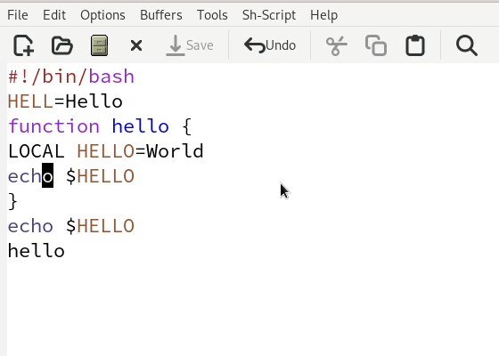
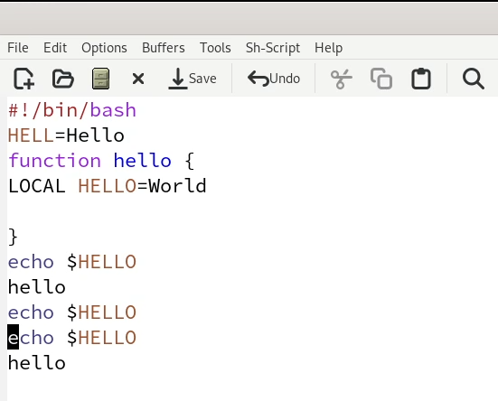
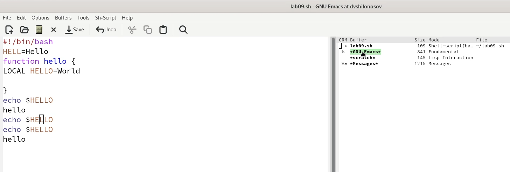
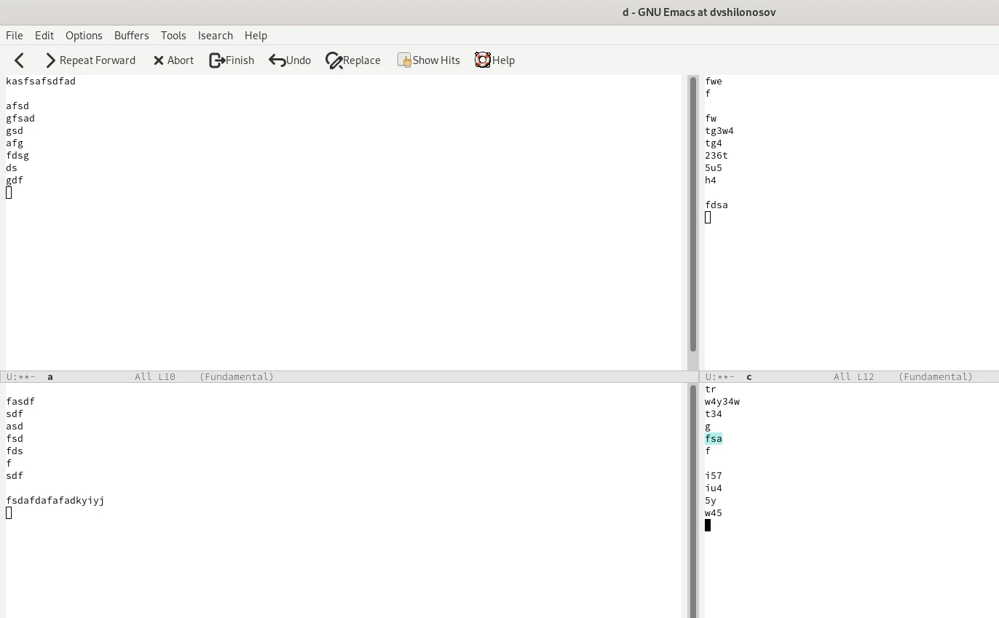
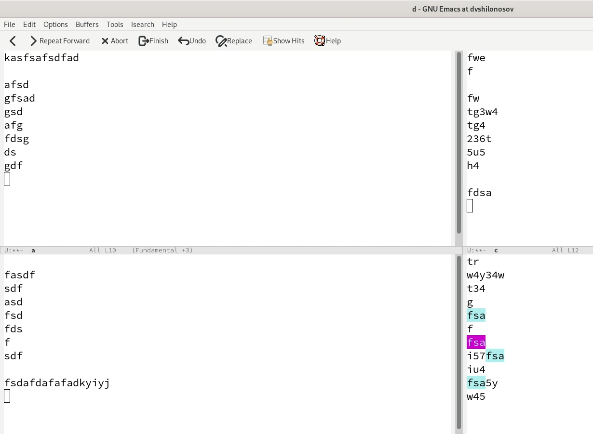

---
## Front matter
lang: ru-RU
title: Лабораторная работа №9
subtitle: Курс "Операционные Системы"
author:
  - Шилоносов Д.В., НКАбд-03-22
institute:
  - Российский университет дружбы народов, Москва, Россия
  
date: 6 апреля 2023

## i18n babel
babel-lang: russian
babel-otherlangs: english

## Formatting pdf
toc: false
toc-title: Содержание
slide_level: 2
aspectratio: 169
section-titles: true
theme: metropolis
header-includes:
 - \metroset{progressbar=frametitle,sectionpage=progressbar,numbering=fraction}
 - '\makeatletter'
 - '\beamer@ignorenonframefalse'
 - '\makeatother'
---

# Информация

## Докладчик

:::::::::::::: {.columns align=center}
::: {.column width="70%"}

  * Шилоносов Данил Вячеславович
  * студент группы НКАбд-03-22
  * кафедры Компьютерные и информационные науки 
  * Российский университет дружбы народов
  * [1132221810@pfur.ru](mailto:1132221810@pfur.ru)
  

:::
::: {.column width="30%"}


:::
::::::::::::::

## Цель работы
Познакомиться с операционной системой Linux. Получить практические навыки работы с редактором Emacs.

## Задачи
1. Ознакомиться с теоретическим материалом.
2. Ознакомиться с редактором emacs.
3. Выполнить упражнения.
   
# Выполнение лабораторной работы
## Задание 1. Задачи

1. Откроем emacs.
2. Создадим файл lab07.sh с помощью комбинации Ctrl-x Ctrl-f (C-x C-f).
3. Наберем текст:
```bash
#!/bin/bash
HELL=Hello
function hello {
LOCAL HELLO=World
echo $HELLO
}
echo $HELLO
hello
```

4. Сохраним файл с помощью комбинации Ctrl-x Ctrl-s (C-x C-s).

## Задание 1. Результат

{#fig:001 width=100%}

## Задание 2. Задачи

5. Проделаем с текстом стандартные процедуры редактирования, каждое действие должно осуществляться комбинацией клавиш:
- Вырежем одной командой целую строку (С-k).
- Вставим эту строку в конец файла (C-y).
- Выделим область текста (C-space).
- Скопируем область в буфер обмена (M-w).
- Вставим область в конец файла.
- Вновь выделим эту область и на этот раз вырежем её (C-w).
- Отменим последнее действие (C-/).

## Задание 2. Результат

{#fig:002 width=100%}

## Задание 3. Задачи

6. Научимся управлять буферами:
- Выведем список активных буферов на экран (C-x C-b)
- Переместимся во вновь открытое окно (C-x) o со списком открытых буферов и переключимся на другой буфер.
- Закроем это окно (C-x 0).
- Теперь вновь переключимся между буферами, но уже без вывода их списка на экран (C-x b).

## Задание 3. Результат

{#fig:003 width=100%}

## Задание 4. Задачи

7. Научимся управлять окнами:
- Поделите фрейм на 4 части: разделите фрейм на два окна по вертикали (C-x 3), а затем каждое из этих окон на две части по горизонтали (C-x 2).
- В каждом из четырёх созданных окон откройте новый буфер (файл) и введите несколько строк текста.

## Задание 4. Результат

{#fig:004 width=100%}

## Задание 5. Задачи

8. Научимся пользоваться режимом поиска:
- Переключимся в режим поиска (C-s) и найдите несколько слов, присутствующих в тексте.
- Будем переключаться между результатами поиска, нажимая C-s.
- Выйдем из режима поиска, нажав C-g.
- Перейдем в режим поиска и замены (M-%), введем текст, который следует найти и заменить, нажмем Enter , затем введем текст для замены. После того как будут подсвечены результаты поиска, нажмем ! для подтверждения замены.
- Испробуем другой режим поиска, нажав M-s o.

## Задание 5. Результат

{#fig:005 width=100%}

# Результаты

## Выводы
В процессе выполнения лабораторной работы были получены практические навыки работы с редактором Emacs.
