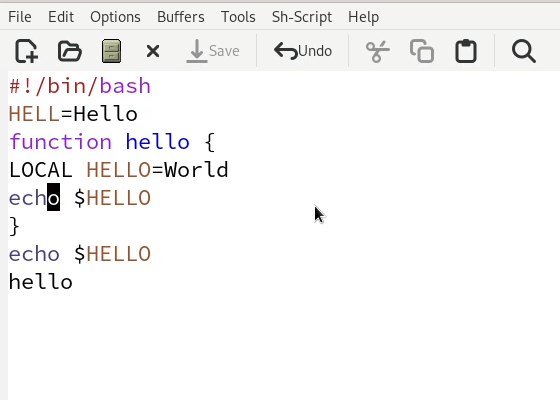
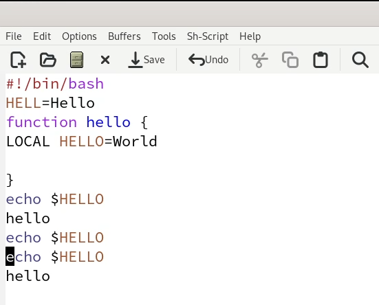
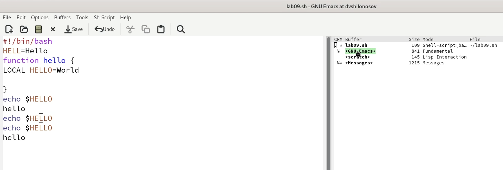
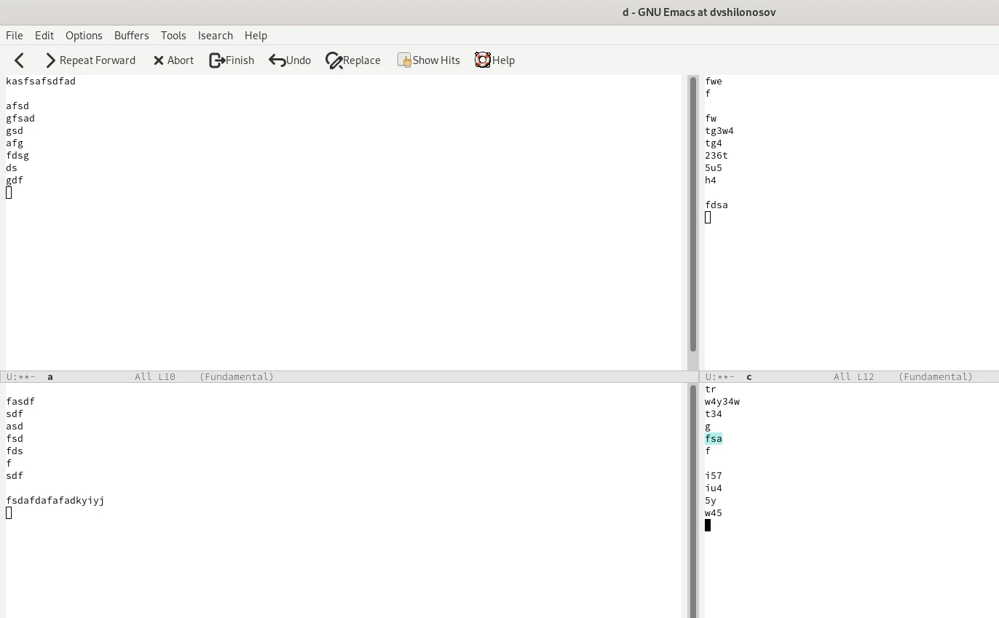
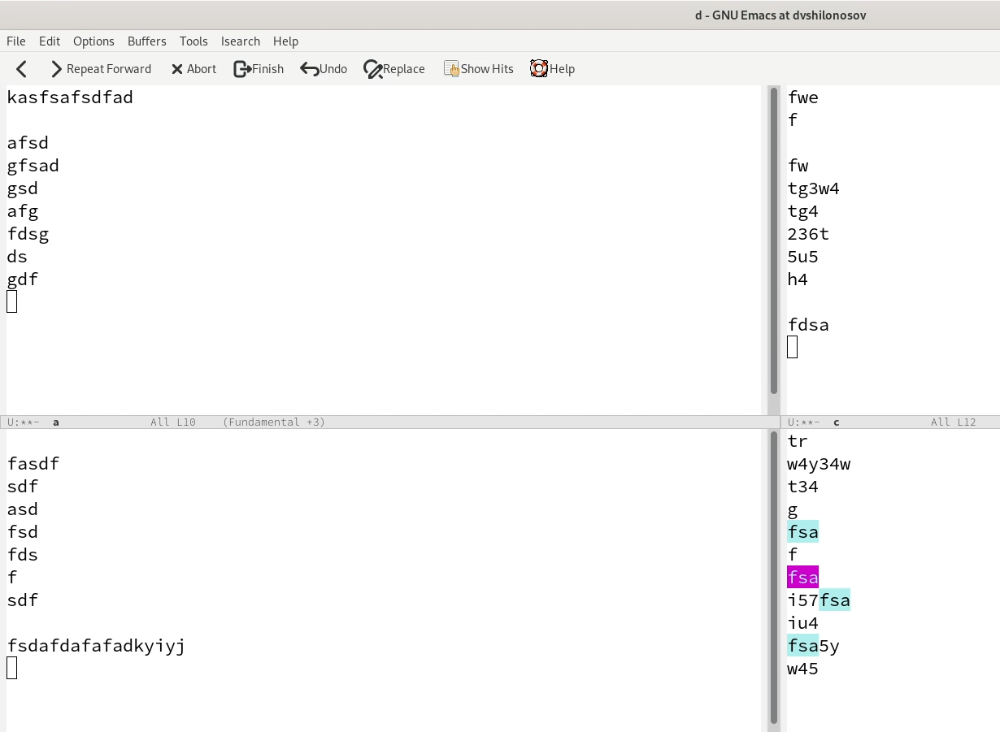

---
## Front matter
title: "ОТЧЕТ О ВЫПОЛНЕНИИ ЛАБОРАТОРНОЙ РАБОТЫ №9"
subtitle: "_дисциплина: Операционные системы_"
author: "Шилоносов Данил Вячеславович"

## Generic otions
lang: ru-RU
toc-title: "Содержание"

## Bibliography
bibliography: bib/cite.bib
csl: pandoc/csl/gost-r-7-0-5-2008-numeric.csl```

## Pdf output format
toc: true # Table of contents
toc-depth: 2
lof: true # List of figures
lot: false # List of tables
fontsize: 12pt
linestretch: 1.5
papersize: a4
documentclass: scrreprt
## I18n polyglossia
polyglossia-lang:
  name: russian
  options:
	- spelling=modern
	- babelshorthands=true
polyglossia-otherlangs:
  name: english
## I18n babel
babel-lang: russian
babel-otherlangs: english
## Fonts
mainfont: PT Serif
romanfont: PT Serif
sansfont: PT Sans
monofont: PT Mono
mainfontoptions: Ligatures=TeX
romanfontoptions: Ligatures=TeX
sansfontoptions: Ligatures=TeX,Scale=MatchLowercase
monofontoptions: Scale=MatchLowercase,Scale=0.9
## Biblatex
biblatex: true
biblio-style: "gost-numeric"
biblatexoptions:
  - parentracker=true
  - backend=biber
  - hyperref=auto
  - language=auto
  - autolang=other*
  - citestyle=gost-numeric
## Pandoc-crossref LaTeX customization
figureTitle: "Рис."
tableTitle: "Таблица"
listingTitle: "Листинг"
lofTitle: "Список иллюстраций"
lotTitle: "Список таблиц"
lolTitle: "Листинги"
## Misc options
indent: true
header-includes:
  - \usepackage{indentfirst}
  - \usepackage{float} # keep figures where there are in the text
  - \floatplacement{figure}{H} # keep figures where there are in the text
---

# Цель работы
Познакомиться с операционной системой Linux. Получить практические навыки работы с редактором Emacs.

# Задачи
1. Ознакомиться с теоретическим материалом.
2. Ознакомиться с редактором emacs.
3. Выполнить упражнения.

# Теоретическое введение
## Указания к работе
Emacs представляет собой мощный экранный редактор текста, написанный на языке
высокого уровня Elisp.
### Основные термины Emacs
**Определение 1.** Буфер — объект, представляющий какой-либо текст.
Буфер может содержать что угодно, например, результаты компиляции программы
или встроенные подсказки. Практически всё взаимодействие с пользователем, в том
числе интерактивное, происходит посредством буферов.
**Определение 2.** Фрейм соответствует окну в обычном понимании этого слова. Каждый фрейм содержит область вывода и одно или несколько окон Emacs.
**Определение 3.** Окно — прямоугольная область фрейма, отображающая один из буферов.
Каждое окно имеет свою строку состояния, в которой выводится следующая информация: название буфера, его основной режим, изменялся ли текст буфера и как далеко вниз по буферу расположен курсор. Каждый буфер находится только в одном из возможных основных режимов. Существующие основные режимы включают режим Fundamental (наименее специализированный), режим Text, режим Lisp, режим С, режим Texinfo и другие. Под второстепенными режимами понимается список режимов, которые включены в данный момент в буфере выбранного окна.
**Определение 4.** Область вывода — одна или несколько строк внизу фрейма, в которой Emacs выводит различные сообщения, а также запрашивает подтверждения и дополнительную информацию от пользователя.
**Определение 5.** Минибуфер используется для ввода дополнительной информации и всегда отображается в области вывода.
**Определение 6.** Точка вставки — место вставки (удаления) данных в буфере.
### Основы работы в Emacs
Для запуска Emacs необходимо в командной строке набрать emacs (или emacs & для работы в фоновом режиме относительно консоли). Для работы с Emacs можно использовать как элементы меню, так и различные сочетания клавиш. Например, для выхода из Emacs можно воспользоваться меню File и выбрать пункт Quit , а можно нажать последовательно Ctrl-x Ctrl-c (в обозначениях Emacs: C-x C-c).
Многие рутинные операции в Emacs удобнее производить с помощью клавиатуры, а не графического меню. Наиболее часто в командах Emacs используются сочетания c клавишами Ctrl и Meta (в обозначениях Emacs: C- и M-; клавиша Shift в Emasc обозначается как S-). Так как на клавиатуре для IBM PC совместимых ПК клавиши Meta нет, то вместо неё можно использовать Alt или Esc . Для доступа к системе меню используйте клавишу F10 .
Клавиши Ctrl , Meta и Shift принято называть префиксными. Например, запись M-x означает, что надо удерживая клавишу Meta (или Alt ), нажать на клавишу x. Для открытия файла следует использовать команду C-x C-f (надо, удерживая клавишу Ctrl , нажать на клавишу x , затем отпустить обе клавиши и снова, удерживая клавишу Ctrl , нажать на клавишу f ).
По назначению префиксные сочетания клавиш различаются следующим образом:
- C-x — префикс ввода основных команд редактора (например, открытия, закрытии,
сохранения файла и т.д.);
- C-c — префикс вызова функций, зависящих от используемого режима.
**Определение 7.** Режим — пакет расширений, изменяющий поведение буфера Emacs при редактировании и просмотре текста (например, для редактирования исходного текста программ на языках С или Perl).

# Выполнение лабораторной работы
## Задание 1. Создание нового файла с использованием vi

1. Откроем emacs.
2. Создадим файл lab07.sh с помощью комбинации Ctrl-x Ctrl-f (C-x C-f).
3. Наберем текст:(рис. [-@fig:001])
```bash
#!/bin/bash
HELL=Hello
function hello {
LOCAL HELLO=World
echo $HELLO
}
echo $HELLO
hello
```

{#fig:001 width=100%}

4. Сохраним файл с помощью комбинации Ctrl-x Ctrl-s (C-x C-s).

5. Проделаем с текстом стандартные процедуры редактирования, каждое действие должно осуществляться комбинацией клавиш: (рис. [-@fig:002])
- Вырежем одной командой целую строку (С-k).
- Вставим эту строку в конец файла (C-y).
- Выделим область текста (C-space).
- Скопируем область в буфер обмена (M-w).
- Вставим область в конец файла.
- Вновь выделим эту область и на этот раз вырежем её (C-w).
- Отменим последнее действие (C-/).

{#fig:002 width=100%}

6. Научимся управлять буферами: (рис. [-@fig:003])
- Выведем список активных буферов на экран (C-x C-b)
- Переместимся во вновь открытое окно (C-x) o со списком открытых буферов и переключимся на другой буфер.
- Закроем это окно (C-x 0).
- Теперь вновь переключимся между буферами, но уже без вывода их списка на экран (C-x b).

{#fig:003 width=100%}

7. Научимся управлять окнами: (рис. [-@fig:004])
- Поделите фрейм на 4 части: разделите фрейм на два окна по вертикали (C-x 3), а затем каждое из этих окон на две части по горизонтали (C-x 2).
- В каждом из четырёх созданных окон откройте новый буфер (файл) и введите несколько строк текста.

{#fig:004 width=100%}

8. Научимся пользоваться режимом поиска: (рис. [-@fig:005])
- Переключимся в режим поиска (C-s) и найдите несколько слов, присутствующих в тексте.
- Будем переключаться между результатами поиска, нажимая C-s.
- Выйдем из режима поиска, нажав C-g.
- Перейдем в режим поиска и замены (M-%), введем текст, который следует найти и заменить, нажмем Enter , затем введем текст для замены. После того как будут подсвечены результаты поиска, нажмем ! для подтверждения замены.
- Испробуем другой режим поиска, нажав M-s o.

{#fig:005 width=100%}

# Выводы
В процессе выполнения лабораторной работы были получены практические навыки работы с редактором Emacs.
