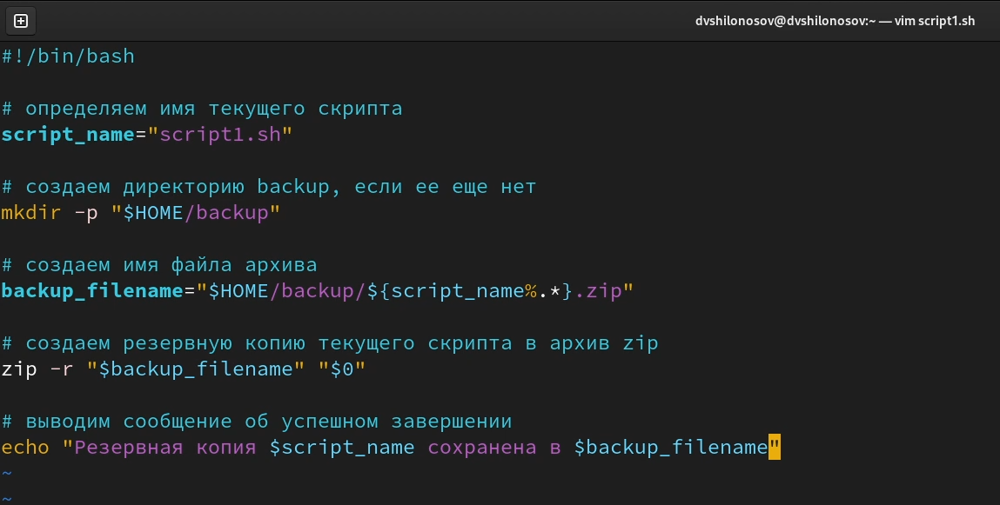
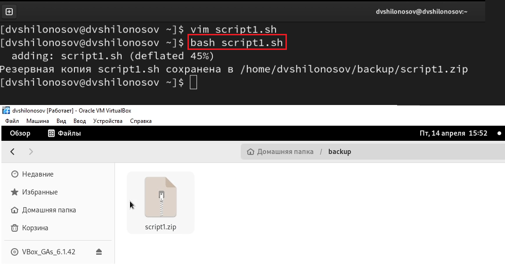
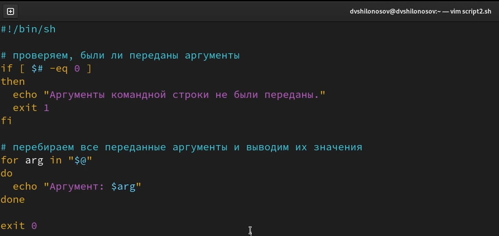
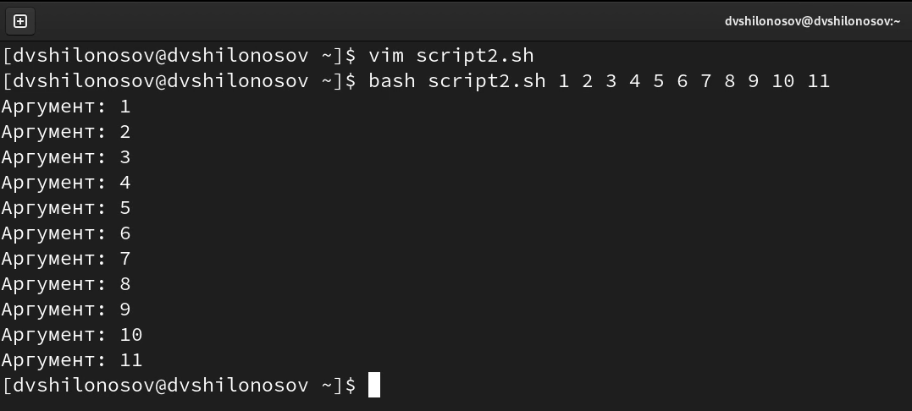
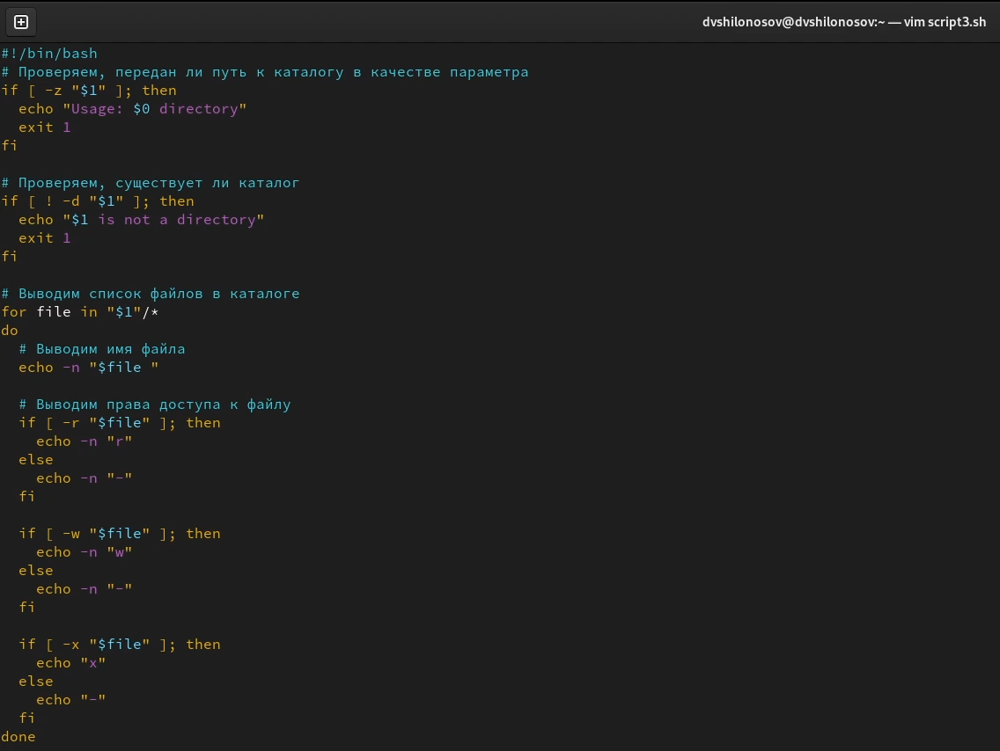
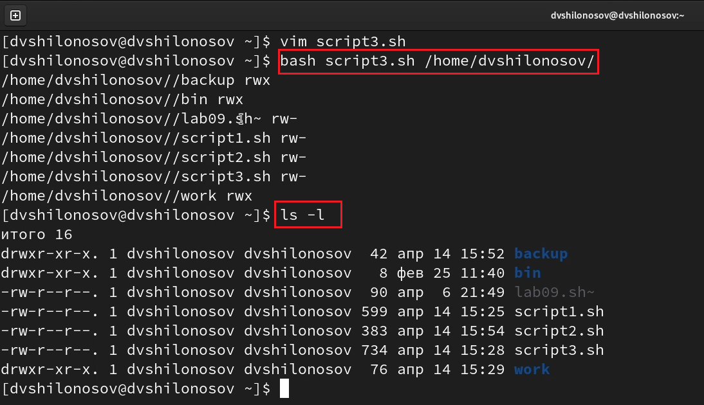
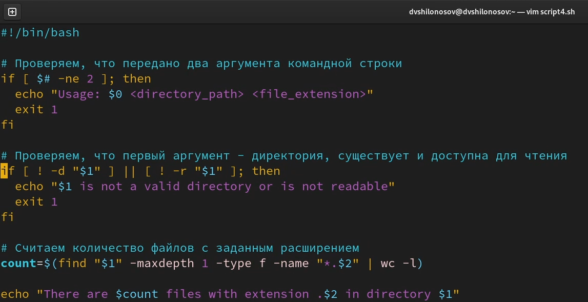
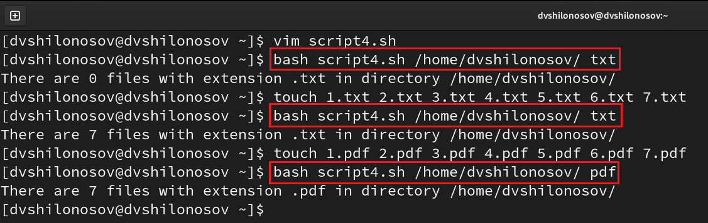

---
## Front matter
lang: ru-RU
title: Лабораторная работа №10
subtitle: Курс "Операционные Системы"
author:
  - Шилоносов Д.В., НКАбд-03-22
institute:
  - Российский университет дружбы народов, Москва, Россия
  
date: 14 апреля 2023

## i18n babel
babel-lang: russian
babel-otherlangs: english

## Formatting pdf
toc: false
toc-title: Содержание
slide_level: 2
aspectratio: 169
section-titles: true
theme: metropolis
header-includes:
 - \metroset{progressbar=frametitle,sectionpage=progressbar,numbering=fraction}
 - '\makeatletter'
 - '\beamer@ignorenonframefalse'
 - '\makeatother'
---

# Информация

## Докладчик

:::::::::::::: {.columns align=center}
::: {.column width="70%"}

  * Шилоносов Данил Вячеславович
  * студент группы НКАбд-03-22
  * кафедры Компьютерные и информационные науки 
  * Российский университет дружбы народов
  * [1132221810@pfur.ru](mailto:1132221810@pfur.ru)
  

:::
::: {.column width="30%"}

:::
::::::::::::::

## Цель работы
Изучить основы программирования в оболочке ОС UNIX/Linux. Научиться писать небольшие командные файлы.

## Задачи
1. Написать скрипт, который при запуске будет делать резервную копию самого себя (то есть файла, в котором содержится его исходный код) в другую директорию backup в вашем домашнем каталоге. При этом файл должен архивироваться одним из архиваторов на выбор zip, bzip2 или tar. Способ использования команд архивации необходимо узнать, изучив справку.

2. Написать пример командного файла, обрабатывающего любое произвольное число аргументов командной строки, в том числе превышающее десять. Например, скрипт может последовательно распечатывать значения всех переданных аргументов.

## Задачи
3. Написать командный файл — аналог команды ls (без использования самой этой ко- манды и команды dir). Требуется, чтобы он выдавал информацию о нужном каталоге и выводил информацию о возможностях доступа к файлам этого каталога.

4. Написать командный файл, который получает в качестве аргумента командной строки формат файла (.txt, .doc, .jpg, .pdf и т.д.) и вычисляет количество таких файлов в указанной директории. Путь к директории также передаётся в виде аргумента командной строки.

   
# Выполнение лабораторной работы
## Исходный код скрипта №1

{#fig:001 width=100%}

## Описание скрипта №1
Этот скрипт создает резервную копию самого себя (то есть файла, в котором содержится исходный код скрипта) в формате zip и сохраняет ее в директории "backup" в домашней директории пользователя. Сначала скрипт определяет имя текущего скрипта с помощью команды basename, затем создает директорию "backup" с помощью команды mkdir -p. Затем скрипт формирует имя файла архива с помощью переменной backup_filename, используя имя текущего скрипта и расширение ".zip". Далее скрипт создает резервную копию самого себя с помощью команды zip, которой передается имя файла архива и имя текущего скрипта. В конце скрипт выводит сообщение об успешном завершении операции.

## Результат выполнения скрипта №1

{#fig:002 width=100%}

## Исходный код скрипта №2

{#fig:001 width=100%}

## Описание скрипта №2
Этот скрипт обрабатывает аргументы командной строки и последовательно выводит их значения. Если аргументы не были переданы, то выводится сообщение об ошибке, и скрипт завершается с кодом 1. Если аргументы были переданы, то они перебираются в цикле, и для каждого аргумента выводится его значение с помощью команды echo. Завершение скрипта происходит с кодом 0.

## Результат выполнения скрипта №2

{#fig:002 width=100%}

## Исходный код скрипта №3

{#fig:001 width=100%}

## Описание скрипта №3
Сначала проверяется, был ли передан путь к каталогу в качестве аргумента командной строки, используя проверку на пустоту переменной "$1". Если переменная пуста, то выводится сообщение об использовании скрипта и завершается его выполнение с кодом ошибки 1.

Затем проверяется, существует ли указанный каталог, используя проверку с помощью команды "[ ! -d "$1" ]". Если каталог не существует, то выводится сообщение об ошибке и скрипт завершается с кодом ошибки 1.

## Описание скрипта №3
Далее используется цикл "for" для перебора файлов в заданном каталоге. Для каждого файла выводится его имя с помощью команды "echo -n", которая не переводит строку на новую строку. Затем для каждого файла проверяется наличие прав доступа на чтение, запись и выполнение с помощью команд "if [ -r "$file" ]", "if [ -w "$file" ]" и "if [ -x "$file" ]". Если права доступа есть, то выводится соответствующий символ (r, w или x), если прав доступа нет, то выводится дефис (-).

Итоговый вывод командного файла будет представлять собой список файлов в заданном каталоге с указанием прав доступа к каждому файлу.

## Результат выполнения скрипта №3

{#fig:002 width=100%}

## Исходный код скрипта №4

{#fig:001 width=100%}

## Описание скрипта №4
Данный скрипт предназначен для поиска файлов с заданным расширением в указанной директории. Скрипт принимает два аргумента командной строки: путь к директории и расширение файла.
С помощью команды find скрипт ищет все файлы с указанным расширением в указанной директории и ее поддиректориях. Количество найденных файлов определяется с помощью команды wc.
Наконец, скрипт выводит сообщение с количеством найденных файлов. Если переданы неверные аргументы командной строки, скрипт выводит сообщение об использовании и завершается с ошибкой.

## Результат выполнения скрипта №4

{#fig:002 width=100%}

# Результаты

## Выводы
Были получены навыки написания небольших командных файлов в оболочке ОС UNIX/Linux.
