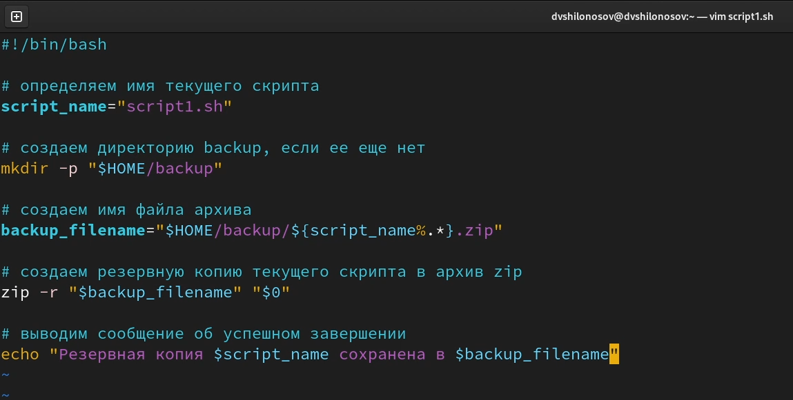
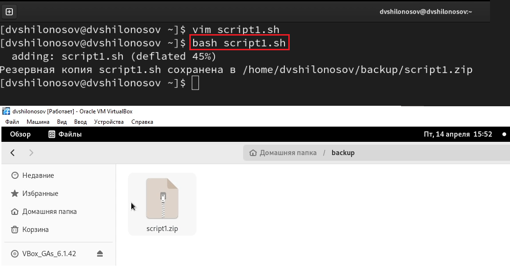
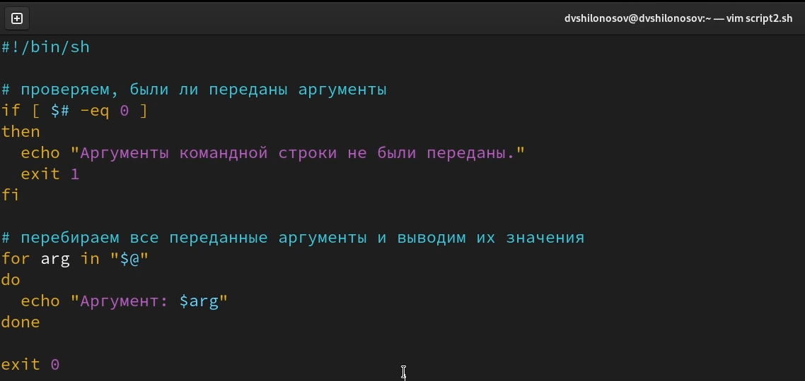
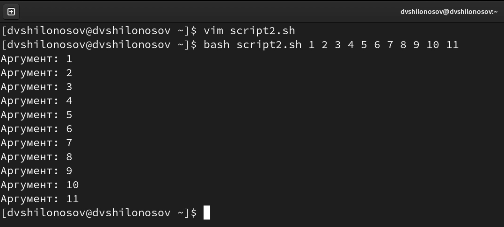
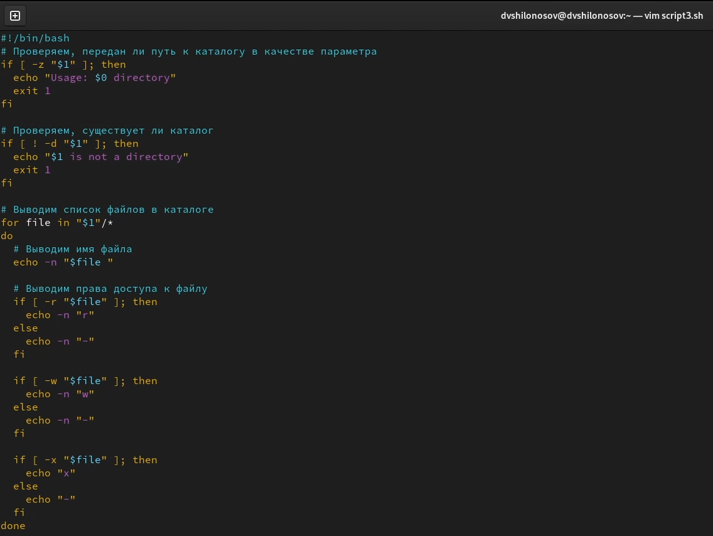
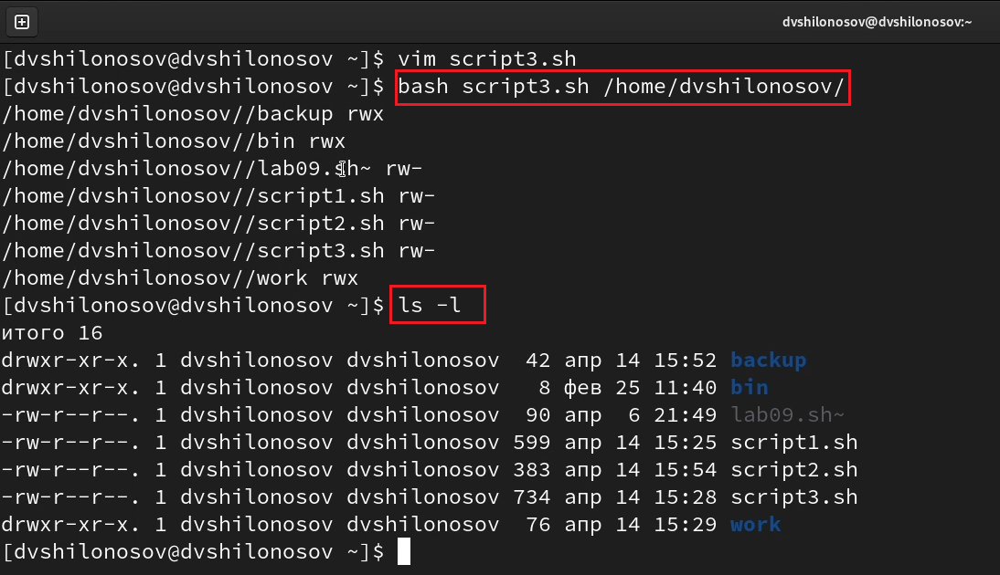
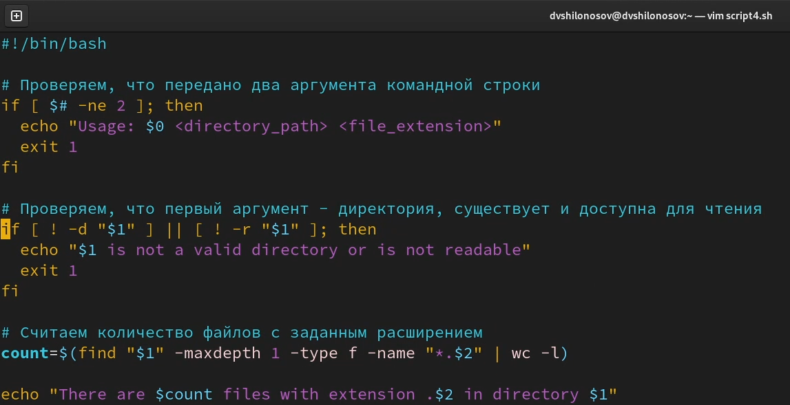
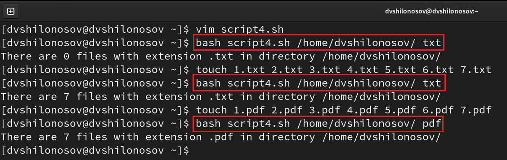

---
## Front matter
title: "ОТЧЕТ О ВЫПОЛНЕНИИ ЛАБОРАТОРНОЙ РАБОТЫ №10"
subtitle: "_дисциплина: Операционные системы_"
author: "Шилоносов Данил Вячеславович"

## Generic otions
lang: ru-RU
toc-title: "Содержание"

## Bibliography
bibliography: bib/cite.bib
csl: pandoc/csl/gost-r-7-0-5-2008-numeric.csl```

## Pdf output format
toc: true # Table of contents
toc-depth: 2
lof: true # List of figures
lot: false # List of tables
fontsize: 12pt
linestretch: 1.5
papersize: a4
documentclass: scrreprt
## I18n polyglossia
polyglossia-lang:
  name: russian
  options:
	- spelling=modern
	- babelshorthands=true
polyglossia-otherlangs:
  name: english
## I18n babel
babel-lang: russian
babel-otherlangs: english
## Fonts
mainfont: PT Serif
romanfont: PT Serif
sansfont: PT Sans
monofont: PT Mono
mainfontoptions: Ligatures=TeX
romanfontoptions: Ligatures=TeX
sansfontoptions: Ligatures=TeX,Scale=MatchLowercase
monofontoptions: Scale=MatchLowercase,Scale=0.9
## Biblatex
biblatex: true
biblio-style: "gost-numeric"
biblatexoptions:
  - parentracker=true
  - backend=biber
  - hyperref=auto
  - language=auto
  - autolang=other*
  - citestyle=gost-numeric
## Pandoc-crossref LaTeX customization
figureTitle: "Рис."
tableTitle: "Таблица"
listingTitle: "Листинг"
lofTitle: "Список иллюстраций"
lotTitle: "Список таблиц"
lolTitle: "Листинги"
## Misc options
indent: true
header-includes:
  - \usepackage{indentfirst}
  - \usepackage{float} # keep figures where there are in the text
  - \floatplacement{figure}{H} # keep figures where there are in the text
---

# Цель работы
Изучить основы программирования в оболочке ОС UNIX/Linux. Научиться писать небольшие командные файлы.

# Задачи
1. Написать скрипт, который при запуске будет делать резервную копию самого себя (то есть файла, в котором содержится его исходный код) в другую директорию backup в вашем домашнем каталоге. При этом файл должен архивироваться одним из архиваторов на выбор zip, bzip2 или tar. Способ использования команд архивации необходимо узнать, изучив справку.

2. Написать пример командного файла, обрабатывающего любое произвольное число аргументов командной строки, в том числе превышающее десять. Например, скрипт может последовательно распечатывать значения всех переданных аргументов.

3. Написать командный файл — аналог команды ls (без использования самой этой ко- манды и команды dir). Требуется, чтобы он выдавал информацию о нужном каталоге и выводил информацию о возможностях доступа к файлам этого каталога.

4. Написать командный файл, который получает в качестве аргумента командной строки формат файла (.txt, .doc, .jpg, .pdf и т.д.) и вычисляет количество таких файлов в указанной директории. Путь к директории также передаётся в виде аргумента командной строки.

# Теоретическое введение
## Указания к лабораторной работе
### Командные процессоры (оболочки)
Командный процессор (командная оболочка, интерпретатор команд shell) — это программа, позволяющая пользователю взаимодействовать с операционной системой компьютера. В операционных системах типа UNIX/Linux наиболее часто используются следующие реализации командных оболочек:
- оболочка Борна (Bourne shell или sh) — стандартная командная оболочка UNIX/Linux, содержащая базовый, но при этом полный набор функций;
- С-оболочка (или csh) — надстройка на оболочкой Борна, использующая С-подобный синтаксис команд с возможностью сохранения истории выполнения команд;
- оболочка Корна (или ksh) — напоминает оболочку С, но операторы управления программой совместимы с операторами оболочки Борна;
- BASH — сокращение от Bourne Again Shell (опять оболочка Борна), в основе своей совмещает свойства оболочек С и Корна (разработка компании Free Software Foundation). POSIX (Portable Operating System Interface for Computer Environments) - набор стандартов описания интерфейсов взаимодействия операционной системы и прикладных программ. Стандарты POSIX разработаны комитетом IEEE (Institute of Electrical and Electronics Engineers) для обеспечения совместимости различных UNIX/Linux-подобных операционных систем и переносимости прикладных программ на уровне исходного кода. POSIX-совместимые оболочки разработаны на базе оболочки Корна. Рассмотрим основные элементы программирования в оболочке bash. В других оболочках большинство команд будет совпадать с описанными ниже.

### Переменные в языке программирования bash
Командный процессор bash обеспечивает возможность использования переменных типа строка символов. Имена переменных могут быть выбраны пользователем. Пользователь имеет возможность присвоить переменной значение некоторой строки символов.
Например, команда

```bash 
mark=/usr/andy/bin
```
присваивает значение строки символов /usr/andy/bin переменной mark типа строка символов.
Значение, присвоенное некоторой переменной, может быть впоследствии использовано. Для этого в соответствующем месте командной строки должно быть употреблено имя этой переменной, которому предшествует метасимвол $. 
Например, команда

```bash
mv afile ${mark}
```
переместит файл afile из текущего каталога в каталог с абсолютным полным именем /usr/andy/bin.
Использование значения, присвоенного некоторой переменной, называется подстановкой. Для того чтобы имя переменной не сливалось с символами, которые могут следовать за ним в командной строке, при подстановке в общем случае используется следующая форма записи:
```bash
${имя переменной}
```

Например, использование команд

```bash
b=/tmp/andy-
ls -l myfile > ${b}ls
```
приведёт к переназначению стандартного вывода команды ls с терминала на файл /tmp/andy-ls, а использование команды ls -l>$bls приведёт к подстановке в командную строку значения переменной bls. Если переменной bls не было предварительно присвоено никакого значения, то её значением будет символ пробела. Оболочка bash позволяет работать с массивами. Для создания массива используется команда set с флагом -A. За флагом следует имя переменной, а затем список значений, разделённых пробелами. Например,

```bash
set -A states Delaware Michigan "New Jersey"
```

Далее можно сделать добавление в массив, например, states[49]=Alaska. Индексация массивов начинается с нулевого элемента.

# Выполнение лабораторной работы

## Задание №1
1. Этот скрипт создает резервную копию самого себя (то есть файла, в котором содержится исходный код скрипта) в формате zip и сохраняет ее в директории "backup" в домашней директории пользователя. Сначала скрипт определяет имя текущего скрипта с помощью команды basename, затем создает директорию "backup" с помощью команды mkdir -p. Затем скрипт формирует имя файла архива с помощью переменной backup_filename, используя имя текущего скрипта и расширение ".zip". Далее скрипт создает резервную копию самого себя с помощью команды zip, которой передается имя файла архива и имя текущего скрипта. В конце скрипт выводит сообщение об успешном завершении операции. (рис. [-@fig:001], [-@fig:002])

{#fig:001 width=100%}

{#fig:002 width=100%}

## Задание №2
2. Этот скрипт обрабатывает аргументы командной строки и последовательно выводит их значения. Если аргументы не были переданы, то выводится сообщение об ошибке, и скрипт завершается с кодом 1. Если аргументы были переданы, то они перебираются в цикле, и для каждого аргумента выводится его значение с помощью команды echo. Завершение скрипта происходит с кодом 0. (рис. [-@fig:003], [-@fig:004])

{#fig:003 width=100%}

{#fig:004 width=100%}

## Задание №3
3. Сначала проверяется, был ли передан путь к каталогу в качестве аргумента командной строки, используя проверку на пустоту переменной "$1". Если переменная пуста, то выводится сообщение об использовании скрипта и завершается его выполнение с кодом ошибки 1.

Затем проверяется, существует ли указанный каталог, используя проверку с помощью команды "[ ! -d "$1" ]". Если каталог не существует, то выводится сообщение об ошибке и скрипт завершается с кодом ошибки 1.

Далее используется цикл "for" для перебора файлов в заданном каталоге. Для каждого файла выводится его имя с помощью команды "echo -n", которая не переводит строку на новую строку. Затем для каждого файла проверяется наличие прав доступа на чтение, запись и выполнение с помощью команд "if [ -r "$file" ]", "if [ -w "$file" ]" и "if [ -x "$file" ]". Если права доступа есть, то выводится соответствующий символ (r, w или x), если прав доступа нет, то выводится дефис (-).

Итоговый вывод командного файла будет представлять собой список файлов в заданном каталоге с указанием прав доступа к каждому файлу. (рис. [-@fig:005], [-@fig:006])

{#fig:005 width=100%}

{#fig:006 width=100%}

## Задание №4
4. Данный скрипт предназначен для поиска файлов с заданным расширением в указанной директории. Скрипт принимает два аргумента командной строки: путь к директории и расширение файла.
С помощью команды find скрипт ищет все файлы с указанным расширением в указанной директории и ее поддиректориях. Количество найденных файлов определяется с помощью команды wc.
Наконец, скрипт выводит сообщение с количеством найденных файлов. Если переданы неверные аргументы командной строки, скрипт выводит сообщение об использовании и завершается с ошибкой. (рис. [-@fig:007], [-@fig:008])

{#fig:007 width=100%}

{#fig:008 width=100%}

# Выводы
Были получены навыки написания небольших командных файлов в оболочке ОС UNIX/Linux.
