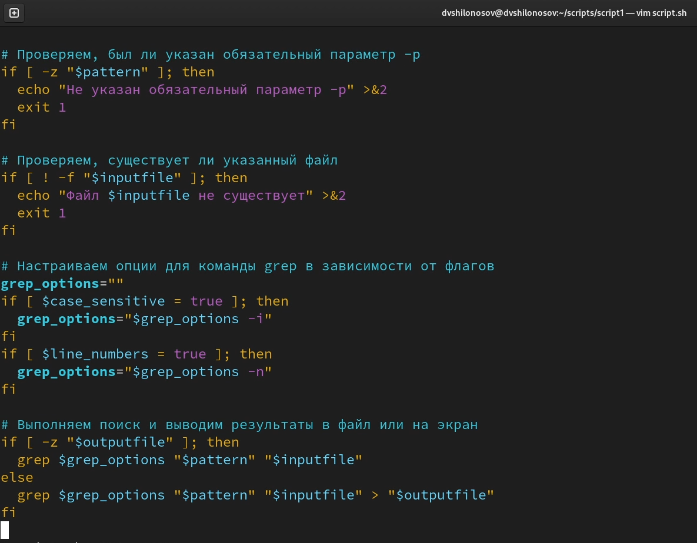
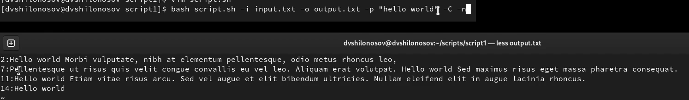
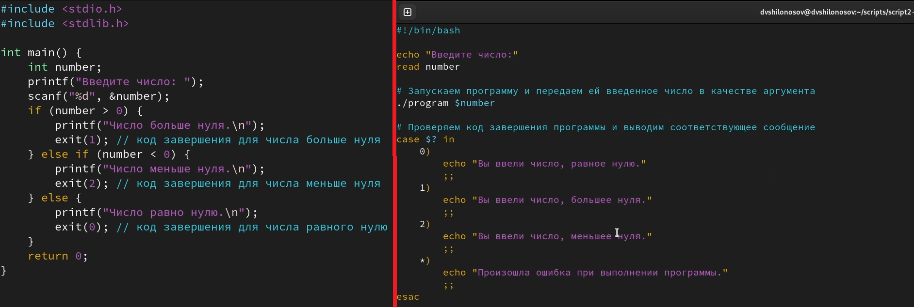
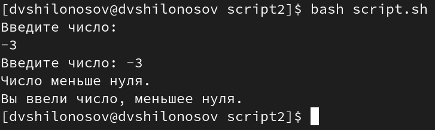
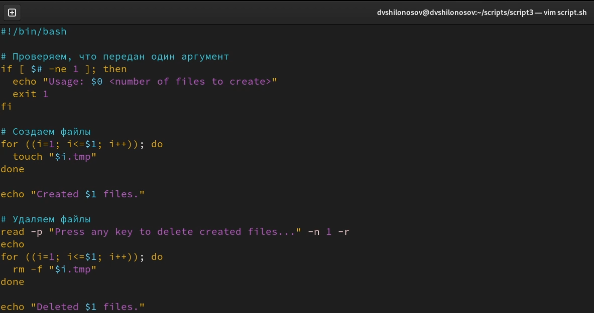
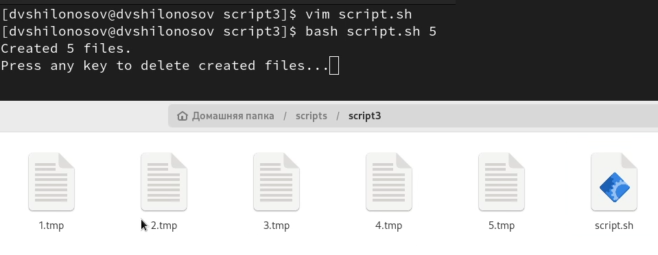
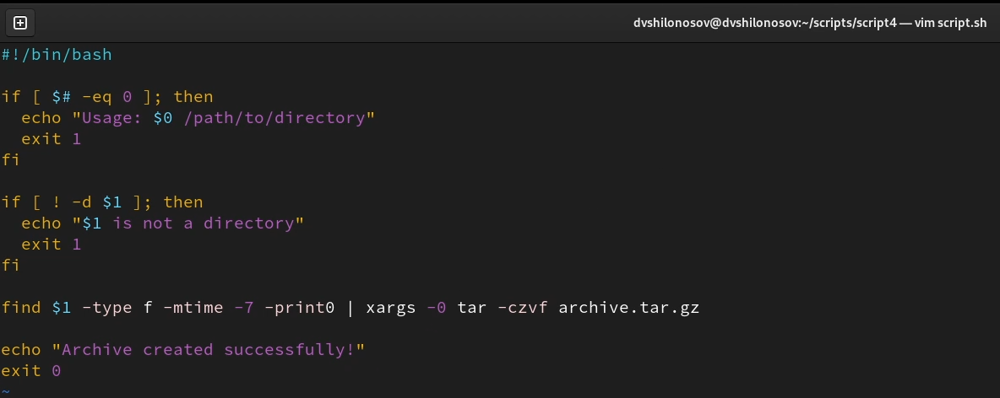
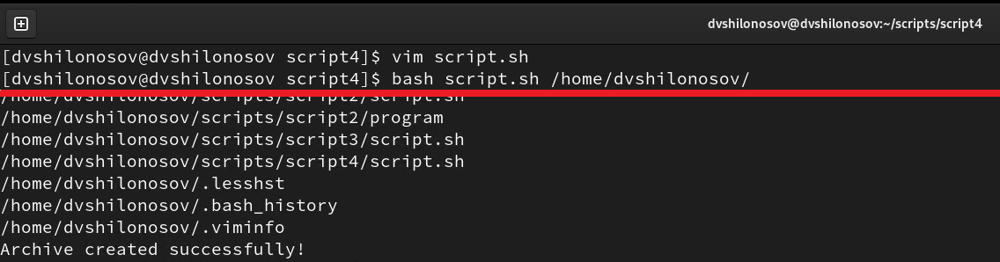

---
## Front matter
title: "ОТЧЕТ О ВЫПОЛНЕНИИ ЛАБОРАТОРНОЙ РАБОТЫ №11"
subtitle: "_дисциплина: Операционные системы_"
author: "Шилоносов Данил Вячеславович"

## Generic otions
lang: ru-RU
toc-title: "Содержание"

## Bibliography
bibliography: bib/cite.bib
csl: pandoc/csl/gost-r-7-0-5-2008-numeric.csl```

## Pdf output format
toc: true # Table of contents
toc-depth: 2
lof: true # List of figures
lot: false # List of tables
fontsize: 12pt
linestretch: 1.5
papersize: a4
documentclass: scrreprt
## I18n polyglossia
polyglossia-lang:
  name: russian
  options:
	- spelling=modern
	- babelshorthands=true
polyglossia-otherlangs:
  name: english
## I18n babel
babel-lang: russian
babel-otherlangs: english
## Fonts
mainfont: PT Serif
romanfont: PT Serif
sansfont: PT Sans
monofont: PT Mono
mainfontoptions: Ligatures=TeX
romanfontoptions: Ligatures=TeX
sansfontoptions: Ligatures=TeX,Scale=MatchLowercase
monofontoptions: Scale=MatchLowercase,Scale=0.9
## Biblatex
biblatex: true
biblio-style: "gost-numeric"
biblatexoptions:
  - parentracker=true
  - backend=biber
  - hyperref=auto
  - language=auto
  - autolang=other*
  - citestyle=gost-numeric
## Pandoc-crossref LaTeX customization
figureTitle: "Рис."
tableTitle: "Таблица"
listingTitle: "Листинг"
lofTitle: "Список иллюстраций"
lotTitle: "Список таблиц"
lolTitle: "Листинги"
## Misc options
indent: true
header-includes:
  - \usepackage{indentfirst}
  - \usepackage{float} # keep figures where there are in the text
  - \floatplacement{figure}{H} # keep figures where there are in the text
---

# Цель работы
Изучить основы программирования в оболочке ОС UNIX. Научится писать более сложные командные файлы с использованием логических управляющих конструкций и циклов.

# Задачи
1. Используя команды getopts grep, написать командный файл, который анализирует командную строку с ключами:
- -iinputfile — прочитать данные из указанного файла;
- -ooutputfile — вывести данные в указанный файл;
- -pшаблон — указать шаблон для поиска;
- -C — различать большие и малые буквы;
- -n — выдавать номера строк.
а затем ищет в указанном файле нужные строки, определяемые ключом -p.

2. Написать на языке Си программу, которая вводит число и определяет, является ли оно больше нуля, меньше нуля или равно нулю. Затем программа завершается с помощью функции exit(n), передавая информацию в о коде завершения в оболочку. Командный файл должен вызывать эту программу и, проанализировав с помощью команды $?, выдать сообщение о том, какое число было введено.

3. Написать командный файл, создающий указанное число файлов, пронумерованных последовательно от 1 до N (например 1.tmp, 2.tmp, 3.tmp,4.tmp и т.д.). Число файлов, которые необходимо создать, передаётся в аргументы командной строки. Этот же командный файл должен уметь удалять все созданные им файлы (если они существуют).

4. Написать командный файл, который с помощью команды tar запаковывает в архив все файлы в указанной директории. Модифицировать его так, чтобы запаковывались только те файлы, которые были изменены менее недели тому назад (использовать команду find).

# Выполнение лабораторной работы

## Задание №1
1. Данный командный файл на Bash обрабатывает параметры командной строки и выполняет поиск строк в указанном файле на основе заданного шаблона. Он поддерживает следующие параметры:
- -i inputfile - указывает входной файл для чтения данных.
- -o outputfile - указывает выходной файл для записи результатов.
- -p pattern - указывает шаблон для поиска в файле.
- -C - различает большие и малые буквы при поиске.
- -n - выводит номера строк, в которых найден заданный шаблон.

Если параметр -p не указан, скрипт выведет сообщение об ошибке и завершится. Если входной файл не существует, скрипт также выведет сообщение об ошибке и завершится.

После обработки параметров, скрипт настраивает опции для команды grep, используя флаги -i (если -C указан) и -n (если -n указан). Затем скрипт выполняет поиск заданного шаблона в указанном файле, используя команду grep. Результаты выводятся в консоль или в указанный выходной файл в зависимости от того, указан ли параметр -o (рис. [-@fig:001], [-@fig:002])

{#fig:001 width=100%}

{#fig:002 width=100%}

## Задание №2
2. Этот скрипт запрашивает у пользователя ввод числа, запускает программу на языке C, передает ей введенное число в качестве аргумента, а затем выводит сообщение в зависимости от кода завершения программы.
Затем скрипт выводит на экран приглашение для ввода числа. Когда пользователь вводит число, оно сохраняется в переменной number.

Далее скрипт вызывает программу на языке C и передает ей введенное число в качестве аргумента.

После того, как программа завершилась, скрипт проверяет код завершения программы с помощью команды $? и выводит соответствующее сообщение, основываясь на коде завершения. Если код завершения равен 0, то выводится сообщение "Вы ввели число, равное нулю.", если код завершения равен 1, то выводится сообщение "Вы ввели число, большее нуля.", а если код завершения равен 2, то выводится сообщение "Вы ввели число, меньшее нуля."(рис. [-@fig:003], [-@fig:004])

{#fig:003 width=100%}

{#fig:004 width=100%}

## Задание №3
3. Данный скрипт - это командный файл для создания и удаления последовательности файлов с пронумерованными именами от 1 до N. Количество файлов, которые нужно создать, передается в качестве аргумента командной строки. Скрипт проверяет, что передан только один аргумент, затем создает файлы в цикле и выводит сообщение о количестве созданных файлов. После этого скрипт ждет от пользователя ввода любой клавиши и затем удаляет созданные файлы в цикле, снова выводя сообщение о количестве удаленных файлов. (рис. [-@fig:005], [-@fig:006])

{#fig:005 width=100%}

{#fig:006 width=100%}

## Задание №4
4. Этот скрипт - это командный файл для создания архива из файлов, находящихся в указанной директории, которые были изменены менее недели тому назад. Он принимает путь к директории в качестве аргумента при запуске и использует команду find для поиска файлов, отвечающих указанному условию. Затем найденные файлы передаются в tar, который создает сжатый архив. Если при запуске скрипта не был передан путь к директории или указанный путь не является действительным каталогом, скрипт выдает сообщение об ошибке и завершает работу с кодом ошибки 1. По завершении работы, скрипт выводит сообщение об успешном завершении и устанавливает код возврата 0. (рис. [-@fig:007], [-@fig:008])

{#fig:007 width=100%}

{#fig:008 width=100%}

# Выводы
Были получены навыки написания более сложных командных файлов с использованием логических управляющих конструкций и циклов.
