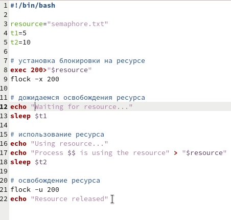
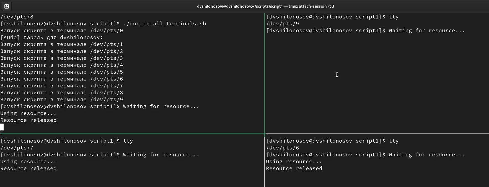
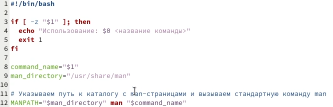
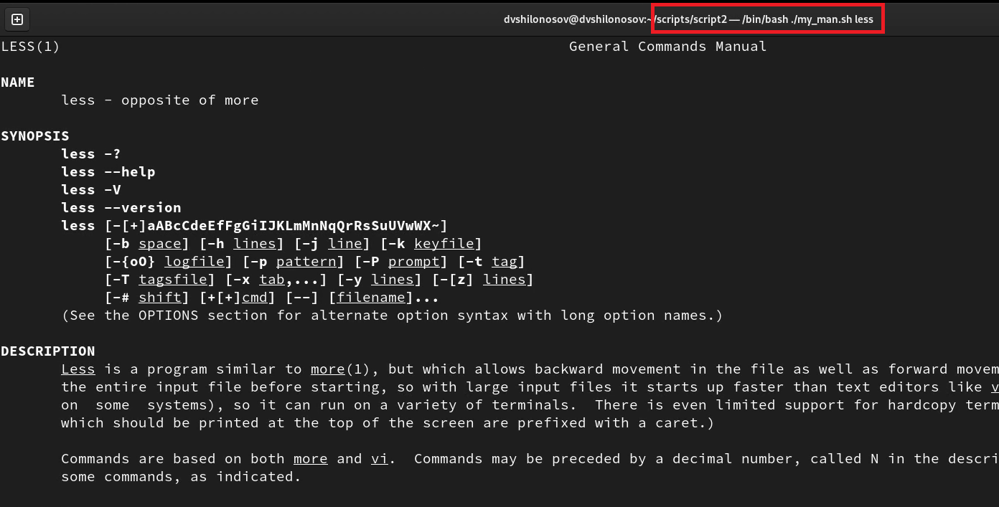
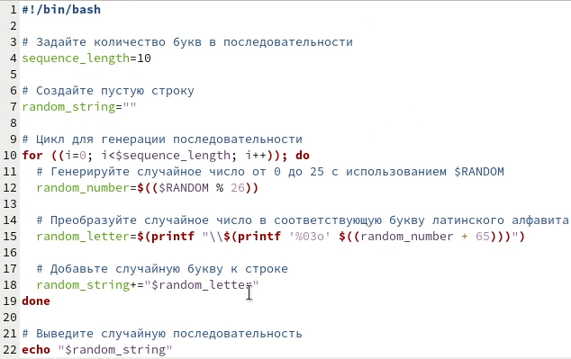
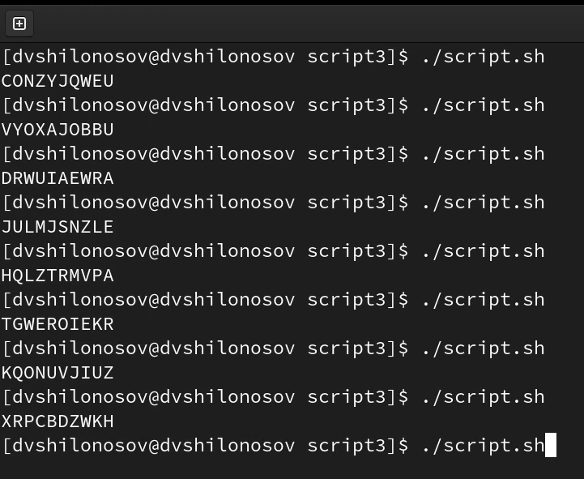

---
## Front matter
lang: ru-RU
title: Лабораторная работа №12
subtitle: Курс "Операционные Системы"
author:
  - Шилоносов Д.В., НКАбд-03-22
institute:
  - Российский университет дружбы народов, Москва, Россия
  
date: 29 апреля 2023

## i18n babel
babel-lang: russian
babel-otherlangs: english

## Formatting pdf
toc: false
toc-title: Содержание
slide_level: 2
aspectratio: 169
section-titles: true
theme: metropolis
header-includes:
 - \metroset{progressbar=frametitle,sectionpage=progressbar,numbering=fraction}
 - '\makeatletter'
 - '\beamer@ignorenonframefalse'
 - '\makeatother'
---

# Информация

## Докладчик

:::::::::::::: {.columns align=center}
::: {.column width="70%"}

  * Шилоносов Данил Вячеславович
  * студент группы НКАбд-03-22
  * кафедры Компьютерные и информационные науки 
  * Российский университет дружбы народов
  * [1132221810@pfur.ru](mailto:1132221810@pfur.ru)
  

:::
::: {.column width="30%"}

:::
::::::::::::::

## Цель работы
Изучить основы программирования в оболочке ОС UNIX. Научиться писать более сложные командные файлы с использованием логических управляющих конструкций и циклов.

## Задачи
1. Написать командный файл, реализующий упрощённый механизм семафоров. Командный файл должен в течение некоторого времени t1 дожидаться освобождения ресурса, выдавая об этом сообщение, а дождавшись его освобождения, использовать его в течение некоторого времени t2<>t1, также выдавая информацию о том, что ресурс используется соответствующим командным файлом (процессом). Запустить командный файл в одном виртуальном терминале в фоновом режиме, перенаправив его вывод в другой (> /dev/tty#, где # — номер терминала куда перенаправляется вывод), в котором также запущен этот файл, но не фоновом, а в привилегированном режиме. Доработать программу так, чтобы имелась возможность взаимодействия трёх и более процессов.

## Задачи
2. Реализовать команду man с помощью командного файла. Изучите содержимое каталога /usr/share/man/man1. В нем находятся архивы текстовых файлов, содержащих справку по большинству установленных в системе программ и команд. Каждый архив можно открыть командой less сразу же просмотрев содержимое справки. Командный файл должен получать в виде аргумента командной строки название команды и в виде результата выдавать справку об этой команде или сообщение об отсутствии справки, если соответствующего файла нет в каталоге man1.

## Задачи
3. Используя встроенную переменную $RANDOM, напишите командный файл, генерирующий случайную последовательность букв латинского алфавита. Учтите, что $RANDOM выдаёт псевдослучайные числа в диапазоне от 0 до 32767.

   
# Выполнение лабораторной работы
## Исходный код скрипта №1

{#fig:001 width=100%}

## Описание скрипта №1
Данный скрипт реализует упрощенный механизм семафоров на основе файловой блокировки. Он дожидается освобождения ресурса, выдавая об этом сообщение, затем использует его, выдавая информацию о том, что ресурс используется соответствующим процессом. Ресурс защищен блокировкой на файле semaphore.txt. Скрипт можно запустить в фоновом режиме и перенаправить его вывод в другой терминал.

## Результат выполнения скрипта №1

{#fig:002 width=100%}

## Исходный код скрипта №2

{#fig:001 width=100%}

## Описание скрипта №2
Этот скрипт предоставляет пользователю возможность получить справку для команды, указанной в качестве аргумента. Он использует стандартную команду man с указанием пути к каталогу с man-страницами через переменную окружения MANPATH.

Скрипт проверяет, указано ли имя команды в качестве аргумента. Если аргумент не указан, выводит справочное сообщение и завершает работу.
Запоминает указанное имя команды и путь к каталогу man-страниц.
Устанавливает значение переменной окружения MANPATH равным пути к каталогу man-страниц.
Вызывает стандартную команду man с именем команды в качестве аргумента.

## Результат выполнения скрипта №2

{#fig:002 width=100%}

## Исходный код скрипта №3

{#fig:001 width=100%}

## Описание скрипта №3
Скрипт генерирует случайную последовательность латинских букв заданной длины. Он использует переменную $RANDOM для получения псевдослучайных чисел, преобразует их в соответствующие буквы и объединяет их в строку. Затем выводит эту строку на экран.

## Результат выполнения скрипта №3

{#fig:002 width=100%}

# Результаты

## Выводы
Были получены практические навыки написания более сложные командных файлов с использованием логических управляющих конструкций и циклов.
