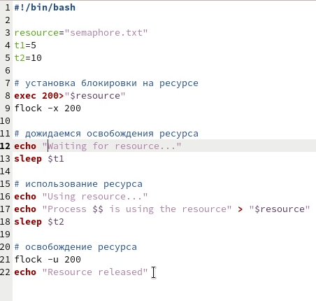
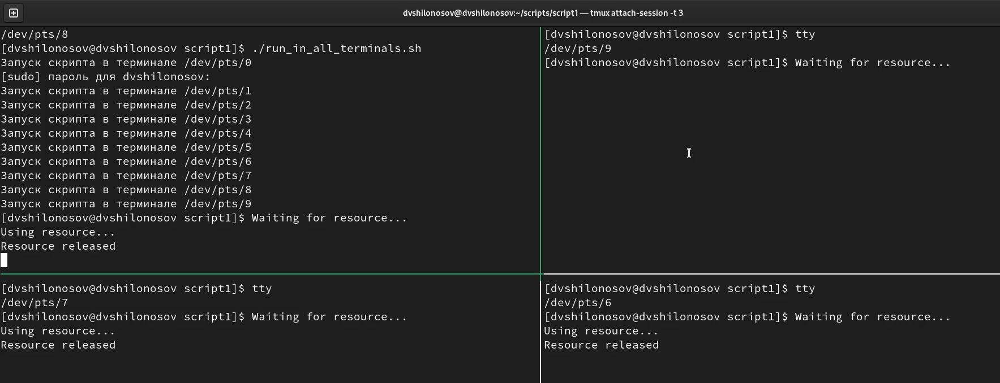
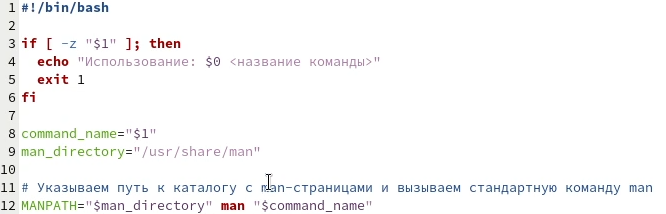
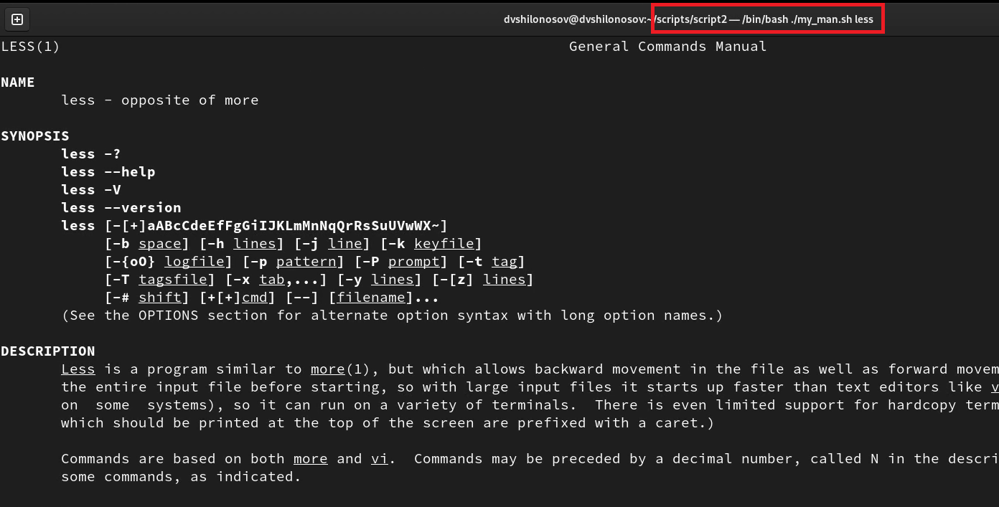
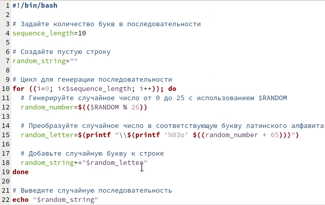

---
## Front matter
title: "ОТЧЕТ О ВЫПОЛНЕНИИ ЛАБОРАТОРНОЙ РАБОТЫ №12"
subtitle: "_дисциплина: Операционные системы_"
author: "Шилоносов Данил Вячеславович"

## Generic otions
lang: ru-RU
toc-title: "Содержание"

## Bibliography
bibliography: bib/cite.bib
csl: pandoc/csl/gost-r-7-0-5-2008-numeric.csl```

## Pdf output format
toc: true # Table of contents
toc-depth: 2
lof: true # List of figures
lot: false # List of tables
fontsize: 12pt
linestretch: 1.5
papersize: a4
documentclass: scrreprt
## I18n polyglossia
polyglossia-lang:
  name: russian
  options:
	- spelling=modern
	- babelshorthands=true
polyglossia-otherlangs:
  name: english
## I18n babel
babel-lang: russian
babel-otherlangs: english
## Fonts
mainfont: PT Serif
romanfont: PT Serif
sansfont: PT Sans
monofont: PT Mono
mainfontoptions: Ligatures=TeX
romanfontoptions: Ligatures=TeX
sansfontoptions: Ligatures=TeX,Scale=MatchLowercase
monofontoptions: Scale=MatchLowercase,Scale=0.9
## Biblatex
biblatex: true
biblio-style: "gost-numeric"
biblatexoptions:
  - parentracker=true
  - backend=biber
  - hyperref=auto
  - language=auto
  - autolang=other*
  - citestyle=gost-numeric
## Pandoc-crossref LaTeX customization
figureTitle: "Рис."
tableTitle: "Таблица"
listingTitle: "Листинг"
lofTitle: "Список иллюстраций"
lotTitle: "Список таблиц"
lolTitle: "Листинги"
## Misc options
indent: true
header-includes:
  - \usepackage{indentfirst}
  - \usepackage{float} # keep figures where there are in the text
  - \floatplacement{figure}{H} # keep figures where there are in the text
---

# Цель работы
Изучить основы программирования в оболочке ОС UNIX. Научиться писать более сложные командные файлы с использованием логических управляющих конструкций и циклов.

# Задачи
1. Написать командный файл, реализующий упрощённый механизм семафоров. Командный файл должен в течение некоторого времени t1 дожидаться освобождения ресурса, выдавая об этом сообщение, а дождавшись его освобождения, использовать его в течение некоторого времени t2<>t1, также выдавая информацию о том, что ресурс используется соответствующим командным файлом (процессом). Запустить командный файл в одном виртуальном терминале в фоновом режиме, перенаправив его вывод в другой (> /dev/tty#, где # — номер терминала куда перенаправляется вывод), в котором также запущен этот файл, но не фоновом, а в привилегированном режиме. Доработать программу так, чтобы имелась возможность взаимодействия трёх и более процессов.

2. Реализовать команду man с помощью командного файла. Изучите содержимое каталога /usr/share/man/man1. В нем находятся архивы текстовых файлов, содержащих справку по большинству установленных в системе программ и команд. Каждый архив можно открыть командой less сразу же просмотрев содержимое справки. Командный файл должен получать в виде аргумента командной строки название команды и в виде результата выдавать справку об этой команде или сообщение об отсутствии справки, если соответствующего файла нет в каталоге man1.

3. Используя встроенную переменную $RANDOM, напишите командный файл, генерирующий случайную последовательность букв латинского алфавита. Учтите, что $RANDOM выдаёт псевдослучайные числа в диапазоне от 0 до 32767.

# Выполнение лабораторной работы

## Задание №1
1. Данный скрипт реализует упрощенный механизм семафоров на основе файловой блокировки. Он дожидается освобождения ресурса, выдавая об этом сообщение, затем использует его, выдавая информацию о том, что ресурс используется соответствующим процессом. Ресурс защищен блокировкой на файле semaphore.txt. Скрипт можно запустить в фоновом режиме и перенаправить его вывод в другой терминал. (рис. [-@fig:001], [-@fig:002])

{#fig:001 width=100%}

{#fig:002 width=100%}

## Задание №2
2. Этот скрипт предоставляет пользователю возможность получить справку для команды, указанной в качестве аргумента. Он использует стандартную команду man с указанием пути к каталогу с man-страницами через переменную окружения MANPATH.

Скрипт проверяет, указано ли имя команды в качестве аргумента. Если аргумент не указан, выводит справочное сообщение и завершает работу.
Запоминает указанное имя команды и путь к каталогу man-страниц.
Устанавливает значение переменной окружения MANPATH равным пути к каталогу man-страниц.
Вызывает стандартную команду man с именем команды в качестве аргумента. (рис. [-@fig:003], [-@fig:004])

{#fig:003 width=100%}

{#fig:004 width=100%}

## Задание №3
3. Скрипт генерирует случайную последовательность латинских букв заданной длины. Он использует переменную $RANDOM для получения псевдослучайных чисел, преобразует их в соответствующие буквы и объединяет их в строку. Затем выводит эту строку на экран. (рис. [-@fig:005], [-@fig:006])

{#fig:005 width=100%}

{#fig:006 width=100%}

# Выводы
Были получены практические навыки написания более сложные командных файлов с использованием логических управляющих конструкций и циклов.
