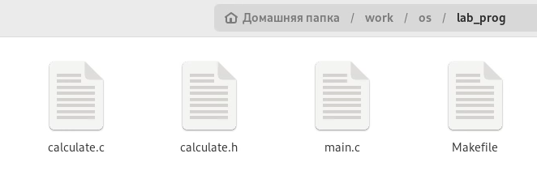
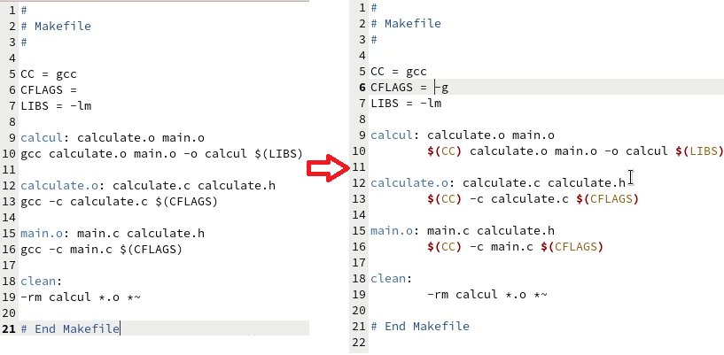
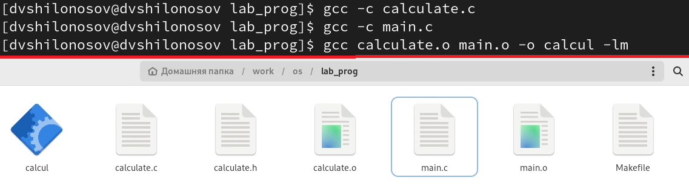
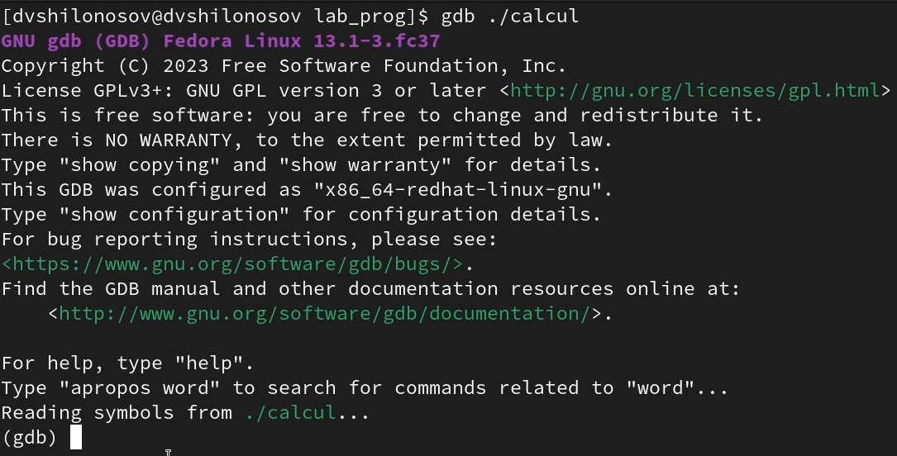
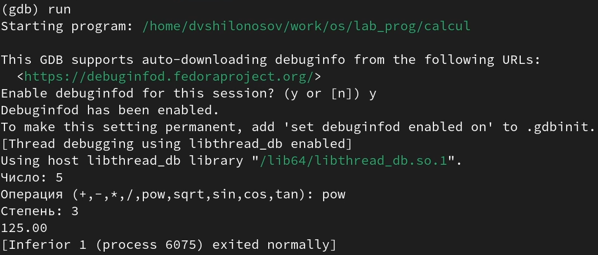
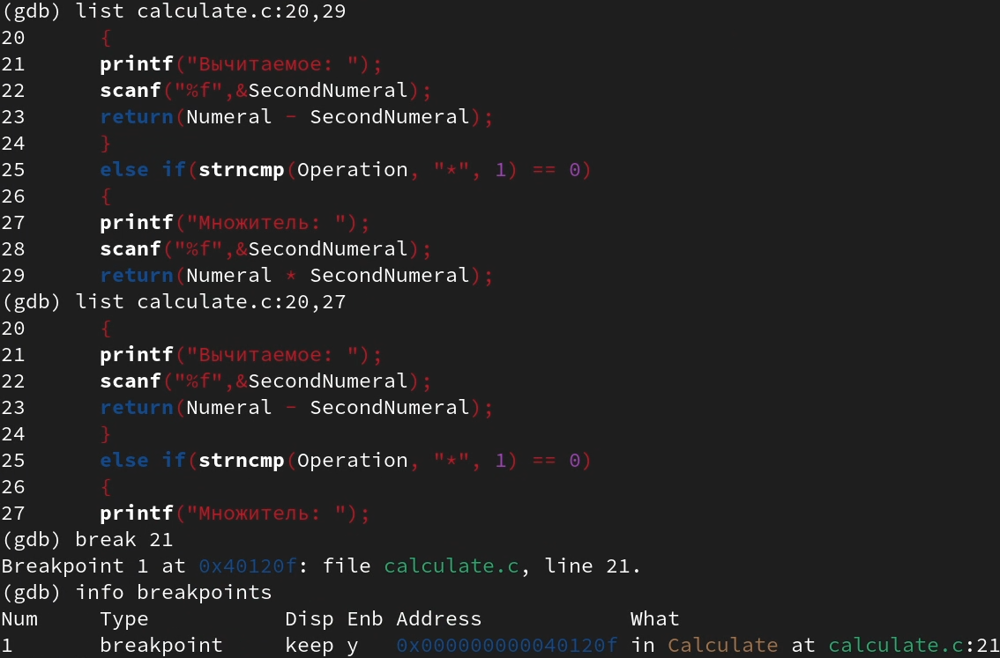
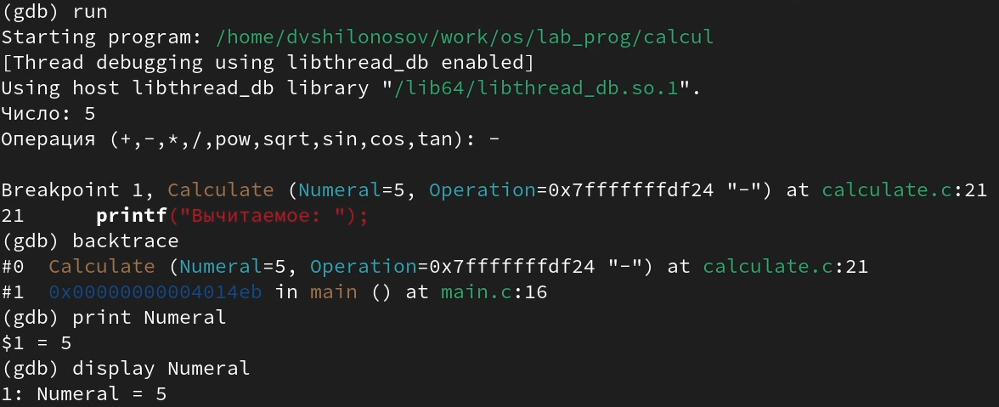
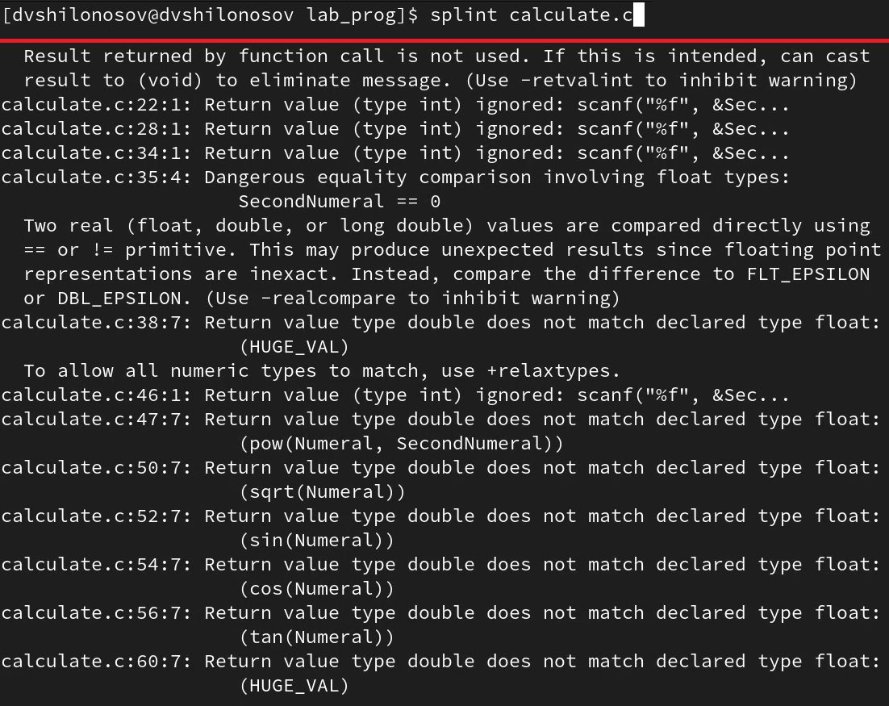

---
## Front matter
lang: ru-RU
title: Лабораторная работа №13
subtitle: Курс "Операционные Системы"
author:
  - Шилоносов Д.В., НКАбд-03-22
institute:
  - Российский университет дружбы народов, Москва, Россия
  
date: 06 мая 2023

## i18n babel
babel-lang: russian
babel-otherlangs: english

## Formatting pdf
toc: false
toc-title: Содержание
slide_level: 2
aspectratio: 169
section-titles: true
theme: metropolis
header-includes:
 - \metroset{progressbar=frametitle,sectionpage=progressbar,numbering=fraction}
 - '\makeatletter'
 - '\beamer@ignorenonframefalse'
 - '\makeatother'
---

# Информация

## Докладчик

:::::::::::::: {.columns align=center}
::: {.column width="70%"}

  * Шилоносов Данил Вячеславович
  * студент группы НКАбд-03-22
  * кафедры Компьютерные и информационные науки 
  * Российский университет дружбы народов
  * [1132221810@pfur.ru](mailto:1132221810@pfur.ru)
  

:::
::: {.column width="30%"}

:::
::::::::::::::

## Цель работы
Приобрести простейшие навыки разработки, анализа, тестирования и отладки приложений в ОС типа UNIX/Linux на примере создания на языке программирования С калькулятора с простейшими функциями.

## Задачи
1. В домашнем каталоге создайте подкаталог ~/work/os/lab_prog.
2. Создайте в нём файлы: calculate.h, calculate.c, main.c.
    Это будет примитивнейший калькулятор, способный складывать, вычитать, умножать и делить, возводить число в степень, брать квадратный корень, вычислять sin, cos, tan.
    При запуске он будет запрашивать первое число, операцию, второе число. После этого программа выведет результат и остановится.
3. Выполните компиляцию программы посредством gcc.
4. При необходимости исправьте синтаксические ошибки.
5. Создайте Makefile.
6. С помощью gdb выполните отладку программы calcul (перед использованием gdb исправьте Makefile).
7. С помощью утилиты splint попробуйте проанализировать коды файлов calculate.c и main.c.

# Выполнение лабораторной работы
# Редактирование, компиляция и линковка исходных файлов
## Исходные файлы
Создадим файлы calculate.c, calculate.h, main.c и Makefile

{#fig:001 width=100%}

Далее, вставим в эти файлы соответствующий код из условия задания.

## Редактирование Makefile
Исправим описание Makefile (добавим опцию -g для того, чтобы сохранялась отладочная информация)

{#fig:002 width=100%}

## Компиляция и линковка
С помощью компилятора GCC скомпилируем объектных файлы, затем слинкуем их в исполняемую программу

{#fig:003 width=100%}

# Работа с отладчиком gdb
## Запуск отладчика gdb

{#fig:004 width=100%}

## Запуск программы
В отладчике запустим программу и введем требуемые значения

{#fig:005 width=100%}

## Отладка
С помощью команды list отобразим нужную для просмотра часть кода, а затем, с помощью команды break поставим точку остановы:

## Запуск программы
Вновь запустив программу, видим дополнительную информацию, касающуюся ее выполнения

{#fig:007 width=100%}

# Утилита splint
Запустим с помощью утилиты splint файл calculate.c и увидим информацию, которые содержит предупреждения о программе:

{#fig:008 width=100%}

# Результаты

## Выводы
В процессе выполнения лабораторной работы были получены простейшие навыки разработки, анализа, тестирования и отладки приложений в ОС типа UNIX/Linux на примере создания на языке программирования С калькулятора с простейшими функциями.
