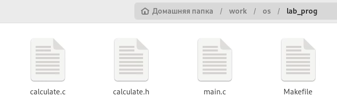
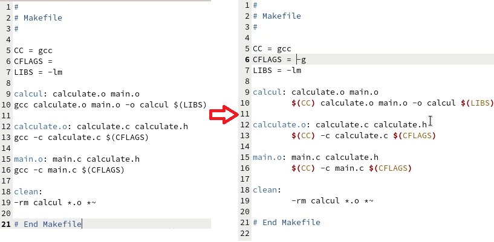
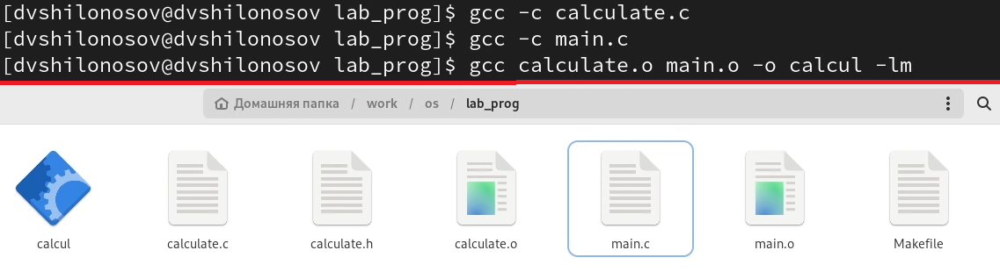
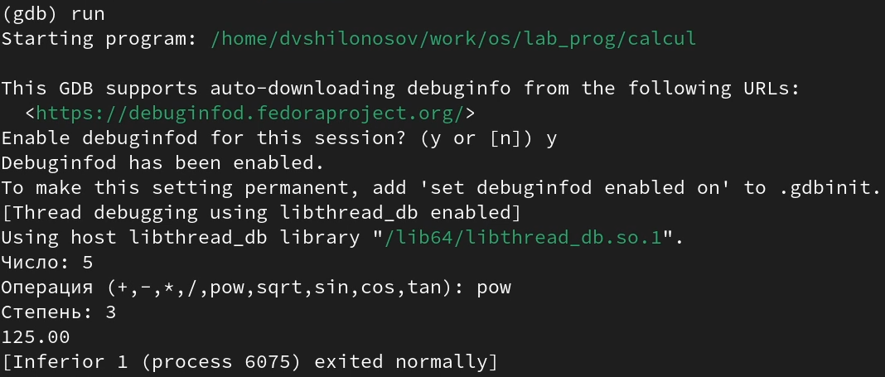
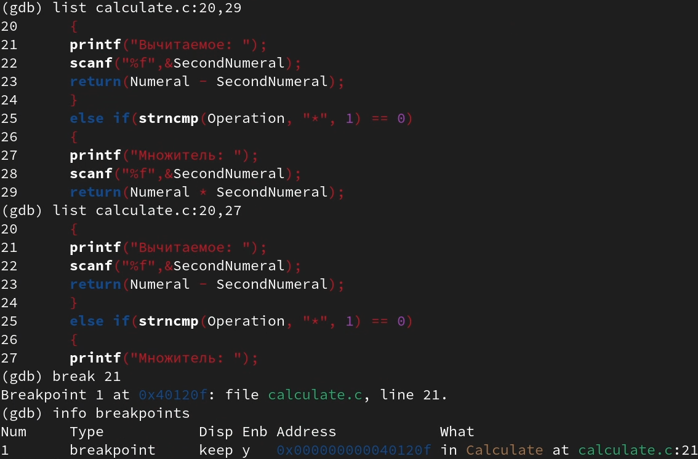
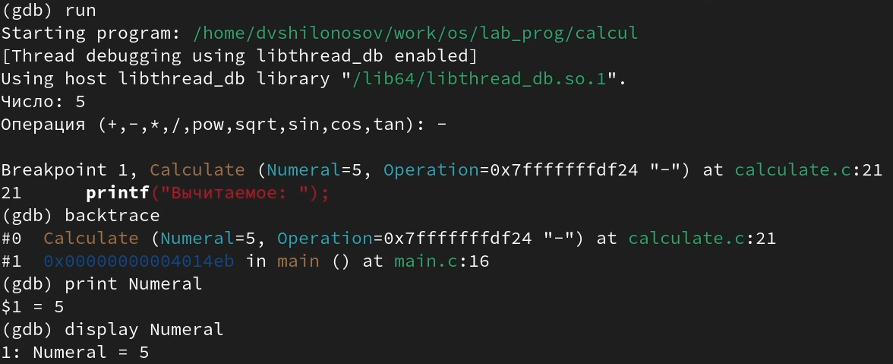
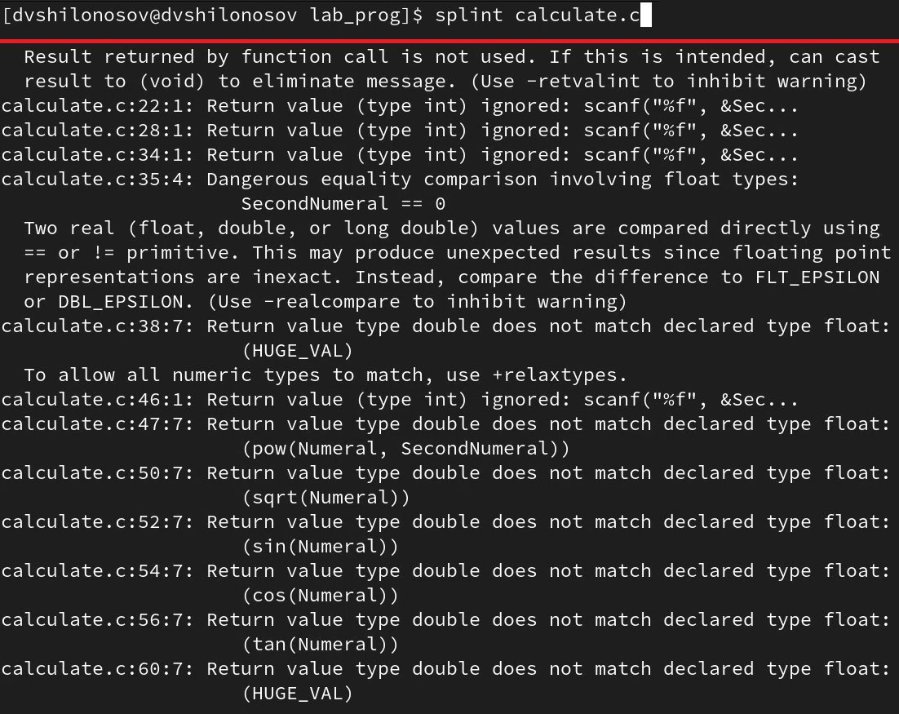

---
## Front matter
title: "ОТЧЕТ О ВЫПОЛНЕНИИ ЛАБОРАТОРНОЙ РАБОТЫ №13"
subtitle: "_дисциплина: Операционные системы_"
author: "Шилоносов Данил Вячеславович"

## Generic otions
lang: ru-RU
toc-title: "Содержание"

## Bibliography
bibliography: bib/cite.bib
csl: pandoc/csl/gost-r-7-0-5-2008-numeric.csl```

## Pdf output format
toc: true # Table of contents
toc-depth: 2
lof: true # List of figures
lot: false # List of tables
fontsize: 12pt
linestretch: 1.5
papersize: a4
documentclass: scrreprt
## I18n polyglossia
polyglossia-lang:
  name: russian
  options:
	- spelling=modern
	- babelshorthands=true
polyglossia-otherlangs:
  name: english
## I18n babel
babel-lang: russian
babel-otherlangs: english
## Fonts
mainfont: PT Serif
romanfont: PT Serif
sansfont: PT Sans
monofont: PT Mono
mainfontoptions: Ligatures=TeX
romanfontoptions: Ligatures=TeX
sansfontoptions: Ligatures=TeX,Scale=MatchLowercase
monofontoptions: Scale=MatchLowercase,Scale=0.9
## Biblatex
biblatex: true
biblio-style: "gost-numeric"
biblatexoptions:
  - parentracker=true
  - backend=biber
  - hyperref=auto
  - language=auto
  - autolang=other*
  - citestyle=gost-numeric
## Pandoc-crossref LaTeX customization
figureTitle: "Рис."
tableTitle: "Таблица"
listingTitle: "Листинг"
lofTitle: "Список иллюстраций"
lotTitle: "Список таблиц"
lolTitle: "Листинги"
## Misc options
indent: true
header-includes:
  - \usepackage{indentfirst}
  - \usepackage{float} # keep figures where there are in the text
  - \floatplacement{figure}{H} # keep figures where there are in the text
---

# Цель работы
Приобрести простейшие навыки разработки, анализа, тестирования и отладки приложений в ОС типа UNIX/Linux на примере создания на языке программирования С калькулятора с простейшими функциями.

# Задачи
1. В домашнем каталоге создайте подкаталог ~/work/os/lab_prog.
2. Создайте в нём файлы: calculate.h, calculate.c, main.c.
    Это будет примитивнейший калькулятор, способный складывать, вычитать, умножать и делить, возводить число в степень, брать квадратный корень, вычислять sin, cos, tan.
    При запуске он будет запрашивать первое число, операцию, второе число. После этого программа выведет результат и остановится.
    Реализация функций калькулятора в файле calculate.h:

```c
////////////////////////////////////
// calculate.c

#include <stdio.h>
#include <math.h>
#include <string.h>
#include "calculate.h"

float
Calculate(float Numeral, char Operation[4])
{
float SecondNumeral;
if(strncmp(Operation, "+", 1) == 0)
{
printf("Второе слагаемое: ");
scanf("%f",&SecondNumeral);
return(Numeral + SecondNumeral);
}
else if(strncmp(Operation, "-", 1) == 0)
{
printf("Вычитаемое: ");
scanf("%f",&SecondNumeral);
return(Numeral - SecondNumeral);
}
else if(strncmp(Operation, "*", 1) == 0)
{
printf("Множитель: ");
scanf("%f",&SecondNumeral);
return(Numeral * SecondNumeral);
}
else if(strncmp(Operation, "/", 1) == 0)
{
printf("Делитель: ");
scanf("%f",&SecondNumeral);
if(SecondNumeral == 0)
{
printf("Ошибка: деление на ноль! ");
return(HUGE_VAL);
}
else
return(Numeral / SecondNumeral);
}
else if(strncmp(Operation, "pow", 3) == 0)
{
printf("Степень: ");
scanf("%f",&SecondNumeral);
return(pow(Numeral, SecondNumeral));
}
else if(strncmp(Operation, "sqrt", 4) == 0)
return(sqrt(Numeral));
else if(strncmp(Operation, "sin", 3) == 0)
return(sin(Numeral));
else if(strncmp(Operation, "cos", 3) == 0)
return(cos(Numeral));
else if(strncmp(Operation, "tan", 3) == 0)
return(tan(Numeral));
else
{
printf("Неправильно введено действие ");
return(HUGE_VAL);
}
}
```

Интерфейсный файл calculate.h, описывающий формат вызова функции-калькулятора:

```c
///////////////////////////////////////
// calculate.h

#ifndef CALCULATE_H_
#define CALCULATE_H_

float Calculate(float Numeral, char Operation[4]);

#endif /*CALCULATE_H_*/
```

Основной файл main.c, реализующий интерфейс пользователя к калькулятору:

```c
////////////////////////////////////////
// main.c

#include <stdio.h>
#include "calculate.h"

int main (void)
{
float Numeral;
char Operation[4];
float Result;
printf("Число: ");
scanf("%f",&Numeral);
printf("Операция (+,-,*,/,pow,sqrt,sin,cos,tan): ");
scanf("%s",&Operation);
Result = Calculate(Numeral, Operation);
printf("%6.2f\n",Result);
return 0;
}
```

3. Выполните компиляцию программы посредством gcc:

```bash
gcc -c calculate.c
gcc -c main.c
gcc calculate.o main.o -o calcul -lm
```

4. При необходимости исправьте синтаксические ошибки.

5. Создайте Makefile со следующим содержанием:

```Makefile
#
# Makefile
#

CC = gcc
CFLAGS =
LIBS = -lm

calcul: calculate.o main.o
gcc calculate.o main.o -o calcul $(LIBS)

calculate.o: calculate.c calculate.h
gcc -c calculate.c $(CFLAGS)

main.o: main.c calculate.h
gcc -c main.c $(CFLAGS)

clean:
-rm calcul *.o *~

# End Makefile
```

Поясните в отчёте его содержание.

6. С помощью gdb выполните отладку программы calcul (перед использованием gdb исправьте Makefile):

- Запустите отладчик GDB, загрузив в него программу для отладки:

```bash
gdb ./calcul
```

– Для запуска программы внутри отладчика введите команду run:

```bash
run
```

- Для постраничного (по 9 строк) просмотра исходного код используйте команду list:

```bash
list
```

- Для просмотра строк с 12 по 15 основного файла используйте list с параметрами:

```bash
list 12,15
```

- Для просмотра определённых строк не основного файла используйте list с параметрами:

```bash
list calculate.c:20,29
```

- Установите точку останова в файле calculate.c на строке номер 21:

```bash
list calculate.c:20,27
break 21
```

- Выведите информацию об имеющихся в проекте точка останова:

```bash
info breakpoints
```

- Запустите программу внутри отладчика и убедитесь, что программа остановится в момент прохождения точки останова:

```bash
run
5
-
backtrace
```

- Отладчик выдаст следующую информацию:

```bash
#0 Calculate (Numeral=5, Operation=0x7fffffffd280 "-")
at calculate.c:21
#1 0x0000000000400b2b in main () at main.c:17
```

а команда backtrace покажет весь стек вызываемых функций от начала программы до текущего места.

- Посмотрите, чему равно на этом этапе значение переменной Numeral, введя:

```bash
print Numeral
```

На экран должно быть выведено число 5.
- Сравните с результатом вывода на экран после использования команды:

```bash
display Numeral
```

- Уберите точки останова

```bash
info breakpoints
delete 1
```

7. С помощью утилиты splint попробуйте проанализировать коды файлов calculate.c и main.c.

# Теоретическое введение
## Этапы разработки приложений
Процесс разработки программного обеспечения обычно разделяется на следующие этапы:
- планирование, включающее сбор и анализ требований к функционалу и другим характеристикам разрабатываемого приложения;
- проектирование, включающее в себя разработку базовых алгоритмов и спецификаций, определение языка программирования;
- непосредственная разработка приложения:
   - кодирование — по сути создание исходного текста программы (возможно в нескольких вариантах);
   - анализ разработанного кода;
   - сборка, компиляция и разработка исполняемого модуля;
   - тестирование и отладка, сохранение произведённых изменений;
   - документирование.
   
Для создания исходного текста программы разработчик может воспользоваться любым удобным для него редактором текста: vi, vim, mceditor, emacs, geany и др.
После завершения написания исходного кода программы (возможно состоящей из нескольких файлов), необходимо её скомпилировать и получить исполняемый модуль.

## Компиляция исходного текста и построение исполняемого файла
Стандартным средством для компиляции программ в ОС типа UNIX является GCC (GNU Compiler Collection). Это набор компиляторов для разного рода языков программирования (С, C++, Java, Фортран и др.). Работа с GCC производится при помощи одноимённой управляющей программы gcc, которая интерпретирует аргументы командной строки, определяет и осуществляет запуск нужного компилятора для входного файла.
Файлы с расширением (суффиксом) .c воспринимаются gcc как программы на языке С, файлы с расширением .cc или .C — как файлы на языке C++, а файлы c расширением .o считаются объектными.
Для компиляции файла main.c, содержащего написанную на языке С простейшую программу:

```c
/*
* main.c
*/
#include <stdio.h>
int main()
{
printf("Hello World!\n");
return 0;
}
```

достаточно в командной строке ввести:

```bash
gcc -c main.c
```

# Выполнение лабораторной работы
## Редактирование, компиляция и линковка исходных файлов
Создадим файлы calculate.c, calculate.h, main.c и Makefile: (рис. [-@fig:001])

{#fig:001 width=100%}

Далее, вставим в эти файлы соответствующий код из условия задания.

Исправим описание Makefile (добавим опцию -g для того, чтобы сохранялась отладочная информация): (рис. [-@fig:002])

{#fig:002 width=100%}

С помощью компилятора GCC скомпилируем объектных файлы, затем слинкуем их в исполняемую программу: (рис. [-@fig:003])

{#fig:003 width=100%}

## Работа с отладчиком gdb

Запустим отладчик gdb: (рис. [-@fig:004])

{#fig:004 width=100%}

В отладчик запустим программу и введем требуемые значения (рис. [-@fig:005])

{#fig:005 width=100%}

С помощью команды

```bash
list
```

отобразим нужную для просмотра часть кода, а затем, с помощью команды break поставим точку остановы: (рис. [-@fig:006])

{#fig:006 width=100%}

Вновь запустив программу, видим дополнительную информацию, касающуюся ее выполнения: (рис. [-@fig:007])

{#fig:007 width=100%}

## Утилита splint

Запустим с помощью утилиты splint файл calculate.c и увидим информацию, которые содержит предупреждения о программе: (рис. [-@fig:008])

{#fig:008 width=100%}

# Выводы
В процессе выполнения лабораторной работы были получены простейшие навыки разработки, анализа, тестирования и отладки приложений в ОС типа UNIX/Linux на примере создания на языке программирования С калькулятора с простейшими функциями.
