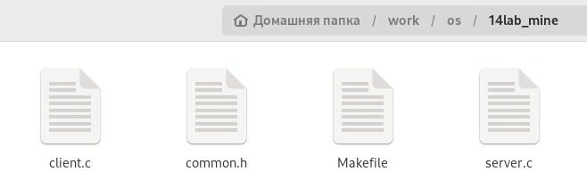
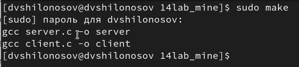
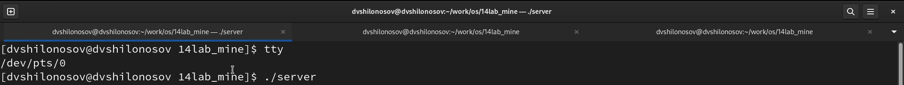
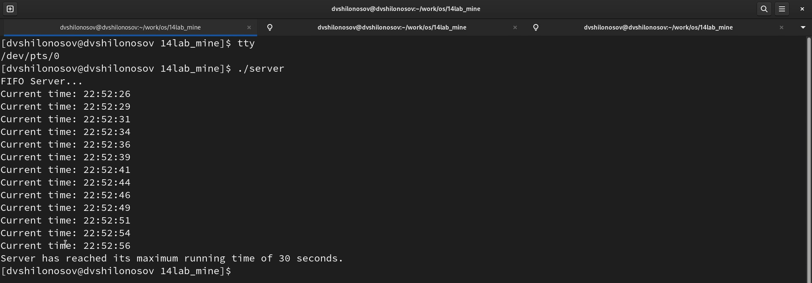

---
## Front matter
lang: ru-RU
title: Лабораторная работа №14
subtitle: Курс "Операционные Системы"
author:
  - Шилоносов Д.В., НКАбд-03-22
institute:
  - Российский университет дружбы народов, Москва, Россия
  
date: 13 мая 2023

## i18n babel
babel-lang: russian
babel-otherlangs: english

## Formatting pdf
toc: false
toc-title: Содержание
slide_level: 2
aspectratio: 169
section-titles: true
theme: metropolis
header-includes:
 - \metroset{progressbar=frametitle,sectionpage=progressbar,numbering=fraction}
 - '\makeatletter'
 - '\beamer@ignorenonframefalse'
 - '\makeatother'
---

# Информация

## Докладчик

:::::::::::::: {.columns align=center}
::: {.column width="70%"}

  * Шилоносов Данил Вячеславович
  * студент группы НКАбд-03-22
  * кафедры Компьютерные и информационные науки 
  * Российский университет дружбы народов
  * [1132221810@pfur.ru](mailto:1132221810@pfur.ru)
  

:::
::: {.column width="30%"}


:::
::::::::::::::

## Цель работы
Приобретение практических навыков работы с именованными каналами.

## Задачи
Изучите приведённые в тексте программы server.c и client.c. Взяв данные примеры за образец, напишите аналогичные программы, внеся следующие изменения:

1. Работает не 1 клиент, а несколько (например, два).

2. Клиенты передают текущее время с некоторой периодичностью (например, раз в пять секунд). Используйте функцию sleep() для приостановки работы клиента.

3. Сервер работает не бесконечно, а прекращает работу через некоторое время (например, 30 сек). Используйте функцию clock() для определения времени работы сервера.
* Что будет в случае, если сервер завершит работу, не закрыв канал?

# Выполнение лабораторной работы
## Создание исходных файлов
Создадим файлы common.h, server.c, client.h и Makefile:

{#fig:001 width=100%}

## Запуск сервера
Скомпилируем исходные файлы с помощью команды
```c
sudo make
```
и получим файлы server и client.

{#fig:002 width=100%}

## Запуск сервера
Запускаем сервер и сразу 2 клиента с интервалом в пару секунд.

{#fig:003 width=100%}

## Результат работы сервера

{#fig:004 width=100%}

# Результаты

## Выводы
В процессе выполнения лабораторной работы были приобретены практические навыки работы с именованными каналами.
