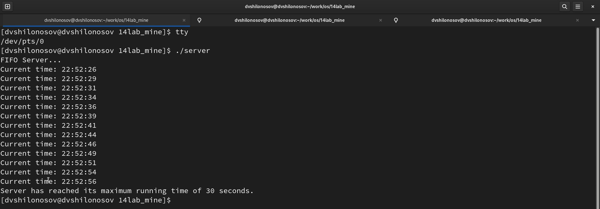

---
## Front matter
title: "ОТЧЕТ О ВЫПОЛНЕНИИ ЛАБОРАТОРНОЙ РАБОТЫ №14"
subtitle: "_дисциплина: Операционные системы_"
author: "Шилоносов Данил Вячеславович"

## Generic otions
lang: ru-RU
toc-title: "Содержание"

## Bibliography
bibliography: bib/cite.bib
csl: pandoc/csl/gost-r-7-0-5-2008-numeric.csl```

## Pdf output format
toc: true # Table of contents
toc-depth: 2
lof: true # List of figures
lot: false # List of tables
fontsize: 12pt
linestretch: 1.5
papersize: a4
documentclass: scrreprt
## I18n polyglossia
polyglossia-lang:
  name: russian
  options:
	- spelling=modern
	- babelshorthands=true
polyglossia-otherlangs:
  name: english
## I18n babel
babel-lang: russian
babel-otherlangs: english
## Fonts
mainfont: PT Serif
romanfont: PT Serif
sansfont: PT Sans
monofont: PT Mono
mainfontoptions: Ligatures=TeX
romanfontoptions: Ligatures=TeX
sansfontoptions: Ligatures=TeX,Scale=MatchLowercase
monofontoptions: Scale=MatchLowercase,Scale=0.9
## Biblatex
biblatex: true
biblio-style: "gost-numeric"
biblatexoptions:
  - parentracker=true
  - backend=biber
  - hyperref=auto
  - language=auto
  - autolang=other*
  - citestyle=gost-numeric
## Pandoc-crossref LaTeX customization
figureTitle: "Рис."
tableTitle: "Таблица"
listingTitle: "Листинг"
lofTitle: "Список иллюстраций"
lotTitle: "Список таблиц"
lolTitle: "Листинги"
## Misc options
indent: true
header-includes:
  - \usepackage{indentfirst}
  - \usepackage{float} # keep figures where there are in the text
  - \floatplacement{figure}{H} # keep figures where there are in the text
---

# Цель работы
Приобретение практических навыков работы с именованными каналами.

# Задачи
Изучите приведённые в тексте программы server.c и client.c. Взяв данные примеры за образец, напишите аналогичные программы, внеся следующие изменения:

1. Работает не 1 клиент, а несколько (например, два).

2. Клиенты передают текущее время с некоторой периодичностью (например, раз в пять секунд). Используйте функцию sleep() для приостановки работы клиента.

3. Сервер работает не бесконечно, а прекращает работу через некоторое время (например, 30 сек). Используйте функцию clock() для определения времени работы сервера.
* Что будет в случае, если сервер завершит работу, не закрыв канал?


# Теоретическое введение
## Указания к работе
Одним из видов взаимодействия между процессами в операционных системах является обмен сообщениями. Под сообщением понимается последовательность байтов, передаваемая от одного процесса другому.
В операционных системах типа UNIX есть 3 вида межпроцессорных взаимодействий: общеюниксные (именованные каналы, сигналы), System V Interface Definition (SVID — разделяемая память, очередь сообщений, семафоры) и BSD (сокеты).
Для передачи данных между неродственными процессами можно использовать механизм именованных каналов (named pipes). Данные передаются по принципу FIFO (First In First Out) (первым записан — первым прочитан), поэтому они называются также FIFO pipes или просто FIFO. Именованные каналы отличаются от неименованных наличием идентификатора канала, который представлен как специальный файл (соответственно имя именованного канала — это имя файла). Поскольку файл находится на локальной файловой системе, данное IPC используется внутри одной системы.
Файлы именованных каналов создаются функцией mkfifo(3).
```c
#include <sys/types.h>
#include <sys/stat.h>

int mkfifo(const char *pathname, mode_t mode)
```
Первый параметр — имя файла, идентифицирующего канал, второй параметр — маска прав доступа к файлу.
После создания файла канала процессы, участвующие в обмене данными, должны открыть этот файл либо для записи, либо для чтения. При закрытии файла сам канал продолжает существовать. Для того чтобы закрыть сам канал, нужно удалить его файл, например с помощью вызова unlink(2).
Рассмотрим работу именованного канала на примере системы клиент–сервер. Сервер создаёт канал, читает из него текст, посылаемый клиентом, и выводит его на терминал.
Вызов функции mkfifo() создаёт файл канала (с именем, заданным макросом FIFO_NAME):
```c
mkfifo(FIFO_NAME, 0600)
```
В качестве маски доступа используется восьмеричное значение 0600, разрешающее
процессу с аналогичными реквизитами пользователя чтение и запись. Можно также
установить права доступа 0666.
Открываем созданный файл для чтения:
```c
f = fopen(FIFO_NAME, O_RDONLY);
```
Ждём сообщение от клиента. Сообщение читаем с помощью функции read() и печатаем на экран. После этого удаляется файл FIFO_NAME и сервер прекращает работу.
Клиент открывает FIFO для записи как обычный файл:
```c
f = fopen(FIFO_NAME, O_WRONLY);
```
Посылаем сообщение серверу с помощью функции write().
Для создания файла FIFO можно использовать более общую функцию mknod(2), предназначенную для создания специальных файлов различных типов (FIFO, сокеты, файлы устройств и обычные файлы для хранения данных).
```c
#include <sys/types.h>
#include <sys/stat.h>
#include <fcntl.h>
#include <unistd.h>

int mknod(const char *pathname, mode_t mode, dev_t dev);
```
Тогда, вместо
```c
mkfifo(FIFO_NAME, 0600)
```
пишем
```c
mknod(FIFO_NAME, S_IFIFO | 0600, 0);
```
Каналы представляют собой простое и удобное средство передачи данных, которое, однако, подходит не во всех ситуациях. Например, с помощью каналов довольно трудно организовать обмен асинхронными сообщениями между процессами.

## Пример программы
### Файл common.h
```c
/*
* common.h - заголовочный файл со стандартными определениями
*/

#ifndef __COMMON_H__
#define __COMMON_H__

#include <stdio.h>
#include <stdlib.h>
#include <string.h>
#include <errno.h>
#include <sys/types.h>
#include <sys/stat.h>
#include <fcntl.h>

#define FIFO_NAME "/tmp/fifo"
#define MAX_BUFF 80

#endif /* __COMMON_H__ */
```
### Файл server.c
```c
/*олняет следующие шаги:
* server.c - реализация сервера
*
* чтобы запустить пример, необходимо:
* 1. запустить программу server на одной консоли;
* 2. запустить программу client на другой консоли.
*/

#include "common.h"

int
main()
{
int readfd; /* дескриптор для чтения из FIFO */
int n;
char buff[MAX_BUFF]; /* буфер для чтения данных из FIFO */

/* баннер */
printf("FIFO Server...\n");

/* создаем файл FIFO с открытыми для всех
* правами доступа на чтение и запись
*/
if(mknod(FIFO_NAME, S_IFIFO | 0666, 0) < 0)
{
fprintf(stderr, "%s: Невозможно создать FIFO (%s)\n",
__FILE__, strerror(errno));
exit(-1);
}

/* откроем FIFO на чтение */
if((readfd = open(FIFO_NAME, O_RDONLY)) < 0)
{
fprintf(stderr, "%s: Невозможно открыть FIFO (%s)\n",
__FILE__, strerror(errno));
exit(-2);
}

/* читаем данные из FIFO и выводим на экран */
while((n = read(readfd, buff, MAX_BUFF)) > 0)
{
if(write(1, buff, n) != n)
{
fprintf(stderr, "%s: Ошибка вывода (%s)\n",
__FILE__, strerror(errno));
exit(-3);
}
}

close(readfd); /* закроем FIFO */

/* удалим FIFO из системы */
if(unlink(FIFO_NAME) < 0)
{
fprintf(stderr, "%s: Невозможно удалить FIFO (%s)\n",
__FILE__, strerror(errno));
exit(-4);
}

exit(0);
}
```
### Файл client.c
```c
/*
* client.c - реализация клиента
*
* чтобы запустить пример, необходимо:
* 1. запустить программу server на одной консоли;
* 2. запустить программу client на другой консоли.
*/

#include "common.h"

#define MESSAGE "Hello Server!!!\n"

int
main()
{
int writefd; /* дескриптор для записи в FIFO */
int msglen;

/* баннер */
printf("FIFO Client...\n");

/* получим доступ к FIFO */
if((writefd = open(FIFO_NAME, O_WRONLY)) < 0)
{
fprintf(stderr, "%s: Невозможно открыть FIFO (%s)\n",
__FILE__, strerror(errno));
exit(-1);
}

/* передадим сообщение серверу */
msglen = strlen(MESSAGE);
if(write(writefd, MESSAGE, msglen) != msglen)
{
fprintf(stderr, "%s: Ошибка записи в FIFO (%s)\n",
__FILE__, strerror(errno));
exit(-2);
}

/* закроем доступ к FIFO */
close(writefd);

exit(0);
}
```
### Файл Makefile
```c
all: server client

server: server.c common.h
    gcc server.c -o server

client: client.c common.h
    gcc client.c -o client

clean:
    -rm server client *.o
```

# Выполнение лабораторной работы
## Создание исходных файлов
Создадим файлы common.h, server.c, client.h и Makefile: (рис. [-@fig:001])

{#fig:001 width=100%}

## Описание исходных файлов и их содержимое
### common.h
#### Описание common.h
Файл common.h является заголовочным файлом, который содержит общие определения и включения библиотек, используемые в программах server.c и client.c.

В этом файле происходит подключение следующих библиотек:

- stdio.h - библиотека стандартного ввода/вывода, предоставляющая функции для работы с вводом и выводом.
- stdlib.h - библиотека стандартных функций языка C, включающая функции для работы с памятью, преобразования типов и другие.
- string.h - библиотека для работы со строками и массивами символов.
- errno.h - библиотека для работы с кодами ошибок.
- sys/types.h и sys/stat.h - библиотеки для работы с файловыми системами.
- fcntl.h - библиотека для работы с файлами и управления файловыми дескрипторами.
- unistd.h - библиотека, предоставляющая доступ к некоторым POSIX-функциям (например, read(), write(), close(), unlink(), sleep()).

Также здесь определены две константы:

- FIFO_NAME - имя FIFO, которое будет использоваться для общения между сервером и клиентами.
- MAX_BUFF - максимальный размер буфера для чтения данных из FIFO.

Заголовочный файл используется для объявления функций и переменных, которые могут быть использованы в нескольких различных исходных файлах. Это помогает избежать дублирования кода и делает его более читабельным и легко поддерживаемым.

#### Содержимое common.h
```c
/*
* common.h - заголовочный файл со стандартными определениями
*/

#ifndef __COMMON_H__
#define __COMMON_H__

#include <stdio.h>
#include <stdlib.h>
#include <string.h>
#include <errno.h>
#include <sys/types.h>
#include <sys/stat.h>
#include <fcntl.h>
#include <unistd.h>     // Для read(), write(), close(), unlink(), sleep()

#define FIFO_NAME "/tmp/fifo"
#define MAX_BUFF 80

#endif /* __COMMON_H__ */
```

### server.c
#### Описание server.c
Файл server.c содержит код серверной части приложения. Он отвечает за создание и чтение из FIFO (named pipe), а также за удаление FIFO после завершения работы.

В этом файле функция main() выполняет следующие действия:
1. Выводит на экран сообщение о запуске сервера.

2. Создает FIFO, используя функцию mknod(). При этом используются константы, определенные в common.h: имя FIFO и права доступа. В случае ошибки выводится сообщение об ошибке и программа завершается.

3. Открывает FIFO для чтения с помощью функции open(). В случае ошибки выводится сообщение об ошибке и программа завершается.

4. В цикле читает данные из FIFO с помощью функции read(). Прочитанные данные записываются в буфер buff. Если чтение прошло успешно (возвращено положительное число), то данные из буфера выводятся на экран с помощью функции write(). В случае ошибки выводится сообщение об ошибке и программа завершается.

5. После того как сервер завершает чтение из FIFO (в случае если время работы сервера превышает 30 секунд), он закрывает FIFO с помощью функции close().

6. Наконец, сервер удаляет FIFO из системы с помощью функции unlink(). В случае ошибки выводится сообщение об ошибке и программа завершается.

В итоге, сервер выполняет работу по приему данных от клиентов через FIFO, выводит эти данные на экран и удаляет FIFO после завершения работы.

#### Содержимое server.c
```c
#include "common.h"
#include <time.h>

#define MAX_TIME 30 // Максимальное время работы сервера в секундах

int main()
{
    int readfd;
    int n;
    char buff[MAX_BUFF];
    time_t start, current;

    printf("FIFO Server...\n");

    if(mknod(FIFO_NAME, S_IFIFO | 0666, 0) < 0)
    {
        fprintf(stderr, "%s: Невозможно создать FIFO (%s)\n",
        __FILE__, strerror(errno));
        exit(-1);
    }

    if((readfd = open(FIFO_NAME, O_RDONLY)) < 0)
    {
        fprintf(stderr, "%s: Невозможно открыть FIFO (%s)\n",
        __FILE__, strerror(errno));
        exit(-2);
    }

    start = time(NULL);
    while((n = read(readfd, buff, MAX_BUFF)) > 0)
    {
        if(write(1, buff, n) != n)
        {
            fprintf(stderr, "%s: Ошибка вывода (%s)\n",
            __FILE__, strerror(errno));
            exit(-3);
        }
        
        current = time(NULL);
        if (difftime(current, start) >= MAX_TIME) {
            printf("Server has reached its maximum running time of %d seconds.\n", MAX_TIME);
            break;
        }
    }

    close(readfd);

    if(unlink(FIFO_NAME) < 0)
    {
        fprintf(stderr, "%s: Невозможно удалить FIFO (%s)\n",
        __FILE__, strerror(errno));
        exit(-4);
    }

    exit(0);
}
```

### client.c
#### Описание client.c
Файл client.c содержит код клиентской части приложения. Этот код отвечает за открытие FIFO и отправку сообщений в него.

Функция main() в этом файле выполняет следующие действия:

1. Выводит на экран сообщение о запуске клиента.

2. В бесконечном цикле выполняет следующие шаги:
   - Получает текущее время и форматирует его в строку buff с помощью функции strftime().
   - Открывает FIFO для записи с помощью функции open(). В случае ошибки выводится сообщение об ошибке и программа завершается.
   - Передает сообщение серверу (содержимое буфера buff) с помощью функции write(). В случае ошибки выводится сообщение об ошибке и программа завершается.
   - Закрывает FIFO с помощью функции close().
   - Приостанавливает работу на 5 секунд с помощью функции sleep().

Таким образом, клиент периодически (каждые 5 секунд) отправляет серверу сообщения, содержащие текущее время. Это продолжается до тех пор, пока программа клиента не будет остановлена вручную.

#### Содержимое client.c
```c
#include "common.h"
#include <time.h>

#define MESSAGE "Hello Server!!!\n"
#define SLEEP_TIME 5

int main()
{
    int writefd;
    int msglen;
    char buff[MAX_BUFF];

    printf("FIFO Client...\n");

    if((writefd = open(FIFO_NAME, O_WRONLY)) < 0)
    {
        fprintf(stderr, "%s: Невозможно открыть FIFO (%s)\n",
        __FILE__, strerror(errno));
        exit(-1);
    }

    while (1) {
        time_t now = time(NULL);
        strftime(buff, MAX_BUFF, "Current time: %H:%M:%S\n", localtime(&now));
        
        if(write(writefd, buff, strlen(buff)) < 0)
        {
            fprintf(stderr, "%s: Ошибка записи в FIFO (%s)\n",
            __FILE__, strerror(errno));
            exit(-2);
        }

        sleep(SLEEP_TIME);
    }

    close(writefd);

    exit(0);
}
```

### Makefile
#### Описание Makefile
Файл Makefile используется для автоматизации процесса сборки программы. Он содержит инструкции для утилиты make, которая автоматически определяет, какие части программы необходимо перекомпилировать, и выполняет необходимые действия.

В данном Makefile определены следующие цели:

- all: Эта цель является целью по умолчанию (так как она указана первой), и она зависит от целей server и client. Это означает, что при выполнении команды make без указания конкретной цели будут выполнены действия, связанные с целями server и client.

- server: Эта цель компилирует файл server.c с помощью компилятора gcc и создает исполняемый файл server.

- client: Эта цель компилирует файл client.c с помощью компилятора gcc и создает исполняемый файл client.

- clean: Эта цель удаляет исполняемые файлы server и client, а также все объектные файлы (файлы с расширением .o), которые могли быть созданы в процессе компиляции.

Каждая цель в Makefile состоит из двух частей: зависимостей и команд. Зависимости определяют, какие файлы или цели должны быть обновлены или существовать, прежде чем будет выполнена команда. Команды определяют, что нужно сделать для достижения цели.

#### Содержимое Makefile
```makefile
all: server client

server: server.c common.h
	gcc server.c -o server

client: client.c common.h
	gcc client.c -o client

clean:
	-rm server client *.o
```

## Запуск сервера
Скомпилируем исходные файлы с помощью команды (рис. [-@fig:002])
```c
sudo make
```
и получим файлы server и client.

{#fig:002 width=100%}

Запускаем сервер и сразу 2 клиента с интервалом в пару секунд (рис. [-@fig:003])

{#fig:003 width=100%}

Результат работы сервера: (рис. [-@fig:004])

{#fig:004 width=100%}

# Выводы
В процессе выполнения лабораторной работы были приобретены практические навыки работы с именованными каналами.
