---
## Front matter
lang: ru-RU
title: ОТЧЕТ О ВЫПОЛНЕНИИ ИНДИВИДУАЛЬНОГО ПРОЕКТА. ЭТАП №2
subtitle: Курс "Операционные Системы"
author:
  - Шилоносов Д.В. , НКАбд-03-22
institute:
  - Российский университет дружбы народов, Москва, Россия
  
date: 16 марта 2023

## i18n babel
babel-lang: russian
babel-otherlangs: english

## Formatting pdf
toc: false
toc-title: Содержание
slide_level: 2
aspectratio: 169
section-titles: true
theme: metropolis
header-includes:
 - \metroset{progressbar=frametitle,sectionpage=progressbar,numbering=fraction}
 - '\makeatletter'
 - '\beamer@ignorenonframefalse'
 - '\makeatother'
---

## Докладчик

:::::::::::::: {.columns align=center}
::: {.column width="40%"}

  * Шилоносов Данил Вячеславович
  * студент группы НКАбд-03-22
  * кафедры Компьютерные и информационные науки 
  * Российский университет дружбы народов
  * [1132221810@pfur.ru](mailto:1132221810@pfur.ru)
  

:::
::: {.column width="30%"}

:::
::::::::::::::

# Цель и задачи
Целью работы является добавление/редактирование основной информации на сайте.

1. Изменить аватар.
2. Изменить заголовок сайта.
3. Изменить роль/позицию/компетенцию/специальность.
4. Добавить информацию о местах учебы/работы.
5. Добавить bio (краткую информацию о себе).
6. Добавить ссылки на ресурсы.

# Выполнение лабораторной работы

## Изменение аватара
1. Для того изменения аватара добавим изображение, переименуя его в avatar

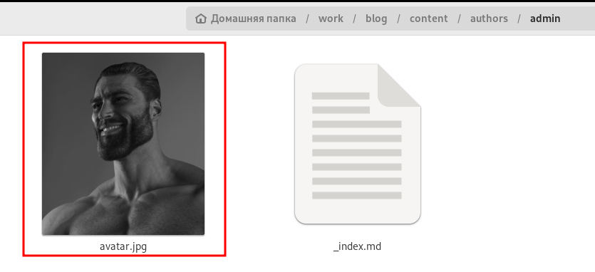{#fig:001 width=100%}

## Результат задания №1
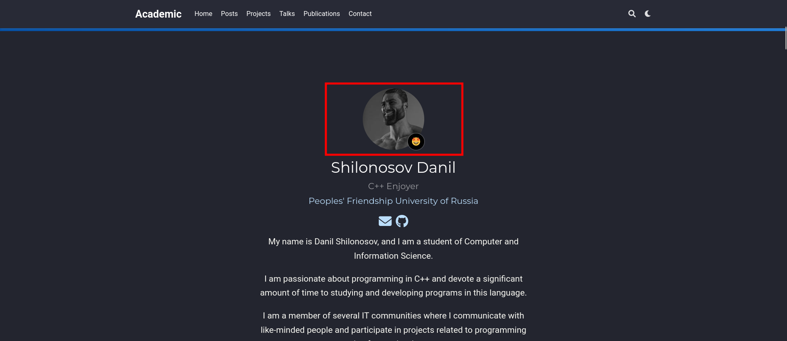{#fig:002 width=100%}

## Изменение заголовка сайта
2. Для того, чтобы изменить заголовок сайта, найдем поле 'title' и изменим информацию в нем

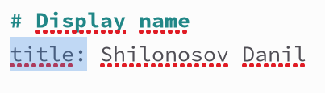{#fig:003 width=100%}

## Результат задания №2
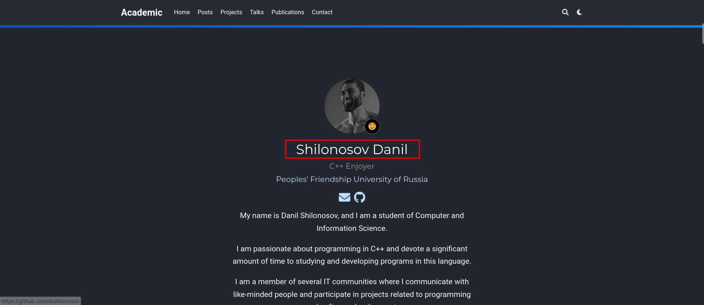{#fig:004 width=100%}

## Добавление информации о роли/позиции/компетенции/специальности
3. Для того, чтобы изменить компетенцию, найдем поле 'role' и изменим в нем текст

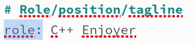{#fig:005 width=100%}

## Результат задания №3
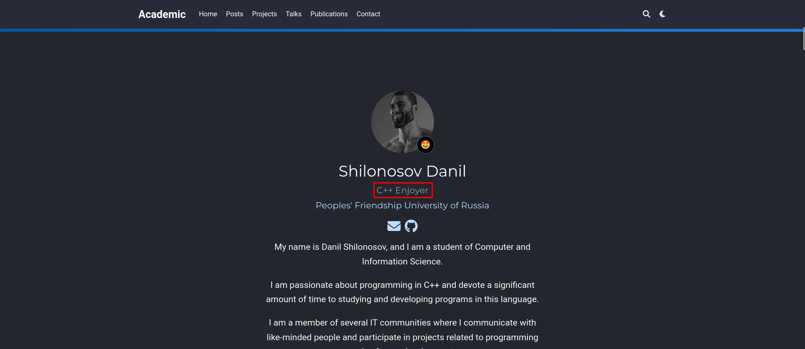{#fig:006 width=100%}

## Добавление информацию об местах учебы, работы
4. Для того, чтобы изменить информацию о местах учебы/работы, найдем поле 'education' и изменим в нем текст

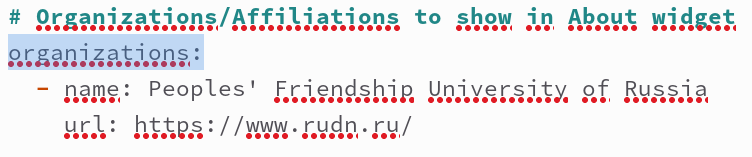{#fig:007 width=100%}

## Результат задания №4
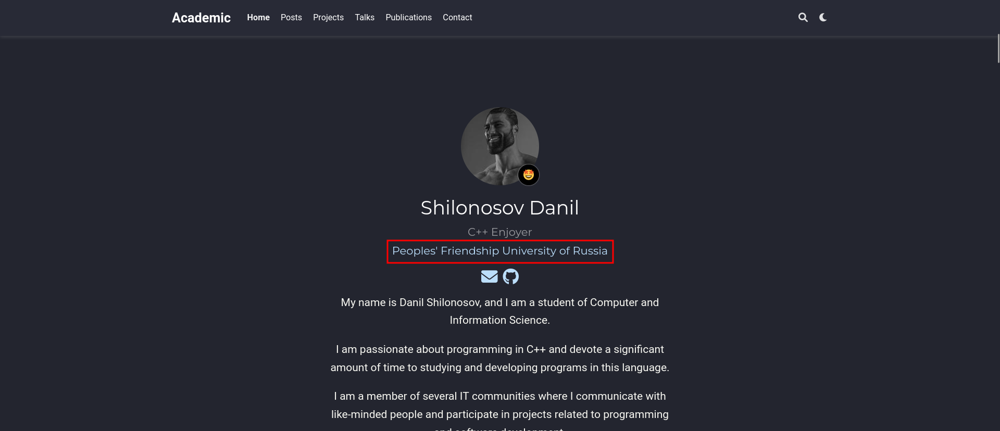{#fig:008 width=100%}

## Добавление bio
5. Для того, чтобы добавить bio, спустимся в самый низ файла _index.md и заменим соответствующий текст

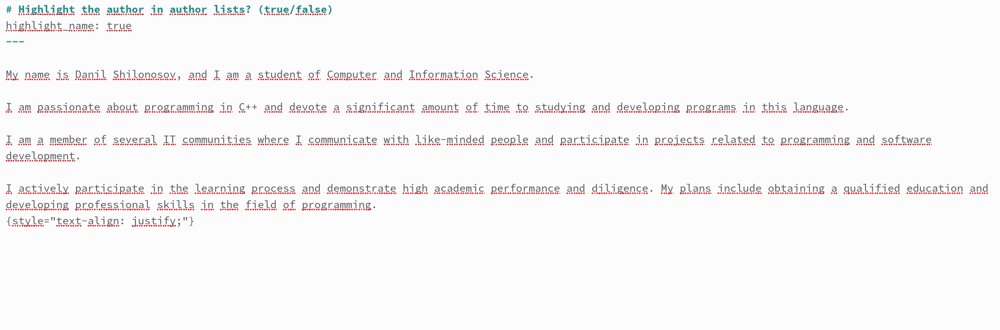{#fig:009 width=100%}

## Результат задания №5
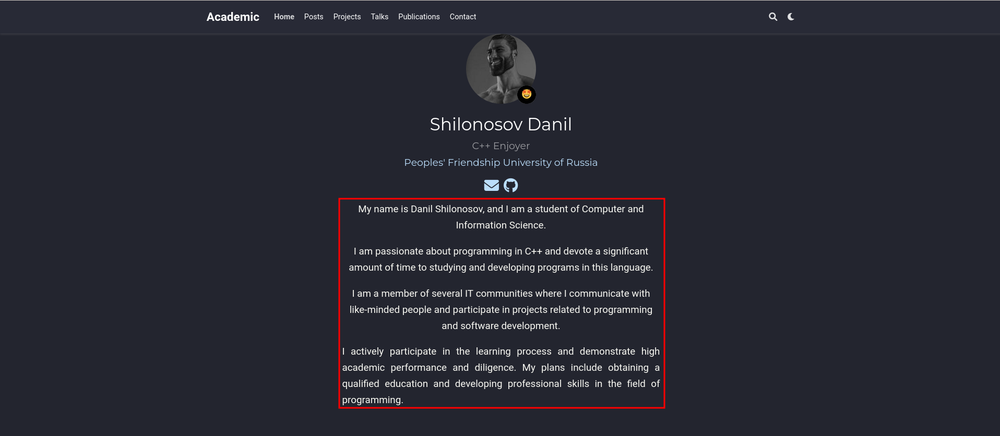{#fig:010 width=100%}

## Добавление ссылок на ресурсы
6. Для того, чтобы добавить ссылки на ресурсы, найдем поле 'social' и изменим его содержимое

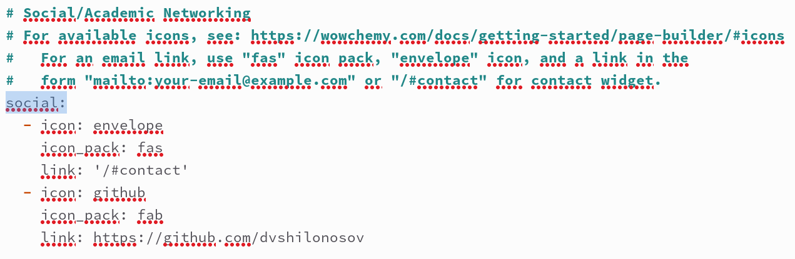{#fig:011 width=100%}

## Результат задания №6
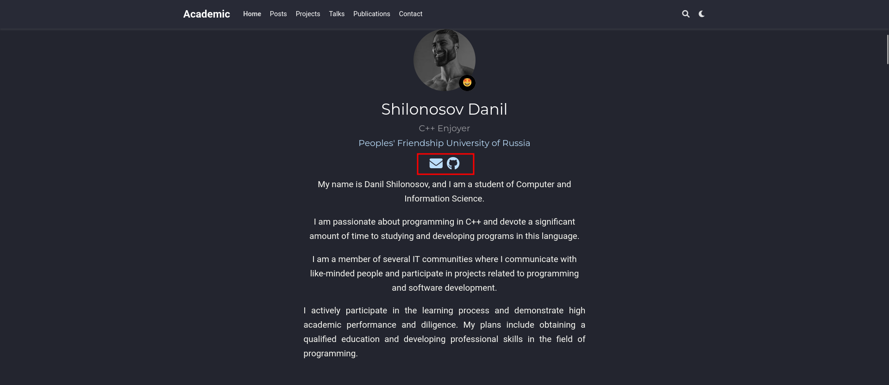{#fig:012 width=100%}

# Выводы
Были добавлена/отредактирована информация на сайте: аватар, заголовок, компетентность, места учебы/работы, bio и ссылки на ресурсы.
