---
## Front matter
title: "ОТЧЕТ О ВЫПОЛНЕНИИ ИНДИВИДУАЛЬНОГО ПРОЕКТА. ЭТАП №2"
subtitle: "_дисциплина: Операционные системы_"
author: "Шилоносов Данил Вячеславович"

## Generic otions
lang: ru-RU
toc-title: "Содержание"

## Bibliography
bibliography: bib/cite.bib
csl: pandoc/csl/gost-r-7-0-5-2008-numeric.csl

## Pdf output format
toc: true # Table of contents
toc-depth: 2
lof: true # List of figures
lot: false # List of tables
fontsize: 12pt
linestretch: 1.5
papersize: a4
documentclass: scrreprt
## I18n polyglossia
polyglossia-lang:
  name: russian
  options:
	- spelling=modern
	- babelshorthands=true
polyglossia-otherlangs:
  name: english
## I18n babel
babel-lang: russian
babel-otherlangs: english
## Fonts
mainfont: PT Serif
romanfont: PT Serif
sansfont: PT Sans
monofont: PT Mono
mainfontoptions: Ligatures=TeX
romanfontoptions: Ligatures=TeX
sansfontoptions: Ligatures=TeX,Scale=MatchLowercase
monofontoptions: Scale=MatchLowercase,Scale=0.9
## Biblatex
biblatex: true
biblio-style: "gost-numeric"
biblatexoptions:
  - parentracker=true
  - backend=biber
  - hyperref=auto
  - language=auto
  - autolang=other*
  - citestyle=gost-numeric
## Pandoc-crossref LaTeX customization
figureTitle: "Рис."
tableTitle: "Таблица"
listingTitle: "Листинг"
lofTitle: "Список иллюстраций"
lotTitle: "Список таблиц"
lolTitle: "Листинги"
## Misc options
indent: true
header-includes:
  - \usepackage{indentfirst}
  - \usepackage{float} # keep figures where there are in the text
  - \floatplacement{figure}{H} # keep figures where there are in the text
---

# Цель работы
Целью работы является добавление/редактирование основной информации на сайте.

# Задачи
1. Изменить аватар.
2. Изменить заголовок сайта.
3. Изменить роль/позицию/компетенцию/специальность.
4. Добавить информацию о местах учебы/работы.
5. Добавить bio (краткую информацию о себе).
6. Добавить ссылки на ресурсы.

# Выполнение лабораторной работы

1. Для того изменения аватара добавим изображение, переименуя его в avatar (рис. [-@fig:001], [-@fig:002])

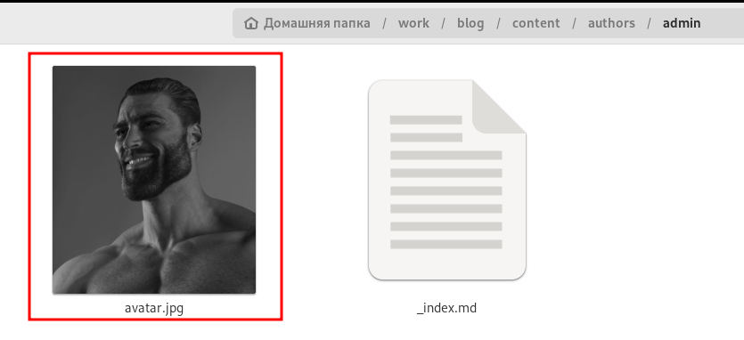{#fig:001 width=100%}

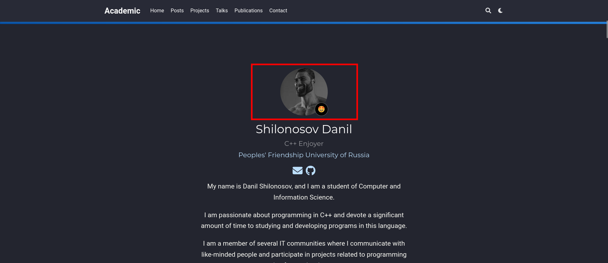{#fig:002 width=100%}

2. Для того, чтобы изменить заголовок сайта, найдем поле 'title' и изменим информацию в нем (рис. [-@fig:003], [-@fig:004])

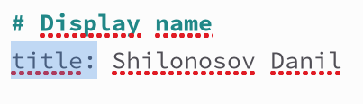{#fig:003 width=100%}

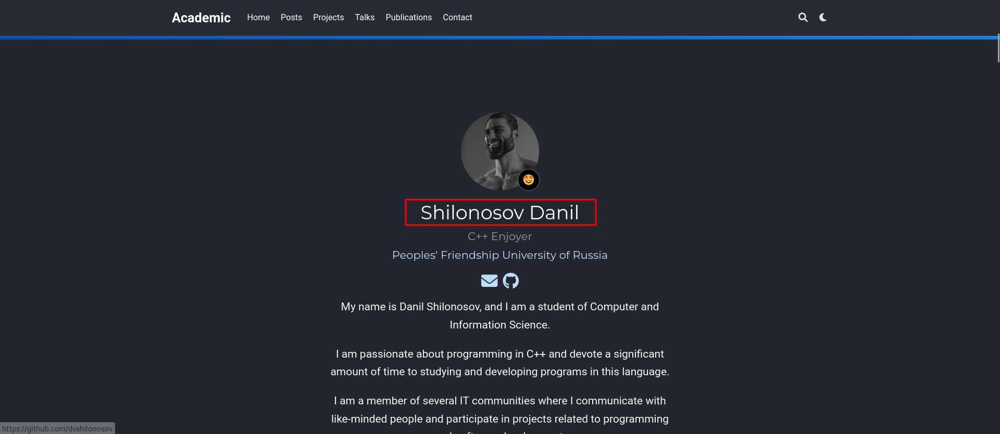{#fig:004 width=100%}

3. Для того, чтобы изменить компетенцию, найдем поле 'role' и изменим в нем текст (рис. [-@fig:005], [-@fig:006])

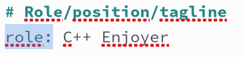{#fig:005 width=100%}

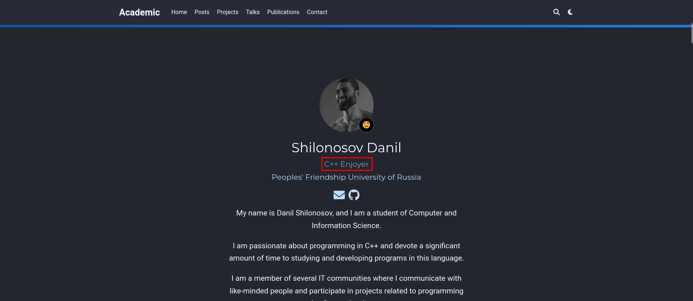{#fig:006 width=100%}

4. Для того, чтобы изменить информацию о местах учебы/работы, найдем поле 'education' и изменим в нем текст (рис. [-@fig:007], [-@fig:008])

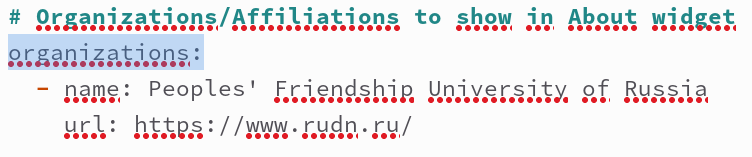{#fig:007 width=100%}

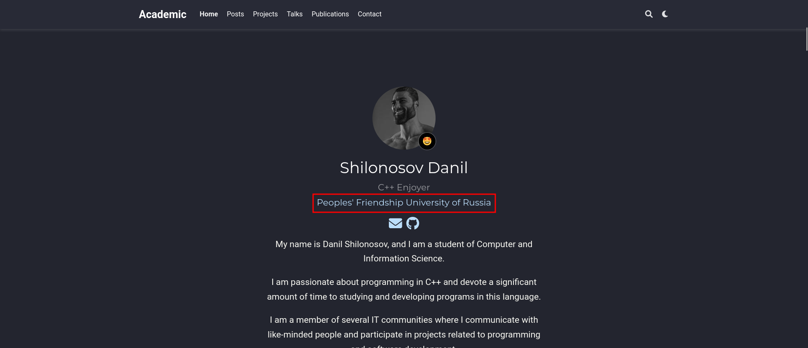{#fig:008 width=100%}

5. Для того, чтобы добавить bio, спустимся в самый низ файла _index.md и заменим соответствующий текст (рис. [-@fig:009], [-@fig:010])

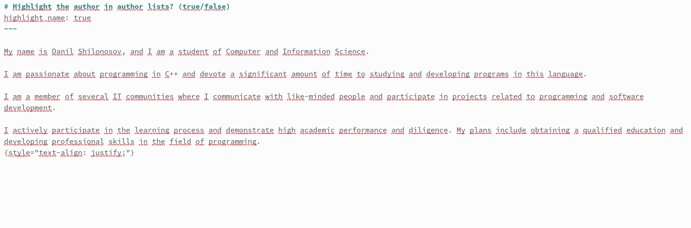{#fig:009 width=100%}

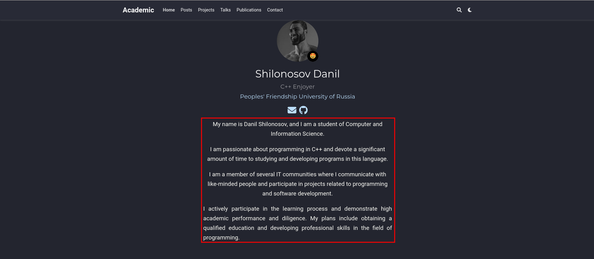{#fig:010 width=100%}

6. Для того, чтобы добавить ссылки на ресурсы, найдем поле 'social' и изменим его содержимое (рис. [-@fig:011], [-@fig:012])

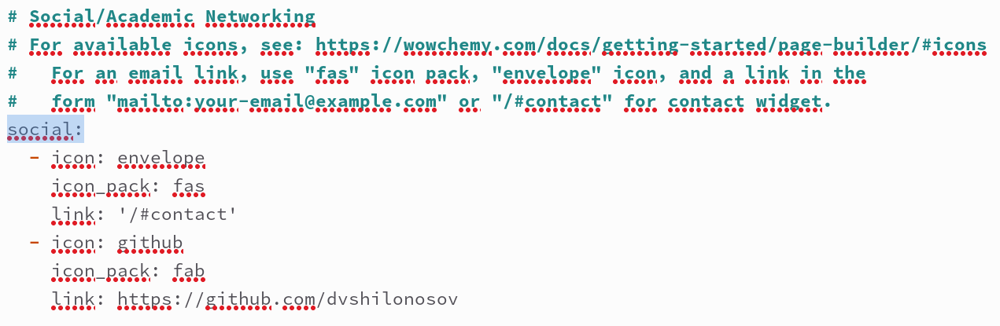{#fig:011 width=100%}

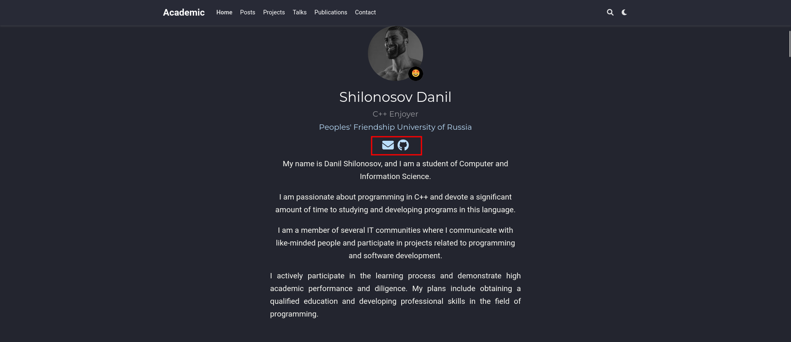{#fig:012 width=100%}

# Выводы
Были добавлена/отредактирована информация на сайте: аватар, заголовок, компетентность, места учебы/работы, bio и ссылки на ресурсы.
