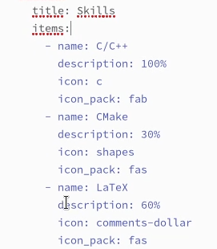
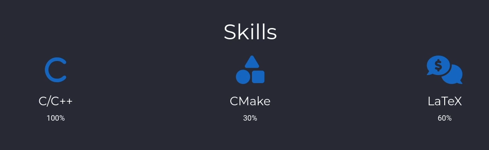
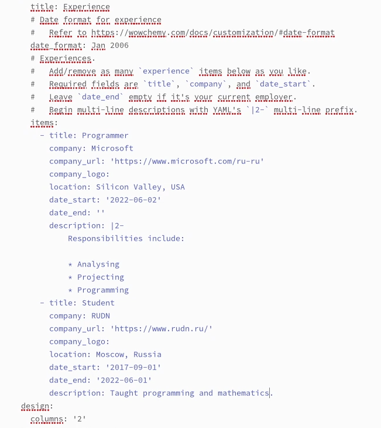
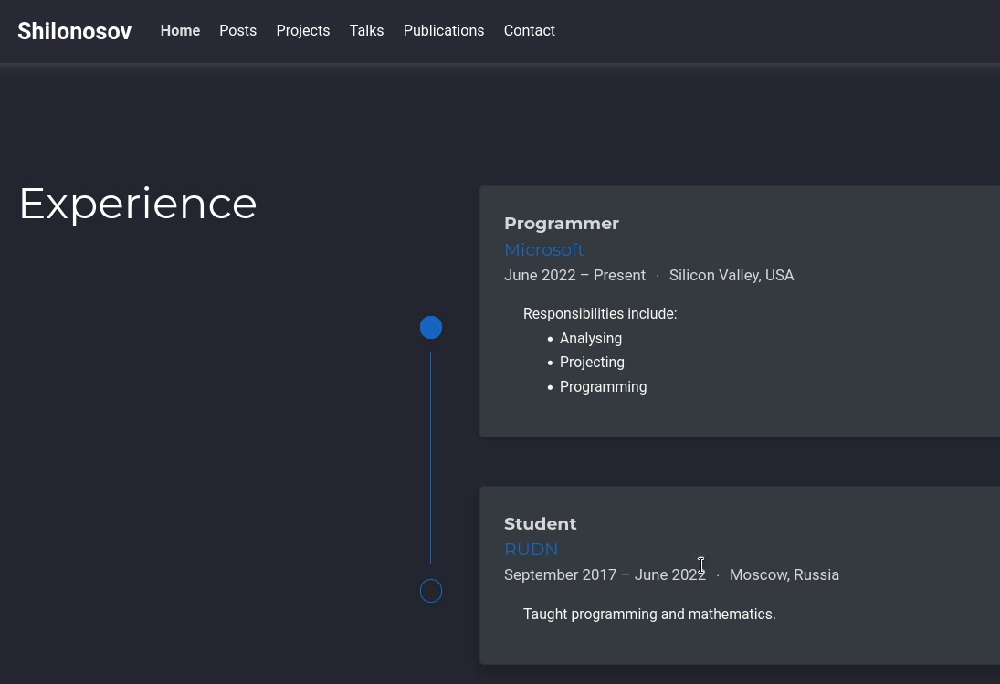
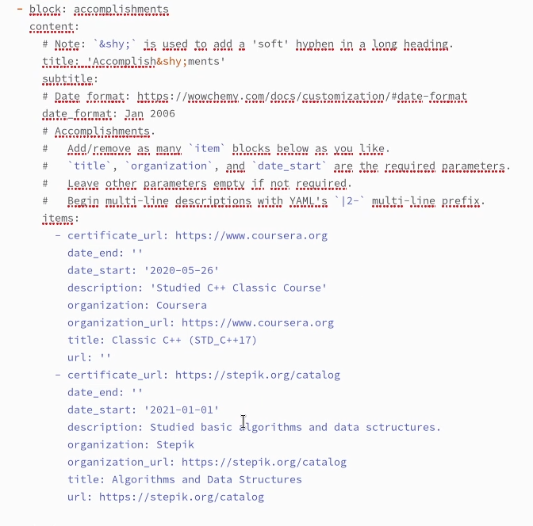
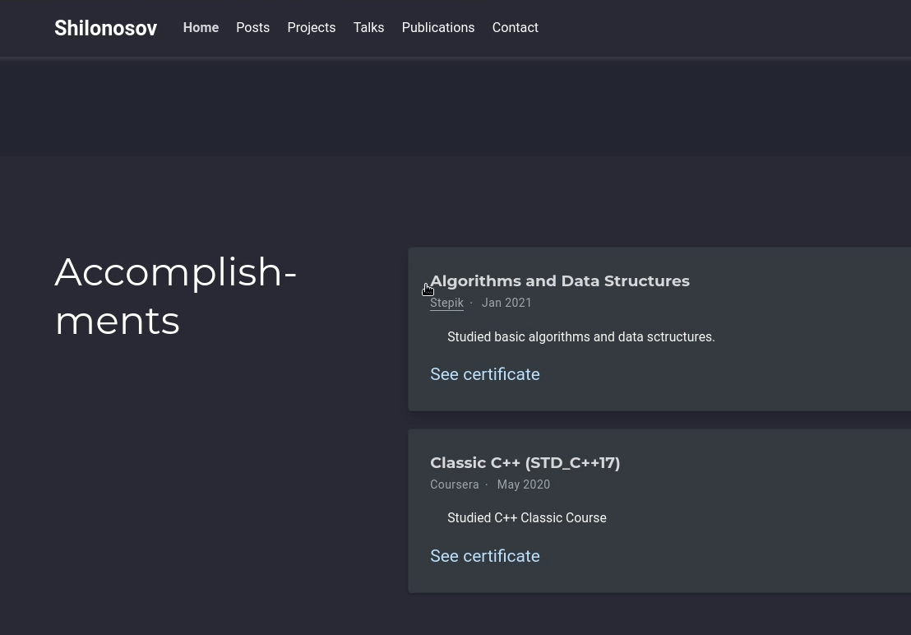
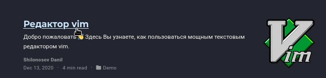
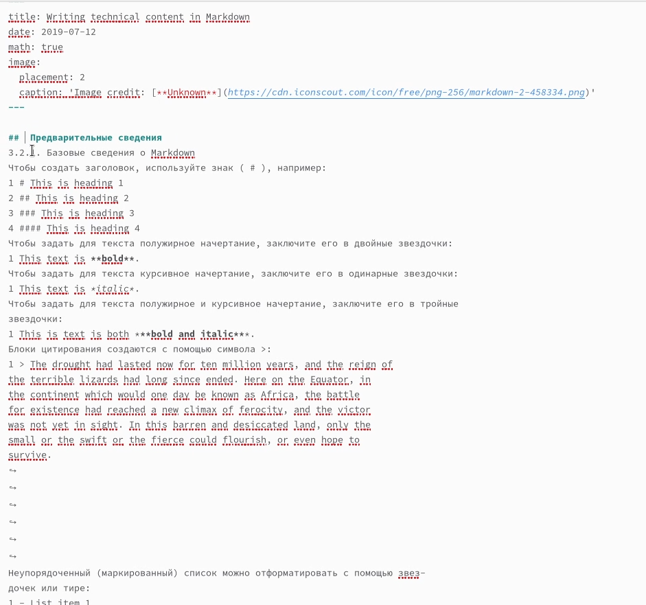
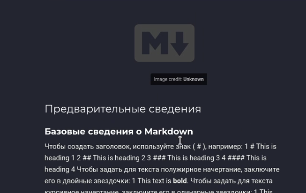

---
## Front matter
lang: ru-RU
title: ОТЧЕТ О ВЫПОЛНЕНИИ ИНДИВИДУАЛЬНОГО ПРОЕКТА. ЭТАП №3
subtitle: Курс "Операционные Системы"
author:
  - Шилоносов Д.В. , НКАбд-03-22
institute:
  - Российский университет дружбы народов, Москва, Россия
  
date: 8 апреля 2023

## i18n babel
babel-lang: russian
babel-otherlangs: english

## Formatting pdf
toc: false
toc-title: Содержание
slide_level: 2
aspectratio: 169
section-titles: true
theme: metropolis
header-includes:
 - \metroset{progressbar=frametitle,sectionpage=progressbar,numbering=fraction}
 - '\makeatletter'
 - '\beamer@ignorenonframefalse'
 - '\makeatother'
---

## Докладчик

:::::::::::::: {.columns align=center}
::: {.column width="40%"}

  * Шилоносов Данил Вячеславович
  * студент группы НКАбд-03-22
  * кафедры Компьютерные и информационные науки 
  * Российский университет дружбы народов
  * [1132221810@pfur.ru](mailto:1132221810@pfur.ru)
  

:::
::: {.column width="30%"}

:::
::::::::::::::

# Цель работы
Целью работы является добавление к сайту постов и достижений его владельца.

# Задачи 
1. Список достижений.
- Добавить информацию о навыках (Skills).
- Добавить информацию об опыте (Experience).
- Добавить информацию о достижениях (Accomplishments).

2. Сделать пост по прошедшей неделе.
3. Добавить пост на тему по выбору:
- Легковесные языки разметки.
- Языки разметки. LaTeX.
- Язык разметки Markdown.

# Выполнение лабораторной работы

1. Список достижений:

# Добавим информацию о навыках (Skills)

## Добавление информации о навыках в markdown
{#fig:001 width=100%}

## Добавление информации о навыках на сайте
{#fig:002 width=100%}

# Добавим информацию об опыте (Experience)

## Добавление информации об опыте в markdown
{#fig:003 width=100%}

## Добавление информации об опыте на сайте
{#fig:004 width=100%}

# Добавим информацию о достижениях (Accomplishments)

## Добавление информации о достижениях в markdown
{#fig:005 width=100%}

## Добавление информации о достижениях на сайте
{#fig:006 width=100%}

# Сделаем пост по прошедшей неделе

## Пост по прошедшей неделе в markdown
{#fig:007 width=100%}

## Пост по прошедшей неделе на сайте
{#fig:008 width=100%}

# Добавить пост на тему по выбору на тему "Язык разметки Markdown"

## Пост а тему по выбору в markdown
{#fig:009 width=100%}

## Пост а тему по выбору на сайте
{#fig:010 width=100%}

# Выводы
В процессе выполнения этапа индивидуального проекта были добавлены достижения и посты на сайте его владельца.
