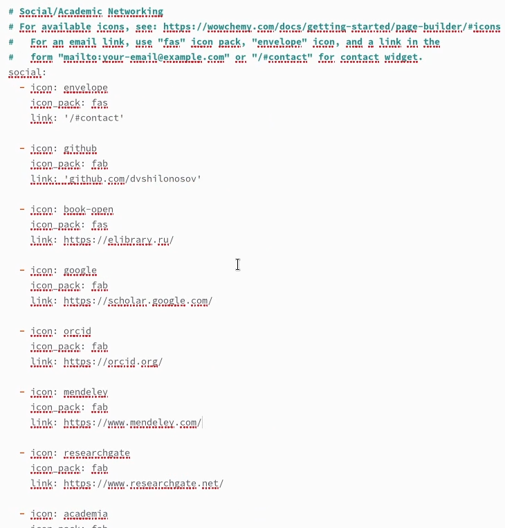
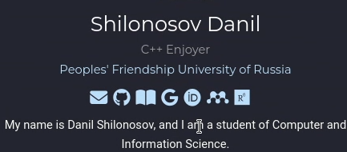
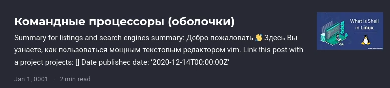
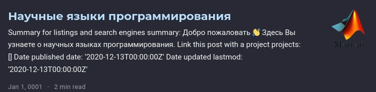

---
## Front matter
lang: ru-RU
title: ОТЧЕТ О ВЫПОЛНЕНИИ ИНДИВИДУАЛЬНОГО ПРОЕКТА. ЭТАП №4
subtitle: Курс "Операционные Системы"
author:
  - Шилоносов Д.В. , НКАбд-03-22
institute:
  - Российский университет дружбы народов, Москва, Россия
  
date: 29 апреля 2023

## i18n babel
babel-lang: russian
babel-otherlangs: english

## Formatting pdf
toc: false
toc-title: Содержание
slide_level: 2
aspectratio: 169
section-titles: true
theme: metropolis
header-includes:
 - \metroset{progressbar=frametitle,sectionpage=progressbar,numbering=fraction}
 - '\makeatletter'
 - '\beamer@ignorenonframefalse'
 - '\makeatother'
---

## Докладчик

:::::::::::::: {.columns align=center}
::: {.column width="40%"}

  * Шилоносов Данил Вячеславович
  * студент группы НКАбд-03-22
  * кафедры Компьютерные и информационные науки 
  * Российский университет дружбы народов
  * [1132221810@pfur.ru](mailto:1132221810@pfur.ru)
  

:::
::: {.column width="30%"}

:::
::::::::::::::

# Цель работы
Целью работы является добавление на сайт ссылок на научные и библиометрические ресурсы, постов.

# Задачи 
1. Добавить к сайту ссылки на научные и библиометрические ресурсы.
Зарегистрироваться на соответствующих ресурсах и разместить на них ссылки на сайте:
- eLibrary : https://elibrary.ru/;
- Google Scholar : https://scholar.google.com/;
- ORCID : https://orcid.org/;
- Mendeley : https://www.mendeley.com/;
- ResearchGate : https://www.researchgate.net/;
- Academia.edu : https://www.academia.edu/;
- arXiv : https://arxiv.org/;
- github : https://github.com/.

2. Сделать пост по прошедшей неделе.

3. Добавить пост на тему по выбору.
- Языки научного программирования.

# Выполнение лабораторной работы
## Добавленние ссылок в файле
1. Добавлены ссылки на ресурсы

{#fig:001 width=100%}

## Добавленние ссылок на сайте

{#fig:002 width=100%}

## Пост по прошедшей неделе
2. Сделан пост по прошедшей неделе

{#fig:003 width=100%}

## Пост на тему по выбору
3. Сделан пост на тему по выбору

{#fig:004 width=100%}

# Выводы
В процессе выполнения этапа индивидуального проекта были добавлены ссылки на научные и библиометрические ресурсы, посты.
