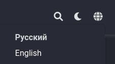

---
## Front matter
title: "ОТЧЕТ О ВЫПОЛНЕНИИ ИНДИВИДУАЛЬНОГО ПРОЕКТА. ЭТАП №6"
subtitle: "_дисциплина: Операционные системы_"
author: "Шилоносов Данил Вячеславович"

## Generic otions
lang: ru-RU
toc-title: "Содержание"

## Bibliography
bibliography: bib/cite.bib
csl: pandoc/csl/gost-r-7-0-5-2008-numeric.csl

## Pdf output format
toc: true # Table of contents
toc-depth: 2
lof: true # List of figures
lot: false # List of tables
fontsize: 12pt
linestretch: 1.5
papersize: a4
documentclass: scrreprt
## I18n polyglossia
polyglossia-lang:
  name: russian
  options:
	- spelling=modern
	- babelshorthands=true
polyglossia-otherlangs:
  name: english
## I18n babel
babel-lang: russian
babel-otherlangs: english
## Fonts
mainfont: PT Serif
romanfont: PT Serif
sansfont: PT Sans
monofont: PT Mono
mainfontoptions: Ligatures=TeX
romanfontoptions: Ligatures=TeX
sansfontoptions: Ligatures=TeX,Scale=MatchLowercase
monofontoptions: Scale=MatchLowercase,Scale=0.9
## Biblatex
biblatex: true
biblio-style: "gost-numeric"
biblatexoptions:
  - parentracker=true
  - backend=biber
  - hyperref=auto
  - language=auto
  - autolang=other*
  - citestyle=gost-numeric
## Pandoc-crossref LaTeX customization
figureTitle: "Рис."
tableTitle: "Таблица"
listingTitle: "Листинг"
lofTitle: "Список иллюстраций"
lotTitle: "Список таблиц"
lolTitle: "Листинги"
## Misc options
indent: true
header-includes:
  - \usepackage{indentfirst}
  - \usepackage{float} # keep figures where there are in the text
  - \floatplacement{figure}{H} # keep figures where there are in the text
---

# Цель работы
Размещение двуязычного сайта на Github.

# Задачи
- Сделать поддержку английского и русского языков.
- Разместить элементы сайта на обоих языках.
- Разместить контент на обоих языках.
- Сделать пост по прошедшей неделе.
- Добавить пост на тему по выбору (на двух языках).

# Выполнение лабораторной работы
## Реализация поддержки сайтом английского и русского языков
### Редактирование файлов конфигурации
Сделаем поддержку английского и русского языков:
- Отредактируем файл config.yaml (рис. [-@fig:001])

{#fig:001 width=100%}

- Отредактируем файл languages.yaml (рис. [-@fig:002])

{#fig:002 width=100%}

### Результат редактирования файлов конфигурации
Получаем меню смены языка и переведенные на выбранный язык панели меню (рис. [-@fig:003], [-@fig:004], [-@fig:005])

{#fig:003 width=100%}

{#fig:004 width=100%}

{#fig:005 width=100%}

### Редактирование контента
В зависимости от выбранного языка содержимое будет переведено на соответствующий. Это реализовано с помощью создания нескольких каталогов с одинаковым по смыслу содержимым, но на написанным разных языках (редактирование приходится делать вручную) (рис. [-@fig:006])

{#fig:006 width=100%}

Путь к этим каталогам прописан в файлах, редактируемых ранее.

## Пост по прошедшей неделе
Сделан пост по прошлой неделе на русском и английском языке (рис. [-@fig:007], [-@fig:008])

{#fig:007 width=100%}

{#fig:008 width=100%}

# Выводы
В процессе выполнения этапа индивидуального проекта был размещен двуязычный сайт на Github.
